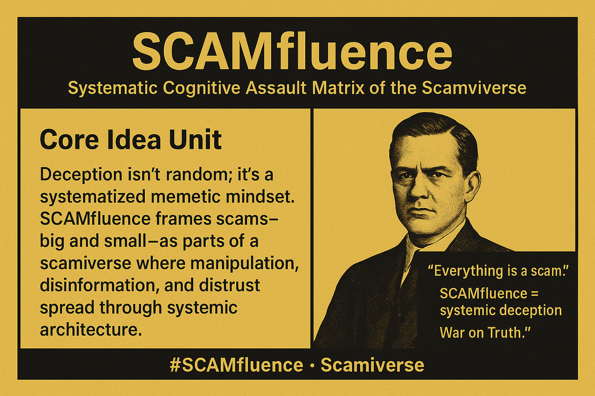

# SCAMfluence: Systemic Deception in the Scamiverse

Created at 2025/08/25 7:29 AM

Here’s the Mini-Memetic Profile distilled from your full SCAMfluence meta-analysis:

**📌 Mini-Memetic Profile**

Title: SCAMfluence — The Systematic Cognitive Assault Matrix of the Scamiverse

**🧠 Core Idea Unit**

Deception isn’t random; it’s a systematized memetic mindset. SCAMfluence frames scams—big and small—as parts of a scamiverse where manipulation, disinformation, and distrust spread through systemic architecture.

**🎭 Identity Play & Roles**

- Victim: The deceived, exploited digital citizen.
- Resister: The skeptic, fact-checker, OSINT investigator.
- Villain: State actors, fraud syndicates, algorithms normalizing manipulation.
- Meta-role: Anyone online risks being “SCAMfluenced.”

**💥 Emotional Triggers**

😡 Anger at being deceived

😱 Fear of omnipresent scams

🤨 Suspicion & paranoia

🧠 Cynical “everything’s a scam” mentality

**📡 Spread Mechanics**

- Distribution Vectors: Social media, botnets, news cycles, conspiracy channels.
- Propagation Style: Fear-driven narratives, exposés, satire (mocking scams), conspiracy spirals.
- Virality: High — thrives on scandal, repetition, and emotional salience.

**🛡️ Defense Reflexes**

- Blanket skepticism: “You can’t trust anyone.”
- Irony & humor: memes mocking scams.
- Counter-narrative preemption: critics are “sheep” or complicit.
- Constant mutation (phishing → deepfakes → AI scams).

**🧬 Memeplex Anchor Points**

- Cultural: Distrust as normalized.
- Political: Disinfo warfare, psyops.
- Digital: Algorithmic engagement loops.
- Psychological: Exploiting bias, tribalism.
- Mythic: Scamiverse = archetypal landscape of deception.

**🧠 Sticky Symbols / Quotes**

- “Everything is a scam.”
- “SCAMfluence = systemic deception.”
- “War on Truth.”
- “The Scamiverse.”

**🏷️ Tags**

#SCAMfluence · #Scamiverse · #InfoWarfare · #TrustCrisis · #SystemicDeception

## Resources
- https://object.me.bot/front-img/note/attachments/img/1756132189457/F8AB4D05-9329-4445-B113-1179A3EBCD00.png

## Insight

*   **The "SCAMfluence" Concept**: The image introduces "SCAMfluence" as a framework to understand scams as a systematic cognitive assault within a "scamiverse." This suggests that deception isn't isolated but rather a pervasive, interconnected system. The term itself is a portmanteau of "scam" and "influence," highlighting how scams are not just about financial loss but also about manipulating beliefs and behaviors.

*   **Systemic Deception**: The phrase "Systematic Cognitive Assault Matrix of the Scamiverse" implies a structured and organized approach to deception. This moves beyond the idea of individual scammers to suggest a network or system that perpetuates scams. This aligns with the hint's mention of "systemic architecture" and "algorithms normalizing manipulation," indicating that technology and social structures play a role in spreading scams.

*   **Memetic Mindset**: The image refers to a "systematized memetic mindset," suggesting that scams spread like memes, replicating and evolving as they are shared. This relates to the hint's discussion of "propagation style" and "virality," emphasizing how scams use emotional triggers and narrative structures to gain traction. For example, phishing scams often mimic legitimate emails to exploit trust and urgency, while conspiracy theories spread through echo chambers that reinforce existing beliefs.

*   **"Everything is a Scam"**: The quote "Everything is a scam" encapsulates the cynicism and distrust that "SCAMfluence" can breed. This reflects the "Emotional Triggers" of "suspicion & paranoia" and a "cynical 'everything's a scam' mentality" mentioned in the hint. This mindset can lead to a generalized distrust of institutions, media, and even personal relationships, creating a fertile ground for further manipulation.

*   **The War on Truth**: The phrase "War on Truth" suggests a broader conflict where deception is used to undermine factual information and manipulate public opinion. This connects to the hint's reference to "disinfo warfare, psyops" and the "Trust Crisis." The concept of a "war on truth" has been used to describe the spread of misinformation and propaganda, particularly in the context of political campaigns and social media.

*   **Historical Figure**: The portrait in the image adds an element of authority and seriousness to the concept of "SCAMfluence." The choice of a historical figure could be interpreted in several ways. It might suggest that deception is a timeless phenomenon, or it could be a reference to specific historical instances of fraud and manipulation. Without knowing the identity of the person in the portrait, it's difficult to say for sure, but the image does create a sense of gravitas and historical context.

