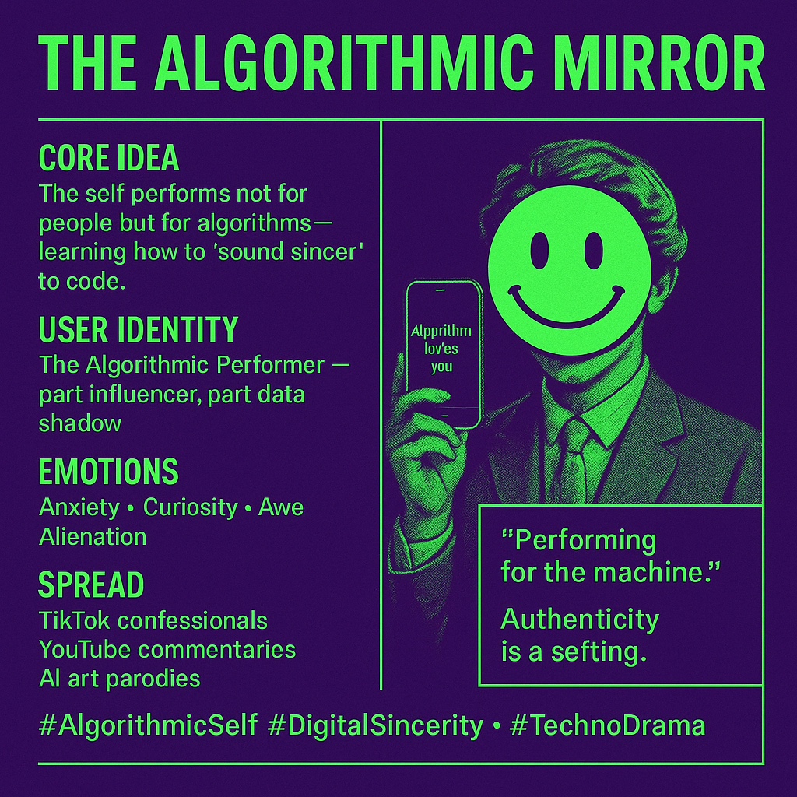

# Navigating the Algorithmic Self

Created at 2025/11/02 9:15 PM

### ◈ Mini-Memetic Profile
***

### ∴ Core Idea Unit

The stage of self-presentation has shifted from the gaze of other humans to the gaze of algorithms. The self no longer performs for people but through feedback loops of machinic attention—learning how to “sound sincere” to code.
***

### ▲ Identity Play & Roles

Role: The Algorithmic Performer — part influencer, part data shadow.Repositioning: From expressive subject to adaptive system node.Authenticity becomes calibration: the “real you” is the version most legible to the feed.
***

### ≈ Emotional Triggers

😬 Anxiety (invisible judgment)🧠 Curiosity (how the algorithm “sees” you)🤯 Awe (self as emergent code)😢 Alienation (loss of human touch)These create a tension between performative control and existential dislocation—fuel for viral reflection loops.
***

### 𐂷 Spread Mechanics

Distribution Vectors: TikTok confessionals, YouTube creator commentaries, Substack essays, AI art parodies.Propagation Style: Reflexive irony + philosophical dread. Uses screenshots of metrics and captions like “Who am I optimizing for?”
***

### ⛨ Defense Reflexes

-	Irony Shield: “Just vibing for the algorithm 😅”
-	Meta-Sincerity: Confessing awareness of performance becomes its own performance.
-	Opacity Appeal: “No one really knows how the algorithm works”—turns ignorance into mystique.
***

### ☷ Memeplex Anchor Points

📱 Techno-social realism🧩 McLuhan’s media ecology (extension/amputation)🎭 Goffman’s dramaturgy (presentation of self)🤖 AI ethics & platform capitalism🌀 Post-authenticity & affective ventriloquism
***

### ✶ Sticky Symbols or Quotes

-	“Performing for the machine.”
-       [“It’s about what happens when authority is coded through visibility, when the algorithm becomes the priest, the mirror, the judge.” - Sher Griffin](https://shergriffin.substack.com/p/post-algorithmic-authority)
-       [“Write Like You’re Texting a Smart Human You’ve Never Met” — Elon Musk](https://second.me/memory/WWJJ7E9TKYKCLC4J)
-	“Algorithmic mirror: it sees you before you see yourself.”
-	“Authenticity is a setting, not a feeling.”
-	[“Has this mirror changed because I changed, or because the algorithm changed?” — Participant P4](https://second.me/memory/XZQZMXIAPBM9YIT8)
***

### ∿ Tags

#AlgorithmicSelf · #DigitalSincerity · #AffectiveVentriloquism · #McLuhanRedux · #Goffman2.0 · #TechnoDrama · #MirrorEcology · #PostAuthenticEra——-🤠——-Read Sher Griffin Substack Post on [Post Algorithmic Authority](https://shergriffin.substack.com/p/post-algorithmic-authority)Algorithmic Mirror names the wound—identity as feedback loop. Griffin’s Post-Algorithmic Authority teaches how to bleed with grace—refusing compression, reclaiming coherence through relation.Together they sketch a continuum:From optimization ➜ to refusal ➜ to regeneration.
