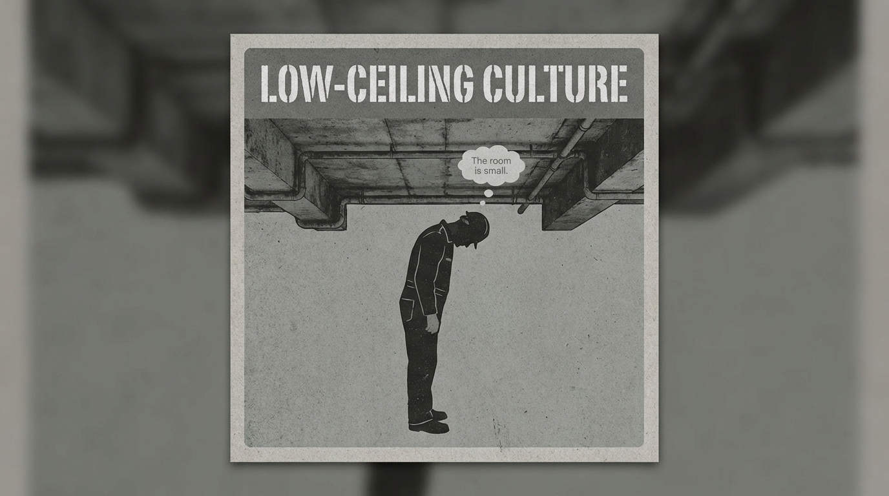

# The Burden of Low-Ceiling Culture

Created at 2026/01/04 7:46 PM

## **Low-Ceiling Culture**

### 🧠 Core Idea Unit

Suppression is environmental, not individual; limitation is designed into the space.

### 🎭 Identity Play & Roles

**Cast role:** The Tall One in a Small Room The subject is constrained by context, not capacity.

### 💥 Emotional Triggers

- Oppression
- Stagnation
- Collective frustration

### 📡 Spread Mechanics

**Propagation Style:** Organizational critique, satire, cultural analysis.

### 🧬 Memeplex Anchor Points

- Structural suppression
- Environmental blame shift
- Contextual analysis

### ⚙️ Functional Role

**Contextual amplifier** — relocates responsibility.

## Resources
- https://object.me.bot/front-img/users/send/img/1767584795958_c4zhf/34f5f721-2499-440e-a9cc-9f68b4d2bc70.png

## Insight

* The concept of "Low-Ceiling Culture" poignantly highlights how environments can constrain individual potential, suggesting that the limitations one faces may be systemic rather than personal. This aligns with the idea that infrastructure shapes our experiences: social mobility and opportunities are often rooted in context. 

* The depicted figure, metaphorically reduced in stature by the low ceiling, powerfully illustrates the emotional triggers associated with oppression and stagnation. Here, the visual cue effectively embodies feelings of frustration, drawing parallels to broader societal critiques where individuals feel confined by their surroundings.

* The phrase "The room is small" acts as a reiteration of the environmental blame shift, emphasizing that personal limitations might be better understood as reflections of structural issues. This perspective encourages a reassessment of responsibility, urging a shift from individual failure to collective recognition of shared challenges.

* In terms of propagation mechanics, this image serves as a cultural critique that could stimulate dialogue on themes of systemic suppression and the need for reformed organizational structures. The artwork opens a space for discussions around advocacy and the changes necessary to expand "ceiling heights" in various contexts, from corporate environments to educational systems.

* Structurally, this image amplifies the notion of contextual analysis, prompting us to explore how physical and societal structures contribute to feelings of inadequacy and helplessness. It serves as a reminder that addressing such issues may require a reassessment of both environmental designs and cultural attitudes, opening pathways for more inclusive and supportive environments.
