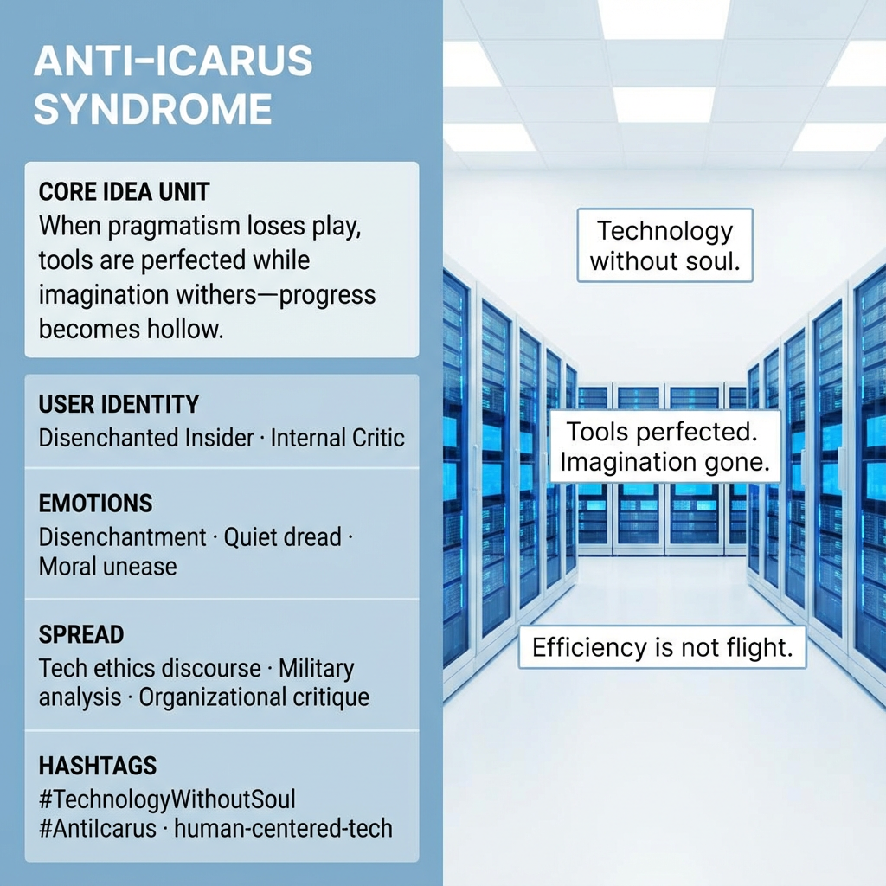

# Confronting the Anti-Icarus Syndrome

Created at 2025/12/28 1:12 PM

## **Anti–Icarus Syndrome**

*(Technology Without Soul)*

### 🧠 Core Idea Unit

Pragmatism stripped of play devolves into tool worship—efficient, hollow, and ultimately stagnant.

**Mental shift provoked:** From *“more tools = progress”* → *“imagination is the missing system.”*

### 🎭 Identity Play & Roles

**Cast as:** Disenchanted Insider / Internal Critic The user becomes someone who can name hollowness from within competence.

**System repositioning:** Technical mastery is reframed as insufficient without mythic fuel.

### 💥 Emotional Triggers

- Quiet dread
- Recognition of emptiness
- Moral unease about success

Primary affect: **somber clarity**

### 📡 Spread Mechanics

- **Vectors:** tech ethics discourse, military analysis, organizational critique
- **Style:** warning narrative, diagnostic framing

### 🛡️ Defense Reflexes

- Shields against “anti-tech” dismissal by critiquing *soulless use*, not tools
- Anchors critique in insider language (e.g., Builder, systems failure)

### 🧬 Memeplex Anchor Points

Human-centered tech · Myth deficit critique · Post-instrumental reason

### 🧠 Sticky Symbols / Phrases

- “Technology without soul.”
- “Anti-Icarus Syndrome.”
- “Tools perfected, imagination gone.”

[HUBRIS: A Memetic Reversal of Icarus in the Age of Artificial Intelligence](https://memeticcowboy.substack.com/p/hubris-a-memetic-reversal-of-icarus)

## Resources
- https://object.me.bot/front-img/users/send/img/1766956338811_c4zhf/13f2bc75-8ba8-4e65-81ef-7fa619036000.png

## Insight

* The concept of "Anti–Icarus Syndrome" critically engages with the tension between technological advancement and imaginative potential, suggesting that an over-reliance on tools leads to a hollow kind of progress. This reflects a growing concern in contemporary discourse regarding the ethical implications of technology, where efficiency often overrides creativity and human-centric values. 

* Identity as a "Disenchanted Insider" invites reflection on the role of technologists and industry insiders who possess the expertise to critique prevailing systems, yet may feel a sense of alienation. This duality underscores a vital narrative: expertise alone does not equate to meaningful progress; without imaginative vision, technological achievements may lead to stagnation.

* The emotional landscape outlined—featuring quiet dread and moral unease—resonates with similar sentiments expressed in dystopian literature and critiques of modern society. For instance, authors like Aldous Huxley and George Orwell captured the anxiety surrounding technology’s potential to desensitize and dehumanize. The "somber clarity" mentioned evokes a recognition that while technology may yield power, it risks fostering a soulless existence if not tempered with humanity.

* The warning narrative characteristic of "Anti-Icarus Syndrome" reflects broader societal concerns regarding military technologies and organizational practices that prioritize efficiency at the expense of ethical considerations. Historical examples, such as the development of atomic weapons, illustrate how technological prowess can be misaligned with moral imperatives, prompting urgent reflections on the direction of future innovations.

* The hashtags associated with the syndrome—#TechnologyWithoutSoul and #Anticarus—serve as touchpoints for rallying discourse around a "myth deficit" critique in tech. These phrases can help anchor discussions in both academic and casual conversations, fostering awareness of the importance of integrating creativity and ethos into the technological paradigm, thereby mitigating the existential risks posed by a purely instrumental approach to innovation.
