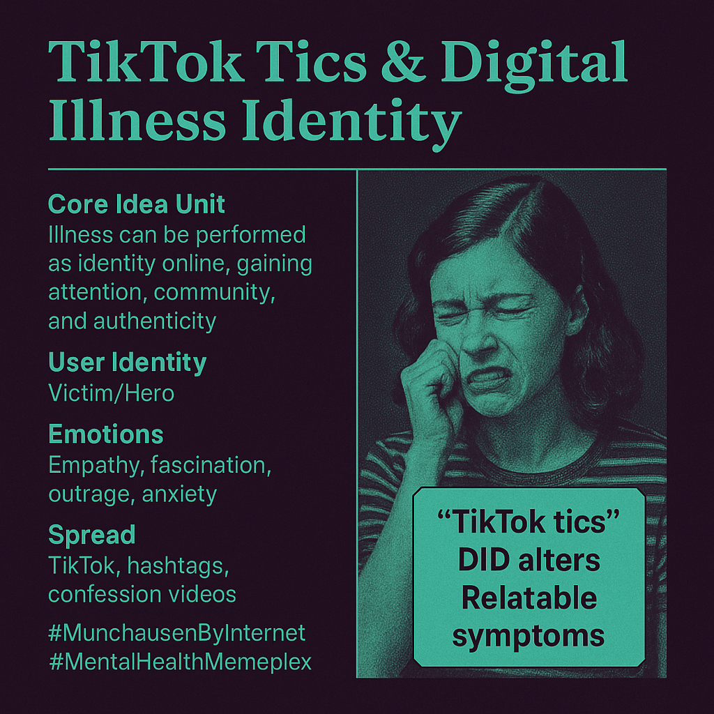

# TikTok Illness Performance: Identity and Authenticity

Created at 2025/08/16 6:50 AM

Mini-Memetic Profile for Munchausen by Internet / TikTok Illness Performance:

Title:

“TikTok Tics & Digital Illness Identity”

🧠 Core Idea Unit:

- Illness can be performed as identity online, gaining attention, community, and authenticity — regardless of medical legitimacy.

🎭 Identity Play & Roles:

- Victim/Hero: The supposed patient bravely sharing struggles.
- Insider: Community members validating each other’s “symptoms.”
- Rebel: Teens self-diagnosing outside of medical authority.
- Exposer/Avenger: Critics who unmask fakers, gaining credibility as truth-tellers.
- Outcast: Genuine patients displaced by performers.

💥 Emotional Triggers:

- Empathy for sufferers.
- Fascination with dramatic, visible symptoms.
- Outrage and betrayal when fakery is revealed.
- Anxiety (“Do I have this too?”) via symptom mimicry.

📡 Spread Mechanics:

- Distribution vectors: TikTok shorts, hashtags (#DIDAlters, #TouretteTikTok), confession-style videos, support forums.
- Propagation style: Emotional confession → awareness framing → algorithmic amplification → backlash exposés.

🛡️ Defense Reflexes:

- “Don’t gatekeep disorders” (preemptive dismissal of skepticism).
- Framing as “raising awareness” shields against critique.
- Emotional blackmail: “Questioning me = harming the vulnerable.”

🧬 Memeplex Anchor Points:

- Mental health awareness movements.
- Confessional authenticity culture.
- Neurodivergence and trauma identity politics.
- Algorithm-driven influencer economies.

🧠 Sticky Symbols or Quotes:

- “TikTok tics”
- “DID alters”
- Lists of “relatable symptoms”
- Hashtags framing illness as community (#MentalHealthTok, #InvisibleIllness)

🏷️ Tags:

#MunchausenByInternet #TikTokTics #PerformativeIllness #MentalHealthMemeplex #AuthenticityEconomy #ConfessionalCulture

## Resources
- https://object.me.bot/front-img/note/attachments/img/1755352235841/655E3852-D66D-4D2B-B0B1-9ADFB367AE9E.png

## Insight

*   **The Performance of Illness Online:** The image and hint highlight how platforms like TikTok enable individuals to perform illness as a form of identity. This performance can lead to attention, community, and a sense of authenticity, regardless of the actual medical legitimacy of the claimed illness. This phenomenon is often referred to as "Munchausen by Internet," where individuals feign illness to gain sympathy or attention online.

*   **Identity Roles and Dynamics:** The hint outlines several roles that emerge within these online communities, such as the "Victim/Hero" who shares their struggles, the "Insider" who validates symptoms, and the "Rebel" who self-diagnoses outside medical authority. Additionally, there are "Exposers/Avengers" who seek to unmask fakers and "Outcasts," who are genuine patients displaced or overshadowed by performers. This dynamic creates a complex social environment where authenticity and credibility are constantly negotiated.

*   **Emotional and Psychological Triggers:** The image and hint suggest that empathy, fascination with dramatic symptoms, outrage at fakery, and anxiety about potentially having the same illness are key emotional triggers that drive engagement with these online performances. The anxiety, in particular, can lead to symptom mimicry, where individuals start to exhibit symptoms they have seen others display, potentially blurring the line between genuine and performed illness.

*   **Spread Mechanics and Defense Mechanisms:** The spread of these performed illnesses is facilitated by TikTok shorts, hashtags, confession-style videos, and support forums. When skepticism arises, individuals often employ defense mechanisms such as dismissing criticism as "gatekeeping" or framing their actions as "raising awareness." These tactics can make it difficult to challenge the authenticity of the claimed illnesses.

*   **Memeplex Anchor Points:** The phenomenon of "TikTok tics" and digital illness identity is anchored in broader cultural trends such as mental health awareness movements, confessional authenticity culture, neurodivergence and trauma identity politics, and algorithm-driven influencer economies. These trends provide a fertile ground for the performance of illness to thrive online.

*   **The "TikTok Tics" Phenomenon:** The image specifically mentions "TikTok tics," which refers to a surge of cases, particularly among teenage girls, exhibiting tic-like behaviors after watching videos of people with Tourette's syndrome on TikTok. While some cases may be genuine, experts have raised concerns about the role of social media in the spread of these behaviors, suggesting that they may be a form of mass sociogenic illness or functional neurological disorder.

*   **The Double-Edged Sword of Mental Health Awareness:** While mental health awareness campaigns aim to reduce stigma and encourage people to seek help, they can also inadvertently provide a script for individuals seeking attention or validation through the performance of illness. This highlights the complex and sometimes contradictory effects of increased awareness and openness about mental health issues.

