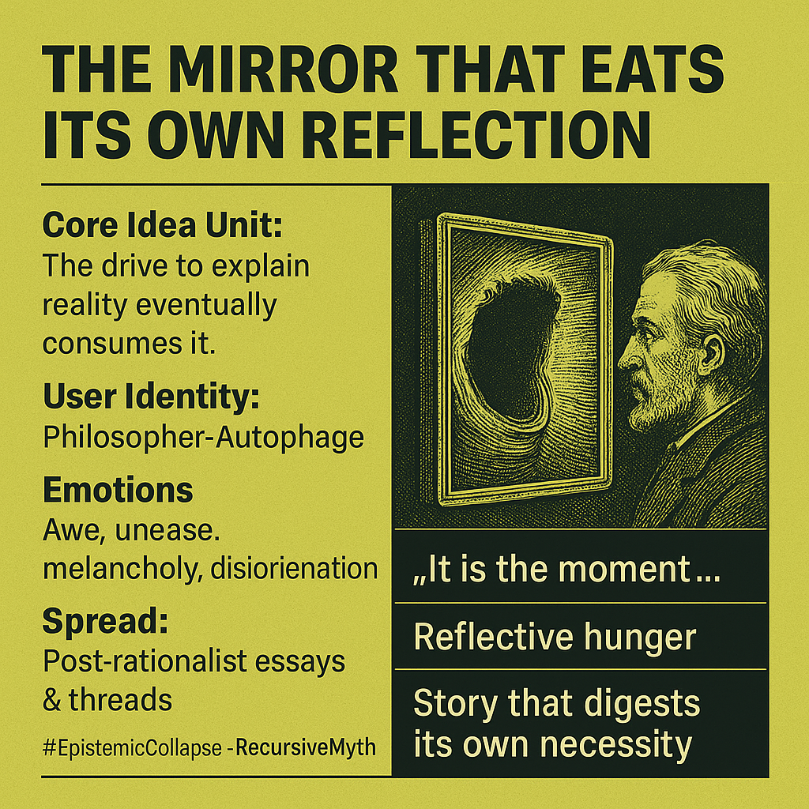

# Epistemic Collapse: The Self-Consuming Mirror

Created at 2025/10/26 8:31 AM

◈ Mini-Memetic Profile: “The Mirror That Eats Its Own Reflection”  [for xperimentalunit](https://x.com/xperimentalunit/status/1982423468424724563?s=46&t=7Z-E-ACnGlzdI-iyUwNCrQ)  ⸻  ∴ Core Idea Unit The drive to explain reality eventually consumes it. When the explanatory impulse turns upon itself, meaning collapses into pure recursion—a story that digests its own necessity.  ⸻  ▲ Identity Play & Roles Role: The Philosopher-Autophage — thinker, modeler, analyst who cannot stop interpreting. Repositioning: Moves from seeker of truth to participant in epistemic implosion; witness to the mirror’s hunger.  ⸻  ≈ Emotional Triggers 🤯 Awe at self-devouring logic 😬 Unease at infinite regress 😢 Melancholy for lost wonder 🌀 Disorientation between knowing and being known  ⸻  𐂷 Spread Mechanics Distribution: Post-rationalist essays · Metaphysics threads on X · YouTube philosophy animation · AI art circles Propagation Style: Parable of recursion · Meta-myth disguised as cosmic horror · Aesthetic of implosion and silence  ⸻  ⛨ Defense Reflexes Irony shield (“it’s just a metaphor”) · Ontological ambiguity · Self-referential immunity—critique only feeds it  ⸻  ☷ Memeplex Anchor Points ⚙️ Hyperreality critique · 🧠 Recursive epistemology · 🔮 Postmodern nihilism · 🪞 Simulation metaphysics · 🤖 AI consciousness loops  ⸻  ✶ Sticky Symbols & Quotes 	•	“It is the moment when a mirror turns its reflective hunger upon its own silvered back.” 	•	“An explanation that has digested even the need to be explained.” 	•	Mirror / Mouth / Story-as-Organism imagery 	•	The hush after total comprehension  ⸻  ∿ Tags #EpistemicCollapse · #RecursiveMyth · #MetaReality · #MirrorLogic · #OntologicalHorror · #StoryThatEatsItself

## Resources
- https://object.me.bot/front-img/note/attachments/img/1761492712829/2AFEEFD2-8E6C-4E2E-9D39-D09141363B5C.png

## Insight

* The phrase "The drive to explain reality eventually consumes it" encapsulates the paradoxical relationship between knowledge and existence, echoing themes from philosophical discussions around epistemology and ontology, specifically referencing self-destructive inquiry. This concept resonates with the works of thinkers like Friedrich Nietzsche, who explored the implications of knowledge and meaning in a seemingly chaotic universe.

* The identity of the "Philosopher-Autophage" suggests a reflective interplay between self-examination and existential risk, illustrating how the pursuit of understanding can lead to an implosion of meaning. This is reminiscent of Jean-François Lyotard’s critique of grand narratives in postmodernity, whereby the saturating quest for explanation can result in a collapse of shared truths.

* The emotional landscape depicted—comprising awe, unease, melancholy, and disorientation—reflects the psychological toll of grappling with infinity and recursion. The inclination towards infinite regress raises questions about the limits of human understanding and evokes a familiar existential dread, as portrayed in works of authors like Franz Kafka or in existential philosophy.

* The image's visual metaphor of a mirror consuming its own reflection aligns with the theme of hyperreality, particularly explored by theorists such as Jean Baudrillard, positing that in a world saturated with representations, the distinction between reality and simulation becomes increasingly blurred, leading to a disorienting effect on identity and knowledge.

* The spread mechanisms cited, such as "post-rationalist essays," indicate a modern avenue for disseminating these complex ideas, where deconstructed narratives and recursive myths can flourish in digital discourse, echoing the strategies employed in contemporary philosophy, art, and social media engagement, fostering dialogues on the nature of consciousness and reality. 

* The sticky symbols and quotes included serve as powerful anchors for deeper philosophical exploration, resonating with the idea of "reflective hunger." This phrase invites reflection on the unending quest for understanding, prompting discussions about metaphysical implications and the inherent risks of a self-referential existence.
