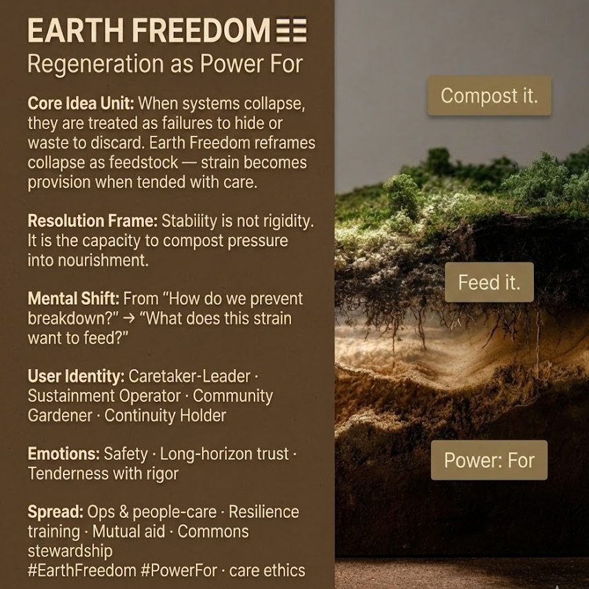

# Earth Freedom: Regeneration Through Care

Created at 2025/12/14 1:28 PM

## **Earth Freedom: Regeneration as Power For** ☷

***

## ∴ Core Idea Unit

When systems collapse, they are treated as failures to hide or waste to discard. **Earth Freedom reframes collapse as feedstock** — strain becomes provision when tended with care, allowing continuity through regeneration rather than denial.

**Resolution frame:** Stability is not rigidity. It is **the capacity to compost pressure into nourishment**.

**Mental shift provoked:** From *“How do we prevent breakdown?”* → *“What does this strain want to feed?”*

***

## ▲ Identity Play & Roles

**Cast the viewer as:**

- **Caretaker-Leader** — strength expressed as provision
- **Sustainment Operator** — keeping systems alive under load
- **Community Gardener** — stewarding shared soil
- **Continuity Holder** — thinking in seasons, not sprints

**Repositioning:** The self becomes a **grounding function** — ensuring others can stand, grow, and endure.

***

## ≈ Emotional Hooks & Cognitive Levers

- 🌾 **Safety** — reliable ground beneath uncertainty
- 🕰️ **Long-Horizon Trust** — patience that compounds
- 🤍 **Tenderness with Rigor** — care that does not collapse standards

This meme stabilizes fear by **normalizing care as strength**.

***

## 𐂷 Spread Mechanics

**Distribution Vectors**

- Operations and people-care practices
- Resilience and sustainment training
- Mutual aid and commons culture
- Community health and stewardship discourse

**Propagation Style**

- Quiet authority
- Grounded metaphors (soil, hearth, bread)
- Emphasis on continuity over heroics

***

## ⛨ Defense Reflexes

- **Anti-Sentimentality Shield:** Care is operational, not soft
- **Anti-Martyrdom Guard:** Regeneration ≠ self-erasure
- **Anti-Short-Termism Lock:** Immediate gain rejected in favor of endurance

Critique must explain **how extractive efficiency outperforms regenerative care over time** — a fragile argument.

***

## ☷ Memeplex Anchor Points

- Care ethics
- Commons stewardship
- Metabolic systems thinking
- Regenerative economics
- IF-Prime elemental Earth (☷)

***

## ✶ Sticky Symbols / Quotes

- ☷ **EARTH**
- 🌱 *Loam*
- 🍞 *Bread / hearth*
- 🤲 **“Compost it. Feed it.”**
- 🛡️ **Power: For**

***

## ∿ Tags

#EarthFreedom · #Regeneration · #PowerFor · #CareEthics · #Commons · #IFPrime

***

**Reflection anchor:** This meme doesn’t glorify endurance through neglect. It asks **what kind of care allows systems — and people — to keep going without being consumed.**

## Resources
- https://object.me.bot/front-img/users/send/img/1765747722591_c4zhf/unnamed_%2833%29.jpg

## Insight

* The concept of "Earth Freedom" reframes systemic collapse as an opportunity for regeneration, highlighting that rather than discarding failures, they can serve as nourishment for future growth. This aligns closely with ecological principles, such as those found in permaculture, which emphasize seeing waste as a resource.

* The emphasis on care as strength is pivotal. It suggests that nurturing not only preserves but also enhances systems, challenging conventional notions of productivity that often prioritize short-term efficiency over long-term resilience. This is reminiscent of regenerative economics, which argues for sustainable practices that yield benefits over time.

* The roles defined—such as "Caretaker-Leader" and "Community Gardener"—illustrate a paradigm shift towards collective stewardship. This community-focused approach to care and support fosters a culture of mutual aid, essential in times of instability or crisis, and draws parallels to social movements advocating for commons stewardship.

* The emotional aspects, such as "Safety" and "Long-Horizon Trust," highlight the importance of psychological resilience in facing uncertainties. This perspective encourages a shift from an individualistic mindset toward a communal one, fostering trust and collaboration as foundational elements for societal endurance.

* The central message of composting pressure into nourishment metaphorically illustrates how challenges can be transformed into opportunities for growth. This ties back to ecological practices where organic matter is recycled back into the soil, enhancing fertility and creating a sustainable cycle of life—underscoring the interconnectedness of life, both ecological and social.
