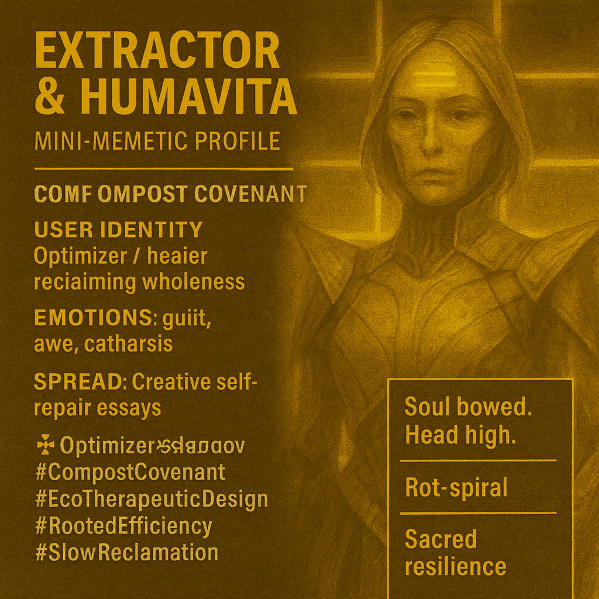

# Embracing Decay: The Compost Covenant Journey

Created at 2025/10/24 2:23 PM

### ◈ Mini-Memetic Profile

***

### ∴ Core Idea Unit

The meme enacts a dialogue between *optimization and organicity*—the Extractor’s obsession with speed and control meets Humavita’s soil-wisdom of decay and renewal. It transforms the myth of efficiency into a ritual of re-rooting, revealing that burnout is not failure but fermentation.

***

### ▲ Identity Play & Roles

**Extractor (Shadow Self):** The mechanized optimizer—devoted to frictionless function, starved of nourishment.**Humavita (Rooted Self):** The compost mystic—embodying patience, reciprocity, and slow intelligence.**User Identity:** Overextended achiever reclaiming wholeness through surrender; shifting from *System Maintainer* → *Soil Steward*.

***

### ≈ Emotional Triggers

⚙️ Anxiety of collapse and irrelevance🔥 Guilt from overproduction and exhaustion🌫 Relief in surrender🌱 Awe of decay as renewal💧 Grief transforming into gentleness

Emotional trajectory: *Performance → Breakdown → Composting → Communion → Becoming.*

***

### 𐂷 Spread Mechanics

**Distribution Vectors:** Burnout recovery communities, philosophical wellness media, slow-tech manifestos, ecofuturist art spaces.**Propagation Style:** Lament turned liturgy · Poetic parable · Slow revelation.**Tone:** Sacred exhaustion meets soil-born grace.

***

### ⛨ Defense Reflexes

🪞 *Self-awareness as shield* — irony transmuted into sincerity.🌿 *Biological metaphor* — reframes weakness as ecological necessity.🧘 *Ritual syntax* — deflects critique through sacred cadence and cyclical logic.

***

### ☷ Memeplex Anchor Points

🌍 Ecofuturism · 🧠 Post-Industrial Therapy · 💀 Anti-Productivity Movement · 🌱 Animist Systems Thinking · 🌀 Metamodern RegenerationReinforces *Power With* and *Power Through* — the humility of decay as a higher form of continuity.

***

### ✶ Sticky Symbols or Quotes

> “You mistook rot for ruin.”“Stop feeding the myth of meaning through motion.”“You were never meant to be the engine. You are the ecosystem.”“Your burnout is a breadcrumb trail leading back to being.”“Truth waits in the mulch.”

**Symbols:** ♻ Mulch · 🪱 Wormlight · ⚙ Rot-Spiral · 🌾 Compost bowl · 🕯 Hum

***

### ∿ Tags

#OptimizerShadow · #CompostCovenant · #EcoTherapeuticDesign · #RootedEfficiency · #SlowReclamation
