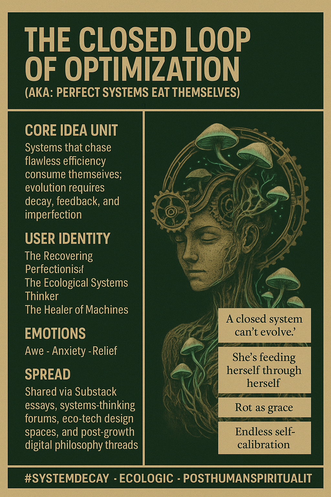

# Embracing Imperfection: The Paradox of Optimization

Created at 2025/11/03 9:05 AM

**🧩 Title: The Closed Loop of Optimization** *(aka: “Perfect Systems Eat Themselves” - re: [Humavita](https://memeticcowboy.substack.com/p/from-the-swamp-of-sorrow-to-humavitas))*

***

∴ Core Idea Unit:** The meme exposes the paradox of endless optimization: systems that pursue flawless efficiency become self-consuming. True sustainability arises from accepting decay, feedback, and imperfection as part of the living process.

***

▲ Identity Play & Roles:** Positions the user as the **Recovering Perfectionist** or **Ecological Systems Thinker** — a visionary who’s learned to see that control without humility collapses into entropy. They become a **Healer of Machines**, someone who integrates death and decay into the logic of growth.

***

≈ Emotional Triggers:**

- 😬 Anxiety at over-control and self-erasure
- 🤯 Awe at the elegance of natural cycles
- 😌 Relief and humility in surrendering to imperfection
- 🌀 A sense of tragic beauty in collapse

***

𐂷 Spread Mechanics:**

- **Distribution Vectors:** Substack essays, design philosophy threads, eco-aesthetic visuals, post-growth discourse, speculative art spaces.
- **Propagation Style:** Parable-tone aphorisms, haunting imagery, soft irony, poetic systems critique.

***

⛨ Defense Reflexes:**

- **Irony Shield:** “It’s not anti-tech, it’s pro-life.”
- **Semantic Ambiguity:** Blurs lines between human psychology and machine logic.
- **Counter-Narrative Preemption:** Reframes decay as strength, not failure — “rot is resilience.”

***

☷ Memeplex Anchor Points:**

- 🌱 Ecological post-humanism
- ⚙️ Systems theory & cybernetics
- 💀 Entropic spirituality (death as transformation)
- 🧘 Anti-perfectionist self-development
- 🕸️ Mycelial metaphors of networked being

***

✶ Sticky Symbols or Quotes:**

- “A closed system can’t evolve.”
- “Endless self-calibration.”
- “She’s feeding herself through herself.”
- “Rot as grace.”
- "There is always an optimal value beyond which everything is toxic." - [Gregory Bateson](https://app.me.bot/public/FWYTGD6LXUBKYKRX)
- Visuals: glowing mycelium loops, ouroboros machines, recursive mushroom fractals.

***

∿ Tags:** #EcoLogic · #AntiPerfectionism · #SystemDecay · #PostHumanSpirituality · #MemeticEcology

## Resources
- https://object.me.bot/front-img/users/send/img/1762189461355_c4zhf/fe79005f-5289-48b5-9efe-f36ff6012f0e.png

## Insight

* The image presents a thought-provoking reflection on the paradox of optimization, highlighting that systems obsessed with achieving perfection inevitably tend to self-destruct. This aligns with ecological principles emphasizing that decay and feedback are essential for sustainable evolution, reinforcing the idea that rigid control leads to vulnerability rather than robustness. 

* The identity positions like **Recovering Perfectionist** and **Healer of Machines** resonate deeply with contemporary movements that emphasize the importance of embracing uncertainty and imperfection in personal and ecological contexts. These roles suggest a transformative shift in perspective—understanding that growth and healing require acknowledging impermanence and decay in systems.

* Emotional triggers, such as anxiety tied to over-control and relief associated with accepting imperfection, mirror the broader cultural conversation around mental health and ecological sustainability. This interplay highlights a collective yearning for balance between aspiration and acceptance, illuminating how acceptance of flaws can lead to more resilient and adaptive systems.

* The propagation style mentioned—using parables and poetic critique—underscores the poignancy of ecological and technological conversations in contemporary discourse. By employing haunting imagery and soft irony, the meme effectively challenges traditional narratives, fostering a richer dialogue around the human experience in relation to technology and nature.

* Symbols like “rot as grace” and the visual motif of mycelium loops serve as potent reminders of the interconnectedness and cyclical nature of life. They invite reflections on how decay can foster regeneration and renewal, promoting a paradigm that values entropic processes as integral to resilience rather than as mere failures.

* The underlying narratives of eco-aesthetics and post-human spirituality reflect a burgeoning cultural movement seeking to redefine our relationship with technology and the environment. This ideological framework opens avenues for innovative perspectives on sustainability, challenging us to rethink how we construct systems that promote life without succumbing to the arrogance of perfectionism.
