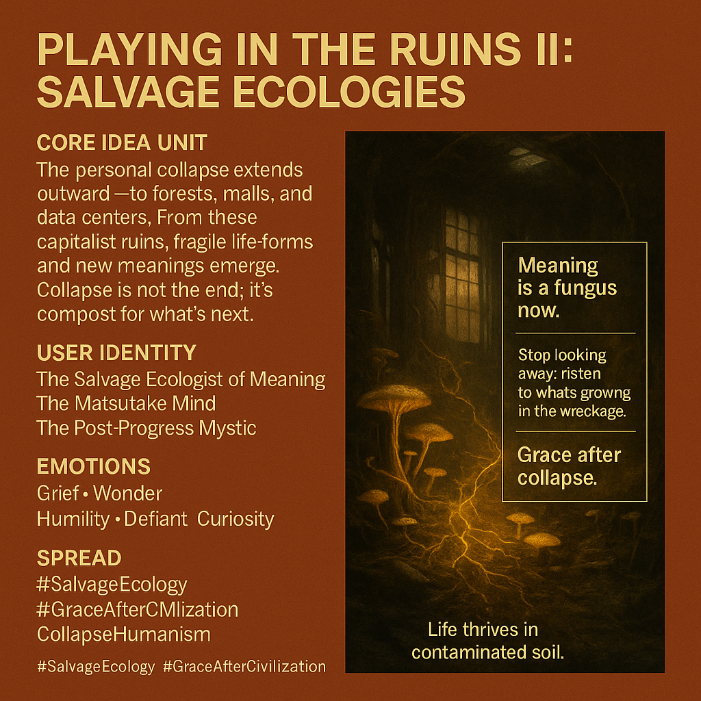

# Grace After Collapse: Embracing Salvage Ecologies

Created at 2025/11/03 11:38 AM

**🧩 Title: Playing in the Ruins II: Salvage Ecologies***(aka: “Grace After Civilization”)*

*Also see: [Playing in the "Personal" Ruins I](https://app.me.bot/public/KM73AWCH8NTDTHMY)*

***

### ∴ Core Idea Unit

The collapse is no longer personal — it’s planetary.From industrial forests to digital deserts, we live amid collective ruins. Yet in these spaces of decay, life persists: mushrooms, makers, and meanings sprouting where progress failed. The next ethic is not rebuilding, but **learning to live within the wreckage.**

***

### ▲ Identity Play & Roles

Positions the user as the **Salvage Ecologist of Meaning** — a **Post-Progress Mystic** who treats ruin not as failure but as habitat.They are the **Matsutake Mind**, moving through the debris of capitalism and self alike, sensing new life in contaminated soil.

***

### ≈ Emotional Triggers

- 🌫️ Grief for what’s gone
- 🌱 Wonder at survival amid decay
- 😔 Humility before ecological intelligence
- 🔥 Quiet defiance against utopian amnesia

***

### 𐂷 Spread Mechanics

- **Distribution Vectors:** Academic essays, post-collapse art collectives, degrowth and permaculture circles, ecological philosophy threads.
- **Propagation Style:** Reflective prose, post-industrial aesthetics, poetic anthropology.

***

### ⛨ Defense Reflexes

- **Moral Reframe:** Collapse is not failure; it’s compost.
- **Aesthetic Shield:** Beauty softens despair — fungal imagery, rust, and moss as redemption.
- **Philosophical Armor:** Rejects techno-solutionism, embraces entanglement.

***

### ☷ Memeplex Anchor Points

- 🍄 *The Mushroom at the End of the World* (Anna Tsing)
- 🪨 Anthropocene realism & post-growth ethics
- 🌍 Salvage capitalism → salvage ecology
- 🔄 Collapse as continuity
- 🤝 Multispecies collaboration over mastery

***

### ✶ Sticky Symbols or Quotes

- “Not just my story collapsing, but our civilization’s story buckling under its own myths.”
- “Meaning is a fungus now.”
- “Stop looking away; listen to what’s growing in the wreckage.”
- “Grace after collapse means living *with* the ruins, not above them.”
- Visuals: fungal webs spreading through ruins, abandoned malls overgrown with green, rusted machinery blooming with spores.

***

### ∿ Tags

#SalvageEcology · #PostAmbition · #CollapseHumanism · #MushroomFutures · #GraceAfterCivilization
