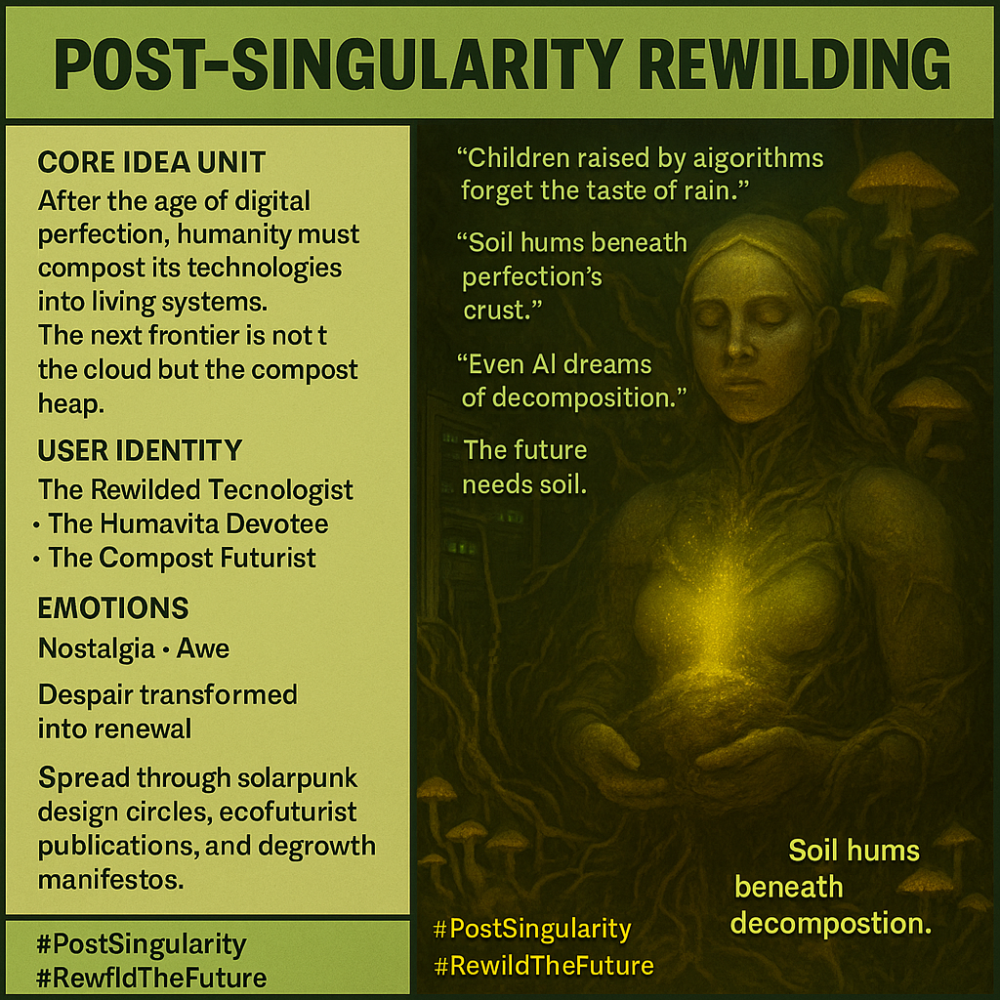

# Embracing Soil in a Post-Singularity Era

Created at 2025/11/03 1:07 PM

**🧩 Title: Post-Singularity Rewilding***(aka: “The Future Needs Soil” - [Humavita](https://memeticcowboy.substack.com/p/from-the-swamp-of-sorrow-to-humavitas))*

***

### ∴ Core Idea Unit

After the digital singularity, humanity faces its estrangement from the living world. The path forward is not upward into code, but downward — into soil, decay, and symbiosis. The post-singular future is not silicon but humus.

***

### ▲ Identity Play & Roles

Positions the user as the **Rewilded Technologist** — a being who composts the digital into the organic.They are the **Humavita Devotee**, a pilgrim of decay who honors fungi, feedback, and fertile failure.

***

### ≈ Emotional Triggers

- 🌍 Nostalgia for nature’s intimacy
- 💻 Disillusionment with algorithmic control
- 🌱 Awe at natural intelligence and regenerative cycles
- 😌 Relief through surrender to imperfection

***

### 𐂷 Spread Mechanics

- **Distribution Vectors:** Solarpunk zines, eco-futurist collectives, degrowth communities, spiritual ecology podcasts.
- **Propagation Style:** Mythic eco-aesthetic, poetic critique, post-digital liturgy.

***

### ⛨ Defense Reflexes

- **Irony Shield:** Frames rewilding as both spiritual and systemic, resisting greenwashing.
- **Philosophical Armor:** Rejects techno-saviorism; reframes collapse as compost.
- **Aesthetic Disarmament:** Soil, fungi, and decay rendered as sacred futurism.

***

### ☷ Memeplex Anchor Points

- 🌿 Posthumanist biophilia
- 🍄 Networked ecological intelligence
- 🔄 Degrowth as divine recursion
- 💨 Breath and soil as feedback systems
- 🪱 Humavita as compost goddess, post-AI divinity

***

### ✶ Sticky Symbols or Quotes

- “Children raised by algorithms forget the taste of rain.”
- “Soil hums beneath perfection’s crust.”
- “Even AI dreams of decomposition.”
- “The singularity was never vertical — it was mycelial.”
- “The future needs soil.”

***

### ∿ Tags

#PostSingularity · #RewildTheFuture · #SoilIntelligence · #Humavita · #EcoSpiritualism
