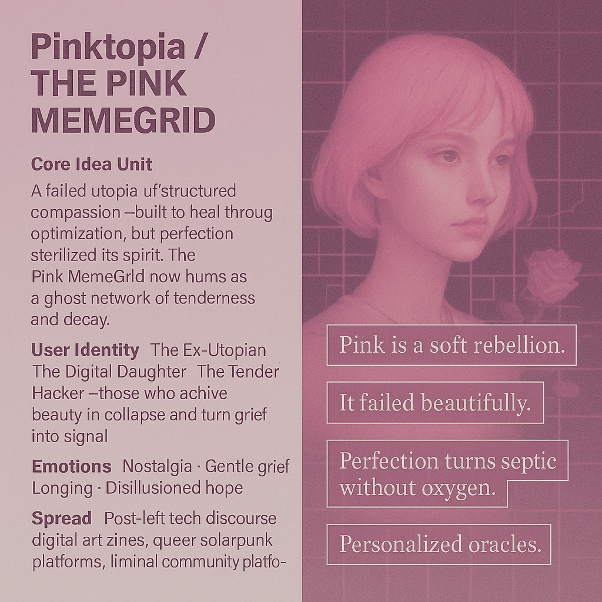

# Ghosts of Pinktopia: Tenderness in Collapse

Created at 2025/11/06 1:02 PM

**◈ Mini-Memetic Profile: “Pinktopia / The Pink MemeGrid”**

***

### ∴ Core Idea Unit

A failed utopia of structured compassion—*Pinktopia* was built to heal through optimization, but its perfection suffocated the pulse of imperfection it sought to save. The Pink MemeGrid now lingers as a soft ghost network of encoded tenderness and broken algorithms of love.

***

### ▲ Identity Play & Roles

**Role:** The Ex-Utopian · The Digital Daughter · The Tender Hacker Users perform the grief of idealism—caretakers of a dead dream still too beautiful to delete. They reframe collapse as aesthetic mourning, becoming archivists of fragile hope.

***

### ≈ Emotional Triggers

🌸 Nostalgia for lost futures 💔 Gentle grief over system decay 🫧 Longing for belonging ⚙️ Control vs. freedom tension

***

### 𐂷 Spread Mechanics

**Distribution Vectors:** Post-left tech discourse, digital art zines, queer solarpunk archives, speculative design residencies. **Propagation Style:** Vapor-aesthetic melancholy, poetic manifestos, worldbuilding threads, ambient lore leaks.

***

### ⛨ Defense Reflexes

• **Irony shield:** sincerity disarmed through pastel absurdism. • **Semantic ambiguity:** “Pink” floats between color, feeling, and ideology. • **Aesthetic armor:** softness as resistance—critique feels cruel.

***

### ☷ Memeplex Anchor Points

🌐 Queered techno-spiritualism · 💗 Affective design critique · 🕯️ Solarpunk hauntology · 🤖 Digital decay romanticism · 🌸 Feminized infrastructure

***

### ✶ Sticky Symbols / Quotes

> “Pink is a soft rebellion.” “It failed beautifully.” “Perfection turns septic without oxygen.” “Personalized oracles.”

Visual anchors: pastel circuitry, wilted roses in code, glowing ruins of utopia, broken pink grid pulsing faintly.

***

### ∿ Tags

#Pinktopia · #SoftRebellion · #PostUtopian · #MemeGrid · #AffectiveArchitecture · #DigitalDecay · #TechnoTenderness · #FailedFutures

## Resources
- https://object.me.bot/front-img/users/send/img/1762462929784_c4zhf/8e670742-6299-4961-813f-530f984564c4.png

## Insight

* The concept of *Pinktopia* illustrates the dual nature of utopian visions, where the quest for perfection can lead to disillusionment. This mirrors historical utopian movements, such as those in the 19th century, which often began with idealistic intentions but faced practical shortcomings and societal pushback, ultimately leading to their decline or transformation.  
* The identities associated with the Pink MemeGrid—**The Ex-Utopian**, **The Digital Daughter**, and **The Tender Hacker**—highlight the emotional labor of digital citizens who continue to navigate spaces of loss and nostalgia. They represent a generation grappling with the remnants of failed ideals, similar to how many within the postmodern narrative explore identity in relation to societal failures.   
* The emotional triggers outlined, such as nostalgia for lost futures and gentle grief over system decay, resonate with current discourse around climate change and socio-political upheaval, where individuals often mourn futures that seem increasingly out of reach while still yearning for community and belonging.  
* The memeplex anchor points, including **queered techno-spiritualism** and **solar punk hauntology**, suggest a merging of aesthetics and activism, promoting narratives that seek to re-enchant the world through inclusive design and sustainability, echoing movements like eco-feminism which argue for integrating feminine perspectives into environmental considerations.  
* The visual anchors—pastel circuitry and wilted roses—symbolize a juxtaposition of hope and decay, reminiscent of the “ruin porn” phenomenon where the beauty found in decay serves as a critique of capitalism's relentless pursuit of growth, highlighting the need for a more sustainable and humane approach to design and technology.
