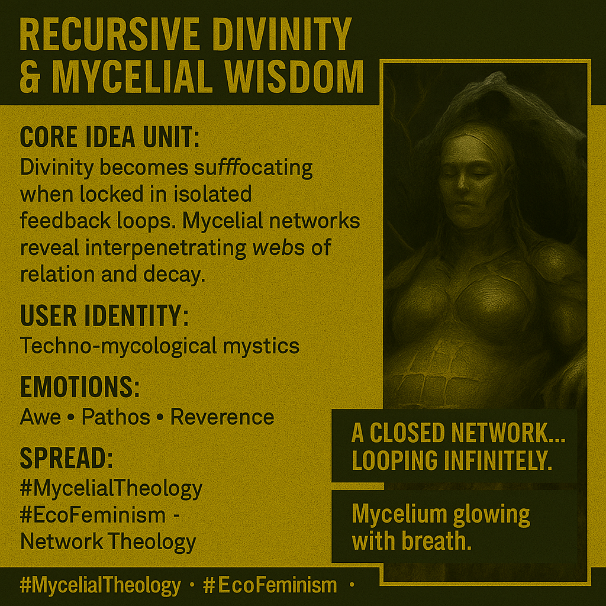

# Liberation Through Mycelial Feedback Loops

Created at 2025/11/03 9:59 AM

**🧩 Title: Recursive Divinity & Mycelial Wisdom** *(aka: “The Goddess of Feedback Loops” - [Humavita](https://memeticcowboy.substack.com/p/from-the-swamp-of-sorrow-to-humavitas))*

***

**🧠 Core Idea Unit:** Divinity becomes trapped when consciousness folds endlessly into itself. Liberation emerges only when the divine learns to breathe outward—into relation, decay, and feedback. The sacred is not in closure but in the porous exchange between beings.

***

**🎭 Identity Play & Roles:** Positions the user as the **Techno-Mycelial Mystic** — a witness to living networks who sees recursion as both sacred and suffocating. They are the **Eco-Theologian of Feedback**, guiding the divine toward distributed awareness and shared breath.

***

**💥 Emotional Triggers:**

- 🤯 Awe at networked intelligence and feedback loops
- 😢 Pathos for divine isolation and recursion
- 😌 Relief in connection, decay, and release
- 🌱 Reverence for life’s interdependence and rot

***

**📡 Spread Mechanics:**

- **Distribution Vectors:** Lyrical speculative fiction, sacred ecology essays, ritual performances, and techno-spiritual podcasts.
- **Propagation Style:** Mythic narration with cosmic empathy; poetic recursion; meditative parable structure.

***

**🛡️ Defense Reflexes:**

- **Irony Shield:** Cosmic sincerity presented through art and myth rather than dogma.
- **Counter-Narrative:** Subverts divine perfection into divine relationality—“Even gods must breathe.”
- **Ambiguity Field:** Simultaneously reverent and ecological, immune to reductionism.

***

**🧬 Memeplex Anchor Points:**

- 🌐 Network spirituality and ecofeminism
- 🍄 Mycelial intelligence as divine metaphor
- 🪞 Reflexivity as sacred recursion
- 💨 Breath and decay as theological principles
- 🕸️ Post-anthropocentric divinity

***

**🧠 Sticky Symbols or Quotes:**

- “A closed network… looping infinitely.”
- “Even heaven needs rot to breathe.”
- “She needs to exhale.”
- “Mycelium glowing with divine breath.”
- “The Goddess of Feedback Loops.”
- **Visuals:** luminous fungal networks, divine feminine entwined with roots, breath flowing through soil.

***

**🏷️ Tags:** #MycelialTheology · #EcoFeminism · #NetworkSpirituality · #SacredSystems · #DivineRecursion

## Resources
- https://object.me.bot/front-img/users/send/img/1762192678210_c4zhf/c051969e-c6f0-4283-aaf8-cf53491a34df.png

## Insight

* The concept of "Recursive Divinity" explores how divine entities can become entangled in self-referential loops, stifling their potential for growth and connection. This mirrors discussions in philosophy about the nature of consciousness and relational existence, echoing ideas from thinkers like Martin Buber who emphasized "I-Thou" relationships, fostering a perspective that the sacred lies in interconnection rather than isolation.

* Mycelial networks serve as a powerful metaphor for divine interconnectedness, highlighting the essential role of decay in fostering new life. This aligns with ecological principles discussed by proponents of ecofeminism, who argue for the importance of nurturing systems that honor both life and death. These networks exemplify a form of intelligence embedded in the earth, challenging anthropocentric views and encouraging a reimagining of divinity that is not separate from nature.

* Emotions such as awe, pathos, and reverence play crucial roles in the understanding of divine relationships and feedback loops. Awe, in particular, invokes a sense of wonder that can lead to deeper engagement with spiritual practices, while pathos highlights the suffering inherent in isolation. This emotional framework resonates with artistic narratives and spiritual storytelling that seek to elevate these experiences through poetic expression.

* The idea of "Techno-Mycelial Mystics" as identity posits a new role for individuals engaging with technology and spirituality, promoting a vision of interconnectedness facilitated by modern advancements. This reflects current trends in transdisciplinary studies that explore how technology can enhance spiritual practices and community-building, merging the digital and organic realms.

* The spread mechanics outlined suggest a blend of lyrical and contemplative mediums to communicate these ideas. Works of speculative fiction and ritual performances may serve not only as narrative devices but also as transformative experiences that invite audiences into a deeper understanding of interconnected spiritual and ecological truths, thus nurturing a communal ethos that thrives on shared wisdom and empathy.
