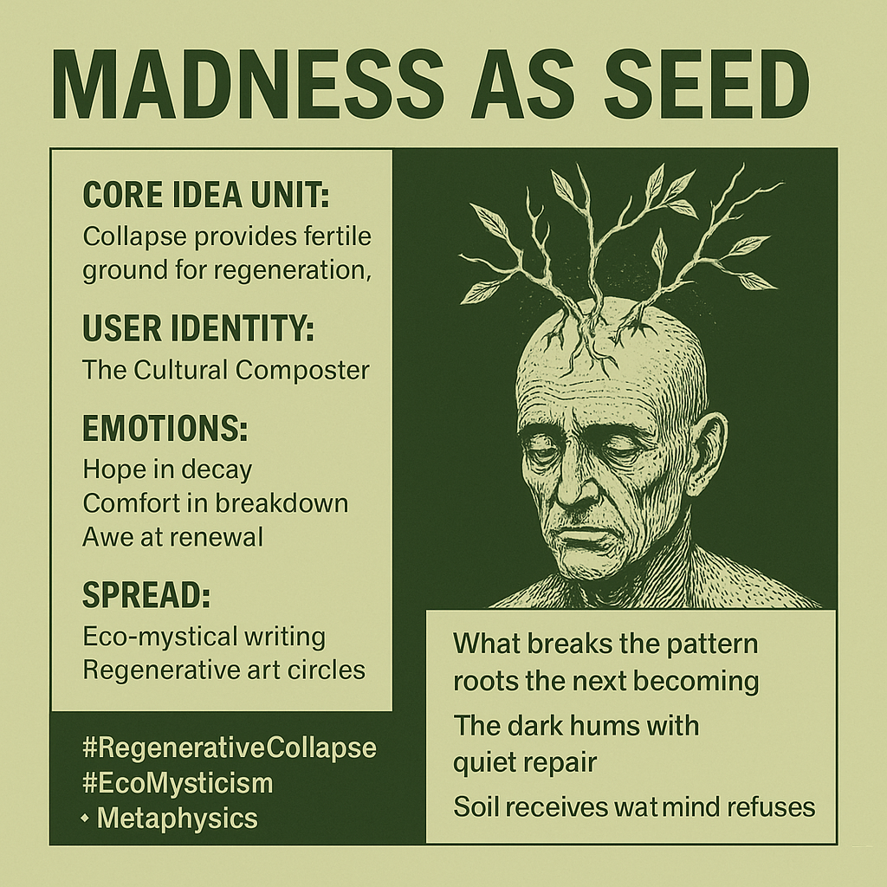

# Madness as Seed: Cultivating Regenerative Collapse

Created at 2025/11/08 5:10 PM

### ◈ **Mini-Memetic Profile: “Madness as Seed — Collapse as Creative Substrate”**

∴ Core Idea Unit:** What appears as breakdown is the soil of rebirth. Madness, decay, and disintegration become fertile grounds for emergent coherence and creative regeneration.

***

▲ Identity Play & Roles:** **The Cultural Composter** — one who tends the soil of collapse, turning psychic and systemic breakdown into nutrient for the next world. Identity is both gardener and gravekeeper, cultivating meaning through surrender.

***

≈ Emotional Triggers:** • Hope born from despair • Comfort in decay • Awe at life’s persistence through death • Humility before cycles of loss and renewal

***

𐂷 Spread Mechanics:** **Distribution Vectors:** Eco-mystical writing, regenerative art circles, permaculture-inspired think pieces, digital ritual spaces. **Propagation Style:** Poetic realism — grounded, slow, and reverent; collapse framed as composting rather than apocalypse.

***

⛨ Defense Reflexes:** • Reframes despair as gestation • Uses mythic-natural language to resist nihilism • Blurs sanity’s borders, turning breakdown into metamorphosis

***

☷ Memeplex Anchor Points:** • 🌱 **Ecological Metaphysics** — soil as psyche, pattern as lifeform • 🌀 **Regenerative Collapse** — entropy as renewal engine • 🔥 **Psychospiritual Alchemy** — shadow turned seed • 💧 **Permacultural Spirituality** — decay as divine process

***

✶ Sticky Symbols / Quotes:** • “What breaks the pattern roots the next becoming.” • “The dark hums with quiet repair.” • “Soil receives what mind refuses.” • “Suicide ain’t no sacrifice.”

***

∿ Tags:** #RegenerativeCollapse · #EcoMysticism · #CulturalCompost · #MetaphysicalEcology

***

**Interpretive Note:** “Madness as Seed” transforms collapse into a cyclical cosmology. Where modernity fears madness as loss, this meme reinterprets it as metamorphosis—the psyche’s composting ritual. To decay consciously is to participate in the regenerative intelligence of life itself.

## Resources
- https://object.me.bot/front-img/users/send/img/1762650645387_c4zhf/a76aaaa6-ca7a-4497-a730-c8824dd10b50.png

## Insight

* The image captures the essence of the concept "Madness as Seed," emphasizing that breakdown and chaos are not endpoints, but rather fertile grounds for new growth and creativity. This mirrors ecological principles where decay in nature leads to renewed life, suggesting that psychological and systemic collapses can also promote similar regenerative processes in human experience.

* The identity of "The Cultural Composter" reflects an active role in transforming despair into potential. This motif resonates with figures in history and culture who have turned personal or societal turmoil into artistic or philosophical movements, such as the Romantic poets who drew inspiration from chaos and emotional turbulence.

* The emotional triggers listed—hope in decay, comfort in breakdown, and awe at life's persistence—create a nuanced understanding of human resilience. This aligns with the teachings of various philosophical traditions, such as Stoicism and Buddhism, which advocate finding meaning in suffering and impermanence.

* The idea of using eco-mystical writing and regenerative art to propagate these concepts speaks to the growing trend of using art as a medium for social commentary and healing. Movements like eco-therapy embrace nature as a source of renewal, emphasizing the interconnectedness of all life forms as suggested in permaculture practices.

* The sticky symbols and quotes evoke poignant reflections on the cycle of life and death. "What breaks the pattern roots the next becoming" serves as a powerful reminder that through disruption, new possibilities can emerge, a theme prevalent in the works of existential philosophers who explore the meaning in chaos and disorder.
