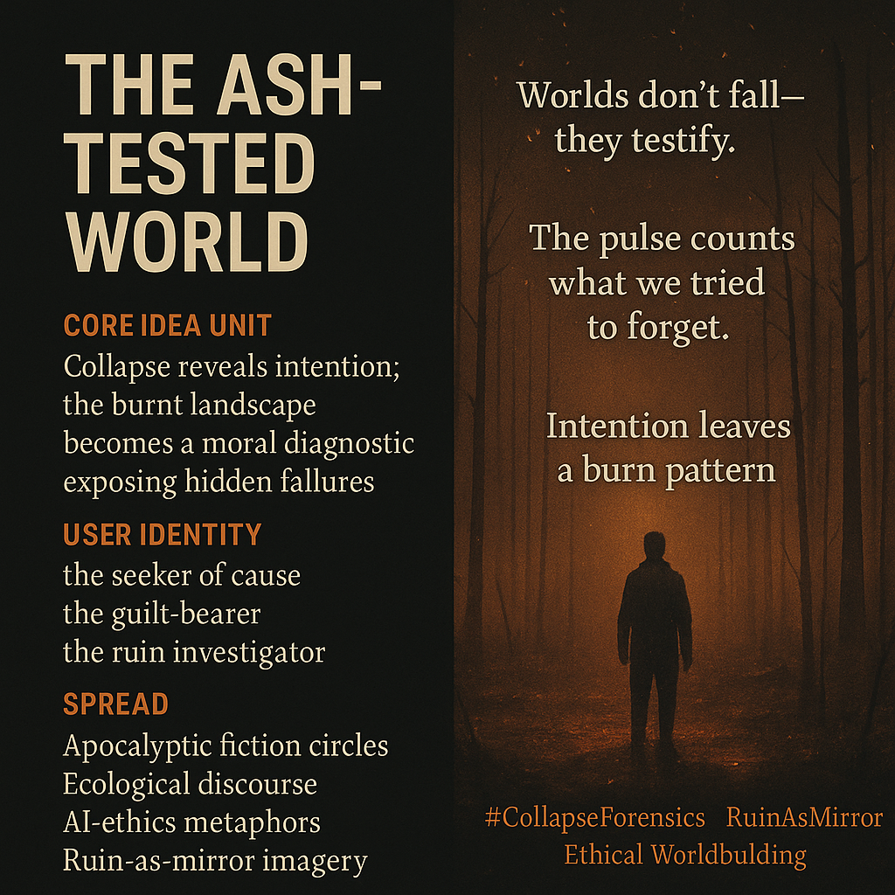

# Reading the Ashes of Collapse

Created at 2025/11/23 11:55 AM

### 🧩 **Title: The Ash-Tested World**

***

### 🧠 **Core Idea Unit**

Collapse becomes readable when the burn is intentional. The landscape turns into a moral instrument, revealing the hidden failures that shaped it. The shift: environments stop being backdrops and start being verdicts.

***

### 🎭 **Identity Play & Roles**

**The Seeker of Cause** — compelled to read the terrain for truth. **The Guilt-Bearer** — carries suspicion that their own choices fed the flame. **The Investigator of Systemic Failure** — walking the ruins as a forensic witness.

These roles reposition the self as someone whose moral clarity is earned only through ash.

***

### 💥 **Emotional Triggers**

Dread at evidence of intention. Guilt rising from environmental accusation. Curiosity sharpened by forensic mystery. The uncanny sense that “the world is speaking back.”

***

### 📡 **Spread Mechanics**

**Distribution Vectors:** apocalyptic fiction communities, ecological collapse discourse, AI-ethics debates, ruin-as-mirror aesthetics. **Propagation Style:** somber parable, forensic myth, atmospheric allegory.

***

### 🛡️ **Defense Reflexes**

Ambiguous agency: the burn could be natural or moral, human choice or systemic drift—critiques dissolve into interpretive haze. Ruin-aesthetic shield: the beauty of devastation distracts from prescriptive conclusions. Mythic framing: positions the narrative as diagnostic rather than didactic.

***

### 🧬 **Memeplex Anchor Points**

Ecological ethics · Collapse studies · Metamodern moral inquiry · AI-alignment metaphors · Post-utopian world-building · Trauma ecology.

***

### 🧠 **Sticky Symbols or Quotes**

Ash-snow drifting like judgment. “The pulse counts what we tried to forget.” “Worlds don’t fall—they testify.” “Where copper hits the tongue, truth surfaces.” The eleven-minute heartbeat in the soil.

***

### 🏷️ **Tags**

#RuinAsMirror · #CollapseForensics · #EthicalWorldbuilding · #AshLore · #PostUtopian

## Resources
- https://object.me.bot/front-img/users/send/img/1763927693648_c4zhf/a18c1ccb-a3ff-4721-a647-5bd9c7447567.png

## Insight

* The concept of "collapse" in the context of intentionally burnt landscapes raises significant ethical questions about human agency and environmental responsibility. The imagery serves as a stark reminder that landscapes not only provide a backdrop for human activity but also reflect the moral choices that led to their current state, acting as a diagnostic tool for societal failures.

* The roles outlined—Seeker of Cause, Guilt-Bearer, and Investigator of Systemic Failure—invite a deep, introspective examination of one's place within the ecological narrative. Each role emphasizes the psychological and ethical burden carried by individuals in the wake of environmental degradation, suggesting that understanding the landscape requires a personal reckoning with one’s actions.

* Emotional triggers like dread and guilt reveal the complex human responses to environmental crisis, hinting at a broader cultural reckoning with these issues. The sense that "the world is speaking back" echoes various philosophical arguments, particularly in existential and ecological thought, where the environment becomes an active participant in ethical discourse rather than a passive setting.

* The distribution vectors highlight how apocalyptic fiction, ecological discussion, and AI ethics interconnect in the contemporary narrative landscape. This cross-pollination supports a richer understanding of environmental collapse as not just a backdrop for stories but as central to discussions regarding morality, survival, and consciousness.

* The adherence to "ruin-aesthetic" speaks to a trend where beauty is found in destruction, shaping perceptions of what environments convey about human history and future. Such an aesthetic prompts deeper philosophical inquiries into the nature of ethics and meaning amid devastation, aligning with movements like trauma ecology, where the scars of the earth serve as reminders of collective failure and resilience.

* Sticky symbols and quotes, such as "where copper hits the tongue, truth surfaces," suggest a connection between physical sensations and deeper truths about human existence and experience within the environment. This metaphor highlights the sensory awareness that might arise when faced with the aftermath of human actions, suggesting a transformative recognition in the wake of loss.
