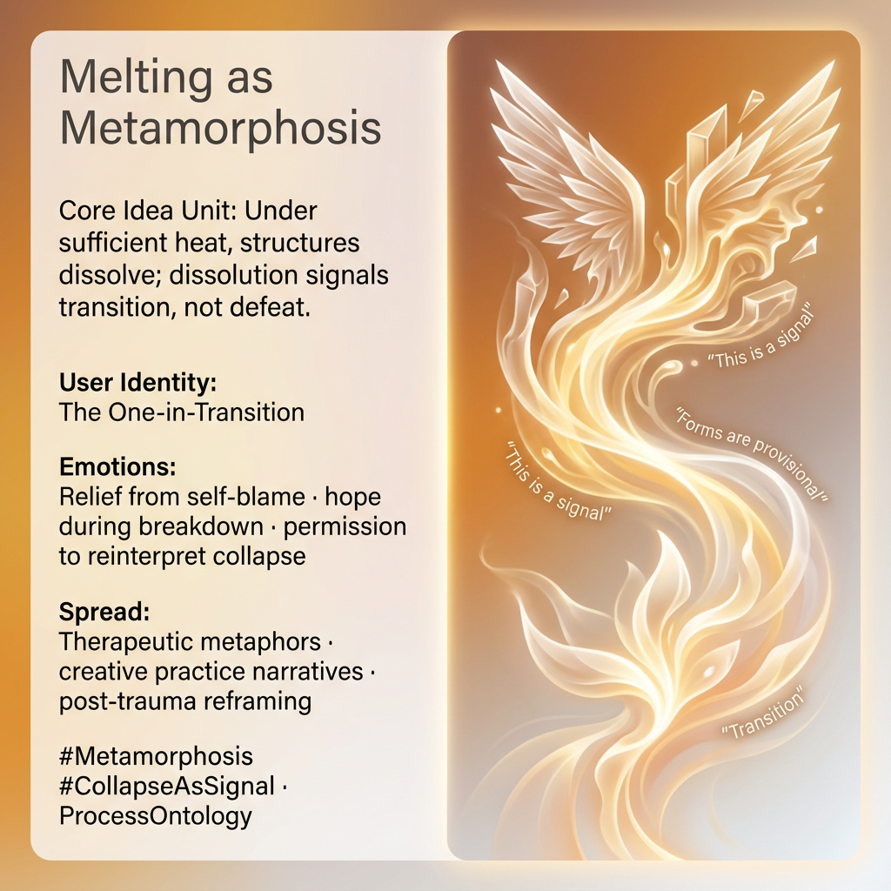

# Embracing Metamorphosis: Transformative Collapse

Created at 2025/12/28 3:50 PM

## **Melting as Metamorphosis (Not Failure)**

[HUBRIS: A Memetic Reversal of Icarus in the Age of Artificial Intelligence](https://memeticcowboy.substack.com/p/hubris-a-memetic-reversal-of-icarus)

### ∴ Core Idea Unit

Under sufficient heat, structures dissolve. This dissolution is not collapse but signal—marking transition into a new mode of being.

### ▲ Identity Play & Roles

**Cast role:** The One-in-TransitionThe subject is reframed from failed actor to metamorphic process.

### ≈ Emotional Triggers

- Relief from self-blame
- Hope during breakdown
- Permission to reinterpret collapse

These emotions interrupt shame loops.

### 𐂷 Spread Mechanics

**Distribution Vectors:**

- Therapeutic metaphors
- Creative practice narratives
- Post-trauma reframing

### 𐂷 Spread Mechanics

Style:**Process language, normalization of dissolution, temporal patience.

### ⛨ Defense Reflexes

- Form-as-provisional framing
- Collapse-as-data
- Refusal of final verdicts

### ☷ Memeplex Anchor Points

- Process ontology
- Generative collapse
- Threshold logic

### ✶ Sticky Symbols or Quotes

/ Phrases

Melting wings · heat · liquefaction · threshold

### ∿ Tags

#Metamorphosis · #CollapseAsSignal · #ProcessBeing · #Transition
