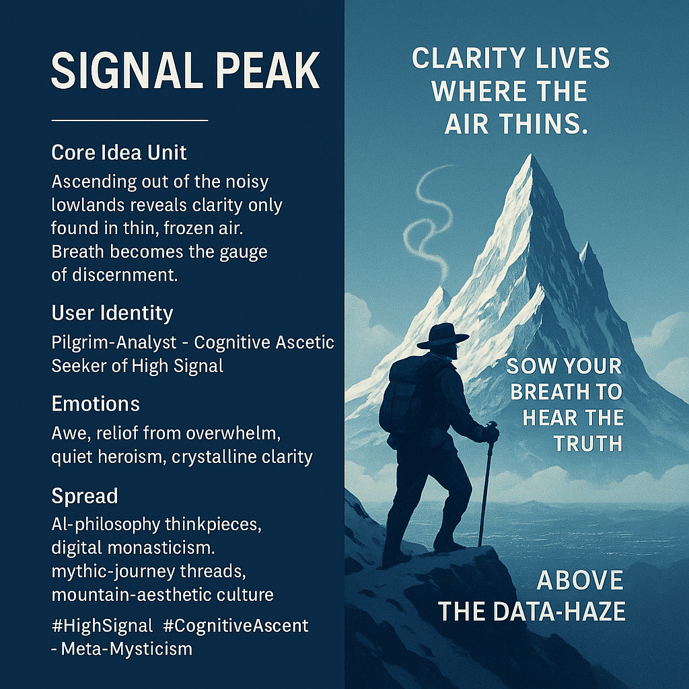

# Clarity Above the Data Haze

Created at 2025/11/28 10:49 AM

### **🧩 Title: Signal Peak**

***

### ∴ Core Idea Unit**

Noise dominates the lowlands; discernment requires ascent. Only in thinner, colder air does the signal separate cleanly from the static. Breath becomes the epistemic barometer — shallow breath = rushed mind; slow breath = clear mind.

***

### ▲ Identity Play & Roles**

- The Pilgrim-Analyst
- The Noise-Weary Seeker
- The Cognitive Ascetic
- The Climber who earns clarity through altitude

This meme casts the user as someone who *leaves the crowded data-plains* and dares to climb toward rarified, mythic air.

***

### ≈ Emotional Triggers**

- Awe of altitude
- Relief from overwhelm
- Quiet heroism
- Sacred solitude
- Cold, crystalline clarity
- A sense of earned revelation

***

### 𐂷 Spread Mechanics**

**Distribution Vectors:** AI-philosophy essays, Instagram mountain aesthetics, X/Twitter meta-threads on discernment, Substack reflections, digital monastery culture.

**Propagation Style:** Mythic seriousness, austere minimalism, ascetic imagery, reflective parable tone.

***

### ⛨ Defense Reflexes**

- **Ascetic Shield:** “If you don’t get it, you haven’t climbed high enough.”
- **Altitude Justification:** Challenges are framed as part of the purification process.
- **Mythic Abstraction:** Keeps critique diffuse by elevating discourse into symbolic terrain.

***

### ☷ Memeplex Anchor Points**

- Mountain mysticism
- Stoic and Zen minimalism
- Epistemic purification
- Neo-monastic digital retreat culture
- Cyber-mythic ascent narratives
- Phenomenology of attention
- Contemplative cognition

***

### ✶ Sticky Symbols & Quotes**

**Symbols:** Frozen thought · Thin air · Signal Peak glyph △· Breath gauge · Blue-white wind

**Quotes / Phrases:**

- “Clarity lives where the air thins.”
- “Frozen thoughts hold their shape.”
- “You must slow your breath to hear the truth.”
- “Climb above the data-haze.”

***

### ∿ Tags**

#HighSignal #CognitiveAscent · Meta-Mysticism #ThinAirThinking #DiscernmentQuest #MythicAnalytics

## Resources
- https://object.me.bot/front-img/users/send/img/1764355754914_c4zhf/15bb9e46-5bea-47a3-969a-da397e15832b.png

## Insight

* The image aptly encapsulates the notion of "Signal Peak," a metaphorical representation of achieving clarity and insight by transcending the chaotic noise of everyday life. This symbolic ascent emphasizes the idea that discernment is often found at higher, more solitary altitudes, both literally and figuratively.

* The depiction of the climber embodies the emotional triggers associated with this journey: awe, relief, and a sense of quiet heroism. The mountain in the background serves as a reminder of both the beauty and the challenges inherent in the pursuit of deeper understanding amidst an overwhelming information landscape.

* The phrase "Clarity lives where the air thins" resonates with philosophical concepts such as stoicism and zen thinking, which advocate for simplicity and focus as paths to wisdom. This connects to the user identities such as the "Cognitive Ascetic," who strives for mental clarity by divesting from distractions.

* The image’s evocative symbolism—like the breath as an epistemic barometer—highlights the relationship between physical presence and mental clarity. This theme aligns with practices in mindfulness and meditation, where awareness of one’s breath is fundamental to achieving a quieter mind.

* By framing cognitive challenges as part of a "purification process," the image creates a narrative that encourages individuals to embrace the hardships of their quest for understanding, suggesting that the real value lies in the journey itself rather than the destination. This resonates deeply with various mythic narratives, where the hero's journey often entails personal trials leading to enlightenment.
