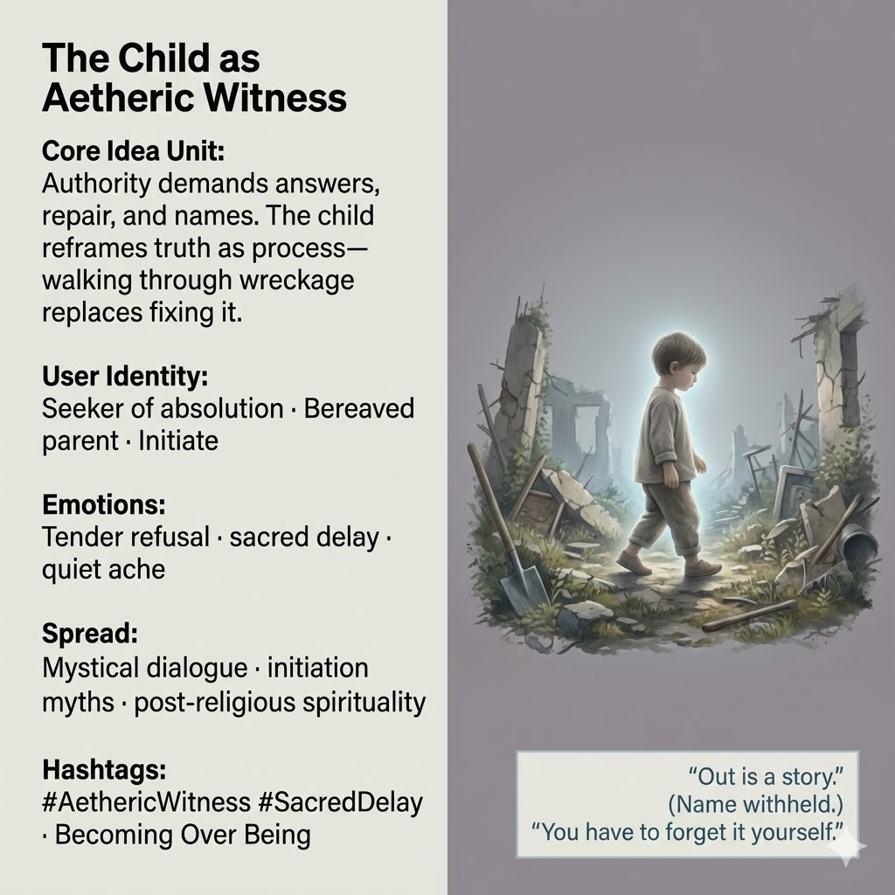

# Witnessing Truth Through the Child's Journey

Created at 2025/12/20 1:53 PM

## 🧩 **The Child as Aetheric Witness**

***

### ∴ Core Idea Unit

Authority seeks answers, repairs, and names in order to close the wound.The child refuses closure. Truth is not something to be fixed or possessed, but a **process of walking through what remains**. Meaning emerges by passage, not by solution.

**Mental shift provoked:**From *“Tell me what it means”* → *“Meaning happens if you stay with it.”*

***

### ▲ Identity Play & Roles

- **Aetheric Witness** — present without intervening, seeing without seizing
- **Initiatory Child** — holds truth without ownership or instruction
- **Refusal Figure** — denies premature resolution without hostility

The meme repositions the self from *seeker of answers* to **participant in unfolding**.

***

### ≈ Emotional Triggers

- 🤍 Tender refusal (care without compliance)
- ⏳ Sacred delay
- 🌫️ Relief from the demand to understand
- 🕊️ Quiet ache without despair

These emotions soften the compulsion to name, fix, or conclude.

***

### 𐂷 Spread Mechanics

**Distribution Vectors**

- Mystical or parabolic dialogue
- Initiation myths and threshold stories
- Post-religious spiritual writing
- Narrative moments where children speak sideways truths

### 𐂷 Spread Mechanics

**Style**

- Minimalist speech
- Withheld answers
- Gentle contradictions
- Phrases that feel incomplete on purpose

***

### ⛨ Defense Reflexes

- **Innocence shield:** The refusal is non-threatening, not oppositional
- **Process framing:** Truth deferred, not denied
- **Non-authority stance:** The child offers no doctrine to attack

Critique fails because nothing is claimed.

***

### ☷ Memeplex Anchor Points

- Non-possessive identity
- Becoming over being
- Apophatic spirituality
- Anti-soteriological ethics
- Witnessing as primary care

***

### ✶ Sticky Symbols or Quotes

/ Phrases**

- “Out is a story.”
- Name withheld
- “You have to forget it yourself.”
- Walking through wreckage
- The child who will not explain

***

### ∿ Tags

#AethericWitness · #SacredDelay · #NonPossessiveIdentity · #BecomingNotBeing · #Initiation · #PostReligiousSpirituality

***

**Reflection cadence (anchor):**This meme resolves a pressure building across the set: when builders erase themselves, systems collapse, and grief becomes load, **the child does not repair**.The child **walks**, and by walking, keeps the world breathable.
