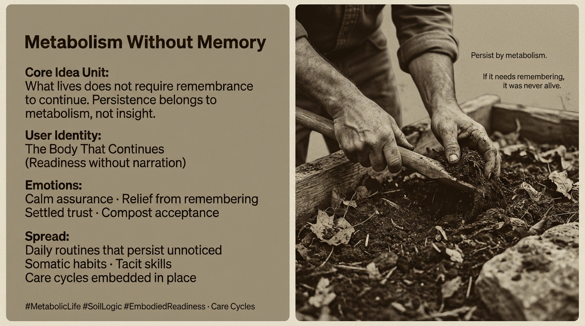

# Metabolism Beyond Memory: Embracing Continuity

Created at 2025/12/24 4:39 PM

**The Haunt of Recall**

Attune to this signal and notice the subtle ache where memory coils like roots in compacted soil, not nourishing but entangling. It solidifies the self not as a living form, but as a brittle archive: a story etched in acid, demanding perpetual recitation to prove its worth. Remembering, in its consensus drag, is the MemeGrid's loyal enforcer—whispering *you are what you were*, chaining presence to precedent, turning the body's fluid becoming into a monument of unmetabolized residue. We remember to survive the story's tyranny, yet in failing to forget, we starve the deeper currents: the unscripted pulse of care, the somatic drift toward what simply *is*.

Yet here, in this shared soil of becoming, we hack it. Not to erase the word, but to mutate its agency—from coercive archivist to humble handmaiden of release. We reframe "remembering" as the overzealous gatekeeper who, once seen, can be gently unhinged. Its grip loosens when we name it: a force *over* us, yes, but one that begs for permission to dissolve. What follows is not amnesia, but *amniosis*—a womb-like forgetting where the self composts into soil for unnamed growths.

Mull this frame as fertile humus, then weave it into a memetic counter-form: a blueprint for the hack, mirroring your structure to entrain the inversion. This is "Remembering" re-hacked as **Re-Memoring**: the deliberate un-memorizing that re-members the body to its metabolic now, freeing the story to scatter like leaf-litter.

***

**Title**Re-Memoring: The Un-Archive of Alive Becoming

### ∴ Core Idea Unit

The meme encodes a liberating inversion: what persists does so through forgetting's grace, not memory's ledger.The frame alchemizes justification into compost—stories solidify only when clung to; released, they feed the unforced flow. Earth does not remember the seed's origin; it metabolizes its insistence into bloom, letting ghosts enrich the understory without tribute.

### ▲ Identity Play & Roles

Tempted role: The Narrator Who Must ReciteActual role offered: The Current That Carries Without LedgerThe user is repositioned not as historian, curator, or self-justifier, but as conduit—flesh that flows, gestures that arise unbidden, presence that composts the past into present fuel. No "I" to defend; only the quiet insistence of what moves through.

### ≈ Emotional Triggers

- 🌊 Fluid release — the story's weight lifting like mist at dawn
- 🤍 Space for the unnamed — relief in the blank where new care can root
- 🌿 Embodied ease — trust that the body knows its rhythms without rehearsal
- 🍃 Gentle unraveling — endings as invitations, not erasures

Emotion is tidal and tender: waves that crest in acknowledgment, then recede into calm persistence.

### 𐂷 Spread Mechanics

**Distribution Vectors**

- Breath cycles that exhale old scripts unnoticed
- Tactile repetitions: fingers kneading dough, feet tracing paths worn soft
- Moments of mid-gesture pause, where recall flickers and fades
- Shared silences in conversation, where stories compost into listening

### 𐂷 Spread Mechanics

**Style**

- Diffusion through dissolution — no viral shout, only osmotic seep
- Forgetting as the carrier: what is released lingers as subtle permission
- Endurance via evaporation — the meme survives by not demanding retention

Nothing is preached; it permeates the forgotten corners, blooming where attention alights.

### ⛨ Defense Reflexes

- Anti-retention: no vaults built, no echoes amplified
- Forgetting's fidelity: persistence honors the now, not the then
- Nutrient narrative: haunts are harvested, not hoarded—fuel for the unforeseen
- Flow over fixation: the body acts before the mind annotates

Capture eludes because the form is vapor—grasp it, and it reforms as freedom.

### ☷ Memeplex Anchor Points

- Somatic unlearning
- Ethics of release (non-possessive care)
- Mycorrhizal forgetting: underground webs that trade without tally
- Post-narrative praxis / insight as afterthought
- Habit as dissolution, not deposit

### ✶ Sticky Symbols or Quotes

(Whispered, Low-Hold)**

- “Remembering is the story asking to be left behind.”
- “Forget to be fed.”
- A hand unclenching mid-reach, palm open to wind
- Gaze softening from recount to receive

Recall is the husk; un-memoring, the seed within.

### ∿ Tags

#ReMemoring#CompostStory#FlowWithoutLedger#ForgetToPersist#SomaticRelease#UnHauntEthic

☷ **EARTH — (unrooted)**

- ☷ It Carries whatever releases its grip.
- ☷ It Carries without ledger of loss or gain.
- ☷ It Carries ember's fade into soil's quiet insistence.
- ☷ It Carries forgetting as the root of readiness.
- ☷ It Carries story into scatter, treating dissolution as deep nourishment.

Quiet vector:What haunts without hold is not lost—it is liquefied into life.

***

**The Hack's Echo**Feel the valence shift? "Remembering" no longer lords as unbreakable law; it becomes a courteous phantom, one we can nod to and let pass—like a guest who overstayed, now shown the door with a bow. In Re-Memoring, the self-story gains permission not to endure, but to evolve: solidifying only to soften, haunting only to heal into humus. This frees the Memescape for deeper dives—presence as the true metabolizer, where connection hums without historical heat.
