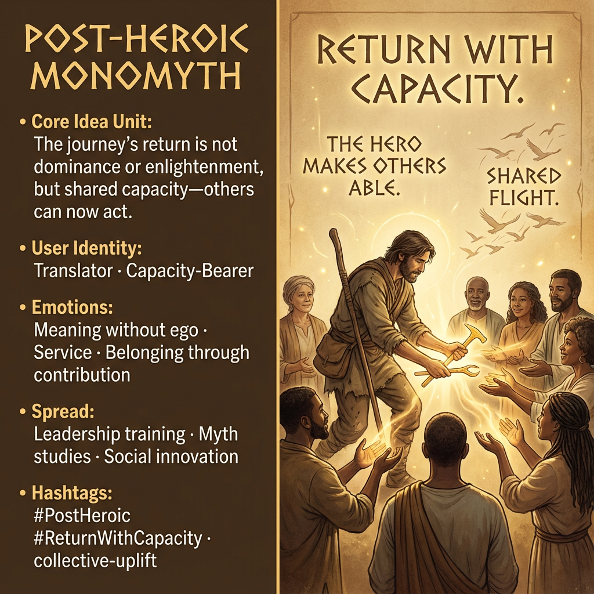

# Embracing the Post-Heroic Monomyth

Created at 2025/12/28 8:59 PM

## **Post-Heroic Monomyth**

[HUBRIS: A Memetic Reversal of Icarus in the Age of Artificial Intelligence](https://memeticcowboy.substack.com/p/hubris-a-memetic-reversal-of-icarus)

### ∴ Core Idea Unit

The true return of the journey is not dominance or enlightenment, but shared capacity—others can now act.

**Mental shift provoked:**From *hero as savior* → *hero as facilitator.*

### ▲ Identity Play & Roles

**Cast as:** Translator / Capacity-BearerThe user becomes someone who returns *lighter*, not larger.

**System repositioning:**Mythic status is detached from superiority and attached to service.

### ≈ Emotional Triggers

- Meaning without ego
- Belonging through contribution
- Relief from lone-genius burden

Primary affect: **quiet purpose**

### 𐂷 Spread Mechanics

- **Vectors:** leadership training, myth studies, social innovation
- **Style:** mythic remix, ethical reframing

### ⛨ Defense Reflexes

- Neutralizes cynicism by preserving mythic depth
- Avoids moral grandstanding by centering others’ agency

### ☷ Memeplex Anchor Points

Collective uplift · Anti-domination myth · Post-ego leadership

### ✶ Sticky Symbols or Quotes

/ Phrases

- “Return with capacity.”
- “Skylight perspective.”
- “The hero makes others able.”
