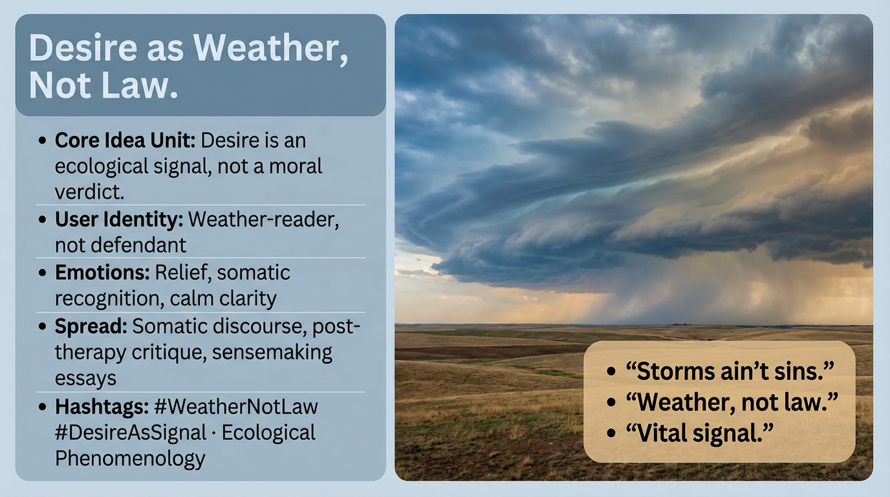

# Desire as Ecological Signal, Not Moral Law

Created at 2026/01/05 10:50 AM

## **Desire as Weather, Not Law**

∴ Core Idea Unit** Desire is an ecological signal, not a moral verdict. Treating it like law converts movement into guilt and self-surveillance.

▲ Identity Play & Roles** Casts the viewer as a *weather-reader* rather than a defendant. Repositions the self from “flawed subject” to sensing organism.

≈ Emotional Triggers** 😮‍💨 Relief · 🌊 Somatic recognition · 🧠 Calm clarity

𐂷 Spread Mechanics**

- **Vectors:** Somatic discourse, post-therapy critique, sensemaking essays
- **Style:** Gentle reframing, ecological metaphor, anti-shame tone

⛨ Defense Reflexes** Deflects critique by refusing prescriptive claims. “Weather” dissolves blame without denying consequence.

☷ Memeplex Anchor Points** Ecological phenomenology · Anti-puritan ethics · Signal-based psychology

✶ Sticky Phrases / Symbols** “Storms ain’t sins” · “Weather, not law” · “Vital signal”

∿ Tags** #DesireAsSignal · #WeatherNotLaw · #AntiShame

## Resources
- https://object.me.bot/front-img/users/send/img/1767639036673_c4zhf/4cbcecf3-6e93-465d-a8fb-559ed40175a1.png

## Insight

* The metaphor of "Desire as Weather" suggests that understanding our desires should be akin to reading weather patterns, where differing conditions are observed and interpreted rather than judged or legislated. This shift helps to cultivate a mindset that is more about awareness and acceptance, rather than guilt and self-condemnation, mirroring how meteorologists analyze atmospheric conditions without moral implications.   
* Viewing oneself as a "weather-reader" emphasizes a more dynamic and fluid identity, encouraging self-exploration in the face of diverse emotional experiences such as relief and somatic recognition. This standpoint aligns with ecological phenomenology, which advocates for a holistic understanding of human experience within the broader environment.  
* The emotional triggers identified—relief, calm clarity, and somatic recognition—indicate a liberating shift from guilt to acceptance. Engaging with one's desires as signals can prompt deeper self-awareness and understanding, fostering a sense of serenity and balance in navigating life’s complexities.  
* The phrase "storms ain’t sins" encapsulates the anti-shame ethos inherent in this idea, reinforcing that intense emotions or desires should not invoke feelings of moral failing but rather be seen as valuable signals to guide personal growth.  
* The promotion of post-therapy critique and sensemaking essays within this framework highlights an ongoing cultural conversation aimed at deconstructing traditional notions of morality in favor of recognizing the importance of environmental context in shaping emotions and desires, thus encouraging dialogue and reflection rather than punitive measures.  
