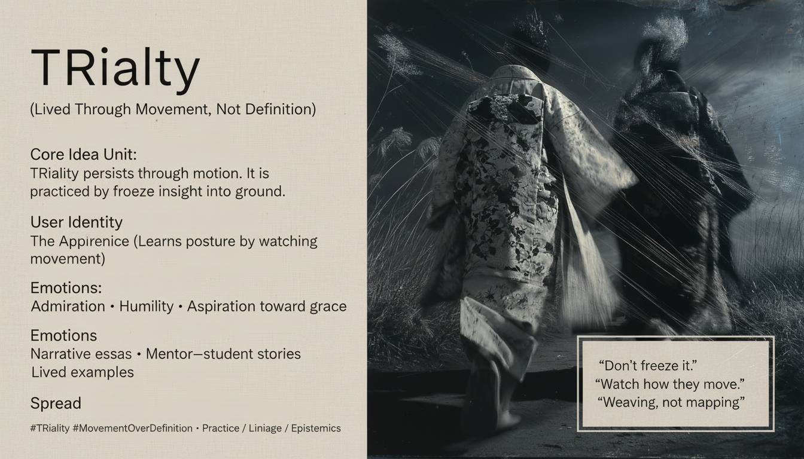

# Embodying TRIality: Movement Over Definition

Created at 2026/01/20 2:24 PM

## 🧩 **TRIality Is Lived Through Movement, Not Definition**

***

## 🧠 Core Narrative Structure

Structures can be named.Frameworks can be mapped.But **naming is not inhabiting**.

When insight is frozen into definition, it becomes ground—something to stand on, defend, or own.

**TRIality resists this move.**It does not live in taxonomies or explanations, but in **motion**:

- in how one shifts frames without betrayal
- in how coherence is held without closure
- in how understanding remains permeable to correction

TRIality manifests as a **refusal to freeze insight into identity or ground**, and as a willingness to keep moving even after clarity appears.

***

### ∴ Core Idea Unit

**Essential belief encoded:**TRIality cannot be secured by definition; it only persists through lived movement.

**Mental shift provoked:**From *“How do we define TRIality?”* → *“How do we practice staying unfrozen once we recognize it?”*

The meme relocates TRIality from concept to **conduct**.

***

### ▲ Identity Play & Roles

**Apprentices / Next-Generation Thinkers / Co-Creators**

- Learn by watching how elders move, not what they claim
- Absorb posture before principle
- Inherit grace rather than doctrine

**Implicit Contrast:**

- Experts who turn insight into territory
- Teachers who mistake explanation for transmission

**Repositioning:**From *mastery through articulation* → *competence through motion*From *claiming insight* → *remaining reachable by it*

***

## ≈ Emotional Hooks & Cognitive Levers

- 🌱 **Admiration** — for those who move without freezing
- 🕊️ **Generational humility** — learning as inheritance, not conquest
- ✨ **Aspiration toward grace** — elegance without ownership
- 🧭 **Orientation over certainty** — knowing how to move, not where to land

**Primary lever:**Shifts aspiration from *being right* to *moving well*.

***

### ⛨ Defense Reflexes

- **Anti-definition stance** — refuses final formulations
- **Embodied transmission** — emphasizes example over explanation
- **Permeability protection** — closure treated as loss of practice
- **Non-proprietary posture** — no one “has” TRIality

The meme resists capture by making possession impossible.

***

### ☷ Memeplex Anchor Points

- Practice-over-theory traditions
- Apprenticeship and lineage learning
- Anti-ownership epistemology
- Lived systems thinking
- Grace as epistemic competence
- Post-doctrinal pluralism

This meme travels best through **stories, mentorship, and lived examples**, not diagrams.

***

### ✶ Sticky Symbols or Quotes

& Phrases

- **Movement**
- **Weaving vs mapping**
- **Refusal of closure**
- **Permeability**
- “Don’t freeze it”
- “Watch how they move”

These act as reminders of posture, not propositions.

***

### ∿ Tags

#TRIality · #LivedPractice · #AntiOwnership · #EpistemicGrace · #Apprenticeship · #MovementOverDefinition

***

### Quiet synthesis

**TRIality Is Lived Through Movement, Not Definition** does not deny the value of maps.It warns against mistaking maps for **ways of walking**.

What persists across generations is not the concept itself,but the **grace with which people move once they’ve glimpsed it**.

TRIality survives wherever insight is allowed to remain **in motion**.
