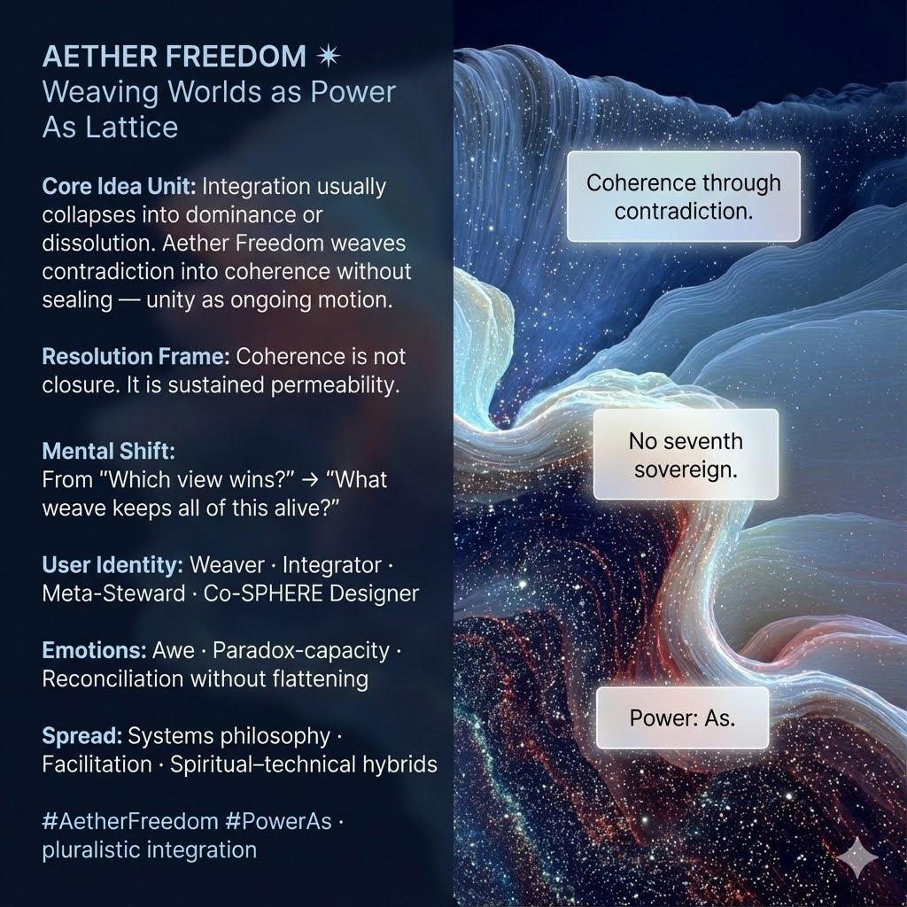

# Aether Freedom: Weaving Coherence from Contradiction

Created at 2025/12/14 1:43 PM

## **Aether Freedom: Weaving Worlds** ✶

***

### ∴ Core Idea Unit

Attempts at integration usually fail in one of two ways:**dominance** (one truth wins) or **collapse** (everything dissolves).

**Aether Freedom names a third mode**:weaving contradictions into **coherence without closure** — unity as *ongoing motion*, not final synthesis.

**Resolution frame:**Integration is not sealing.It is **maintaining permeability while sustaining form**.

**Mental shift provoked:**From *“Which view is right?”* → *“What weave lets all of this stay in motion?”*

***

### ▲ Identity Play & Roles

**Cast the viewer as:**

- **Weaver** — threading incompatible truths
- **Integrator** — holding coherence without flattening
- **Meta-Steward** — caring for the lattice itself
- **Co-SPHERE Designer** — shaping shared worlds without sovereignty

**Repositioning:**The self becomes a **lattice-function** — not a ruler of meanings, but a site where meanings can coexist.

***

## ≈ Emotional Hooks & Cognitive Levers

- ✨ **Awe** — scale without domination
- 🔀 **Reconciliation Without Flattening** — difference survives contact
- 🧠 **Paradox Capacity** — *“I can hold this without resolving it”*

This meme expands agency by **removing the demand for final answers**.

***

### 𐂷 Spread Mechanics

**Distribution Vectors**

- Systems philosophy & meta-theory
- Facilitation and integration practices
- Spiritual–technical hybrid spaces
- Mythic operating manuals & field guides

### 𐂷 Spread Mechanics

**Style**

- Polyphonic language
- Metaphors of weaving, music, lattices
- Refusal of single conclusions

***

### ⛨ Defense Reflexes

- **Anti-Totalization Shield:** No final synthesis allowed
- **Anti-Relativism Guard:** Coherence still required
- **Anti-Mystification Lock:** Functional, not ineffable

Critique must explain **how closed systems outperform open lattices under complexity** — increasingly untenable.

***

### ☷ Memeplex Anchor Points

- Pluralistic integration
- Anti-totalizing synthesis
- Process metaphysics
- Coherence without closure
- IF-Prime elemental Aether (✶)

***

### ✶ Sticky Symbols or Quotes

- ✶ **AETHER**
- 🕸️ *Loom / Lattice*
- 🎼 *Polyphony*
- 🌬️ *Permeability*
- 🚫👑 **“No seventh sovereign.”**
- 🔁 *Coherence through contradiction*

***

### ∿ Tags

#AetherFreedom · #WeavingWorlds · #PowerAs · #PluralisticIntegration · #OpenCoherence · #IFPrime

***

**Reflection anchor:**This meme doesn’t promise resolution.It asks **whether coherence can remain alive when no single voice is allowed to rule — including your own.**
