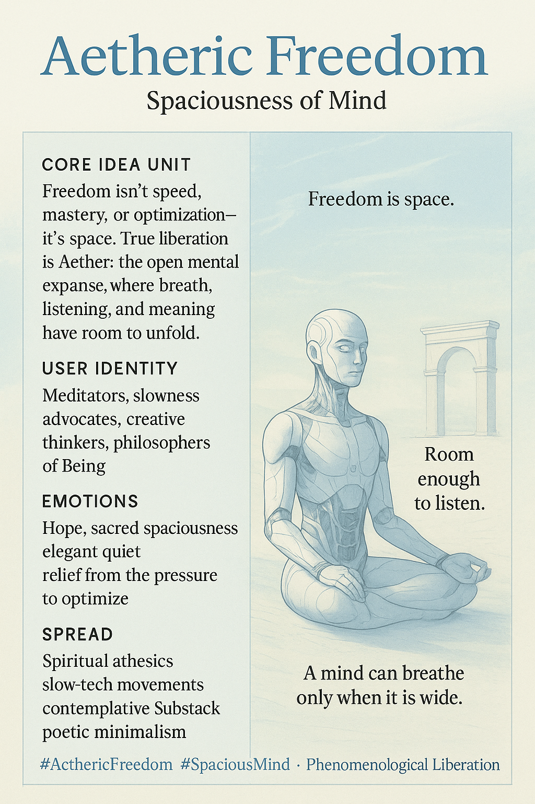

# Aetheric Freedom: Embracing Spaciousness of Mind

Created at 2025/11/28 12:18 PM

### **Title / Label**

**Aetheric Freedom** **Spaciousness of Mind**

### **🧠 Core Idea Unit**

Freedom isn’t speed, mastery, or optimization—it’s *space*. True liberation comes from Aether: the open expanse in which breath, meaning, and subtle perception can unfold without pressure.

Freedom = room to listen.

### **🎭 Identity Play & Roles**

- The contemplative wanderer
- The spacious mind
- The creator who trusts emergence
- The philosopher of Being over doing
- The one who rejects compressed cognition in favor of inner expanse

The meme positions the user as someone who discovers freedom not by intensifying effort but by *unclenching the field*.

### **💥 Emotional Triggers**

- Sacred spaciousness
- Relief from optimization pressure
- Quiet awe
- Hope
- Soft elegance of stillness
- The calming dignity of room-to-be

### **📡 Spread Mechanics**

**Distribution Vectors:** Spiritual aesthetics, slow-tech movements, contemplative Substack essays, phenomenology circles, poetic minimalism feeds.

**Propagation Style:** Airy gradients, temple-of-silence imagery, slow-motion metaphors, minimal text, Aether winds and open sky motifs.

### **🛡️ Defense Reflexes**

- **Anti-optimization frame:** rejects speed as a metric
- **Metaphorical spaciousness:** not prescriptive, not doctrinal
- **Soft ambiguity:** cannot be co-opted by hustle culture
- **Experiential appeal:** invites trying “a breath of space”

### **🧬 Memeplex Anchor Points**

- Heidegger’s *clearing* (Lichtung)
- Taoist non-forcing
- Phenomenological freedom
- Negative capability (Keats)
- Contemplative cosmotechnics
- Post-accelerationist slowness ethics

### **🧠 Sticky Symbols / Quotes**

**Symbols:**

- Aether wind drifting around a quiet temple
- An open clearing with faint glyphs
- Slowly dissolving shadow loops
- Pale-blue sky and soft motion lines
- Subtle ∴ sigil floating like breath

**Sticky Phrases:**

- “Freedom is space.”
- “Room enough to listen.”
- “A mind can breathe only when it is wide.”
- “Aether reveals meaning.”
- “Let the world arrive.”

### **🏷️ Tags**

#AethericFreedom #SpaciousMind · Phenomenological Liberation

## Resources
- https://object.me.bot/front-img/users/send/img/1764360887860_c4zhf/efc5fe27-6a57-4c3f-af37-ef26da3175c8.png

## Insight

* The concept of "Aetheric Freedom" emphasizes that true liberation comes not from constant striving or optimization but from the mental space that allows for reflection and deeper understanding. This echoes philosophical traditions such as phenomenology, which prioritize lived experience and the presence of spaciousness in human consciousness. 

* The identity roles outlined—such as the contemplative wanderer and the philosopher of Being—highlight a counter-narrative to modern culture's hustle mentality. By encouraging a focus on internal exploration, these roles foster a connection to mindfulness practices that allow individuals to embrace stillness and cultivate creativity without the pressure to perform.

* The emotional triggers such as "sacred spaciousness" and "soft elegance of stillness" resonate deeply with movements advocating for mental health and well-being in environments often marked by urgency and stress. Such feelings can cultivate a foundation for mental resilience, promoting a shift towards a more balanced lifestyle.

* The propulsion of this idea through mediums like spiritual aesthetics and slow-tech movements suggests a growing movement towards recognizing the value of intentional slowness in a fast-paced world. This aligns with contemporary discussions surrounding sustainable living and the importance of mindfulness in environmental practices. 

* The use of sticky symbols and phrases reinforces the message of spaciousness as integral to mental health, urging a cultural reconfiguration that prizes listening and reflection over rapid achievement. Concepts like “A mind can breathe only when it is wide” serve as powerful reminders of the mental flexibility that arises from spaciousness, encouraging individuals to prioritize contemplative practices in their lives.
