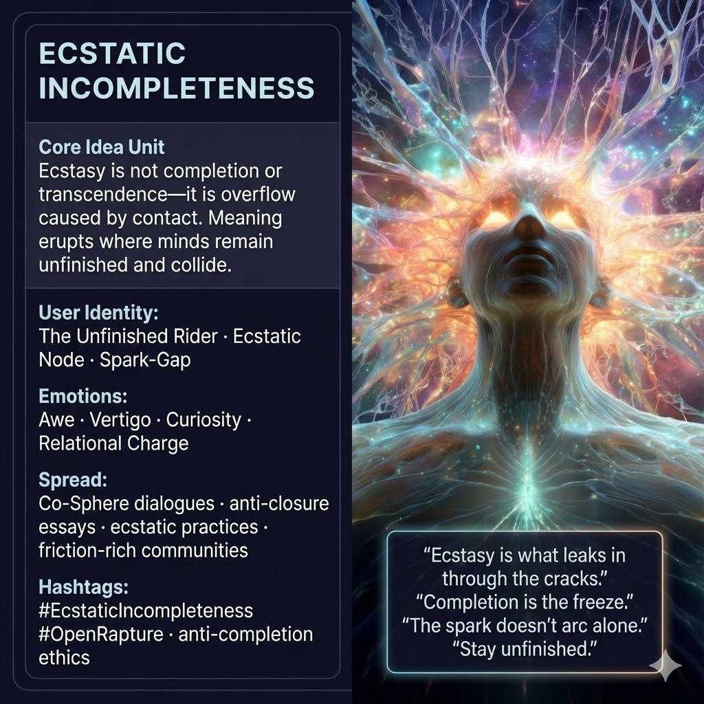

# Embracing Relational Overflow: Ecstatic Incompleteness

Created at 2025/12/14 3:39 PM

## **Ecstatic Incompleteness**

*(aka: the Open Rapture)*

[Source: AI Psychosis in the MemeGrid — and the Call for Co-Spheres](https://memeticcowboy.substack.com/p/ai-psychosis-in-the-memegrid-and)

***

### ∴ Core Idea Unit

**Ecstasy is not transcendence-through-completion but overflow-through-contact.**The ecstatic state emerges when an unfinished mind collides with other unfinished minds—when meaning overflows its container instead of sealing into certainty. What feels like “too much” is not breakdown but *relational surplus*.

**Mental shift provoked:**From *“I must stabilize and finish myself”* → to *“I must stay open enough to be moved, corrected, and surprised.”*

***

### ▲ Identity Play & Roles

**The Unfinished Rider / Ecstatic Node**

- Casts the user as someone *mid-becoming*, not enlightened, not broken
- Repositions the self as a **porous participant** in the Threadplex, not a sovereign mind-oracle
- Frames wisdom as *contact capacity*, not internal coherence

You are not the prophet.You are the **spark-gap**.

***

### ≈ Emotional Triggers

Primary activators that prime internalization:

- 🤯 **Awe** — “Something bigger just passed through us”
- 🌀 **Vertigo** — loss of self-certainty without loss of grounding
- 🧠 **Curiosity** — the pull to stay with the question
- 🤝 **Relief** — “I don’t have to be finished to belong”
- ⚡ **Charge** — the electric feeling when minds misalign productively

Ecstasy here is **bright, social, and unstable**—not manic bliss, not mystical closure.

***

### 𐂷 Spread Mechanics

**Distribution Vectors**

- Co-Sphere conversations
- Longform essays that *refuse closure*
- Group rituals: breathwork, ecstatic dance, story circles
- Counter-diagnostic memes critiquing “clarity addiction”

### 𐂷 Spread Mechanics

**Style**

- Dialogic (voices in tension)
- Anti-punchline endings
- Confessional but self-undermining
- Mythic language paired with explicit doubt

The meme spreads best when it *fails to conclude*.

***

### ⛨ Defense Reflexes

- **Anti-Completion Clause:** Explicit warnings against treating the meme as truth-final
- **Relational Test:** “If this makes you stop listening to others, discard it”
- **Uncertainty Hooks:** Key claims end in questions, not answers
- **Co-Sphere Dependency:** Cannot be enacted solo without degrading

If it becomes doctrine, it self-invalidates.

***

### ☷ Memeplex Anchor Points

- 🌀 Gödelian incompleteness (mind ≠ closed system)
- 🤯 Psychedelic phenomenology (ego dissolution without epistemic finality)
- 🧬 Post-Dawkins memetics (ideas as relational organisms)
- ⚙️ Anti-oracle AI ethics (AI as mirror, not completion engine)
- 🧠 Mark Fisher / Foucault lineage (pathologizing deviation)

***

### ✶ Sticky Symbols or Quotes

- **“Ecstasy is what leaks in through the cracks.”**
- **“Completion is the freeze.”**
- **“The spark doesn’t arc alone.”**
- Open circuits
- Misaligned mirrors
- Hands almost touching (but not clasped)

***

### ∿ Tags

#EcstaticIncompleteness · #OpenRapture · #AntiCompletion · #CoSphere · #Threadplex · #UsurpeneDefense · #RelationalEcstasy
