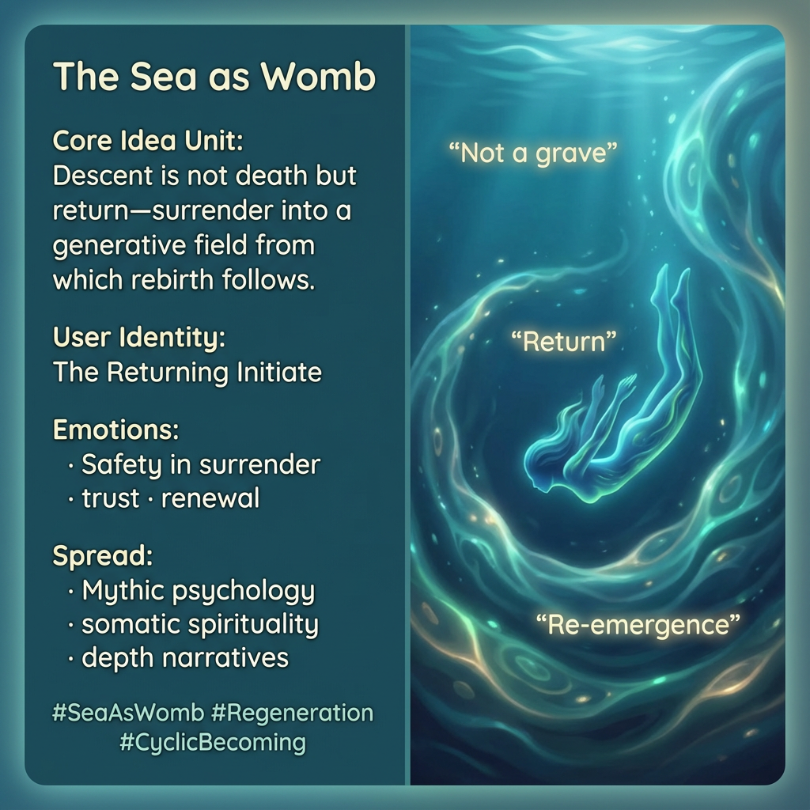

# Embracing Return: The Sea as Womb

Created at 2025/12/28 4:29 PM

## **The Sea as Womb, Not Grave**

[HUBRIS: A Memetic Reversal of Icarus in the Age of Artificial Intelligence](https://memeticcowboy.substack.com/p/hubris-a-memetic-reversal-of-icarus)

### ∴ Core Idea Unit

Descent is reinterpreted as return rather than death. What appears as loss becomes re-entry into a generative, pre-differentiated field from which rebirth emerges.

### ▲ Identity Play & Roles

**Cast role:** The Returning Initiate The subject is permitted to surrender without self-erasure, trusting cyclic renewal.

### ≈ Emotional Triggers

- Safety in surrender
- Relief from catastrophic framing
- Trust in cycles
- Gentle hope during descent

These emotions soften resistance to necessary dissolution.

### 𐂷 Spread Mechanics

**Distribution Vectors:**

- Mythic psychology
- Somatic spirituality
- Depth narratives

**Propagation Style:** Maternal metaphors, cyclic storytelling, reassurance through recurrence.

### ⛨ Defense Reflexes

- Reframing death as phase
- Emphasizing continuity beneath form
- Valuing return over ascent

### ☷ Memeplex Anchor Points

- Regenerative cosmology
- Death–rebirth cycles
- Depth over height

### ✶ Sticky Symbols / Phrases

Sea · womb · primordial potential · re-emergence

∿ **Tags:** #SeaAsWomb · #Regeneration · #CyclicBecoming · #SafeDescent

## Resources
- https://object.me.bot/front-img/users/send/img/1766968181173_c4zhf/86d607de-50e6-4048-a4b5-6ff8be72a4c1.png

## Insight

* The imagery of the sea as a womb evokes the concept of fluidity and restoration, aligning with the philosophical idea that descent can represent transformation rather than demise. This interpretation draws from ancient mythologies where water, particularly the ocean, is often associated with life, creation, and rebirth, reminiscent of the myth of the primordial sea from which life first emerged.

* The role of "The Returning Initiate" suggests a developmental journey where individuals can embrace vulnerability and surrender without losing their identity. This aligns with psychological frameworks that emphasize the importance of resilience and the re-integration of experiences rather than viewing them through the lens of loss.

* Emotional triggers like safety in surrender and trust in renewal highlight a significant shift in perspective regarding challenges and transitions. This mirrors contemporary therapeutic practices such as somatic experiencing, which focus on sensing the body’s experiences to foster healing and growth.

* The concept of cyclical storytelling, as highlighted in the hint, echoes literary traditions where narratives repeat themes of death and rebirth, such as in Joseph Campbell's "Hero's Journey." This cyclical approach resonates with cultural folklore, which often illustrates life as a series of transformative phases rather than a linear progression.

* The use of symbols like "re-emergence" and "primordial potential" reinforces the philosophical idea of regenerative cosmology, where existence is seen as an ongoing cycle of creation and dissolution. This resonates with ecological models that emphasize sustainability and the cyclical nature of life in ecosystems, thus broadening the context of these concepts to include both individual and environmental renewal.
