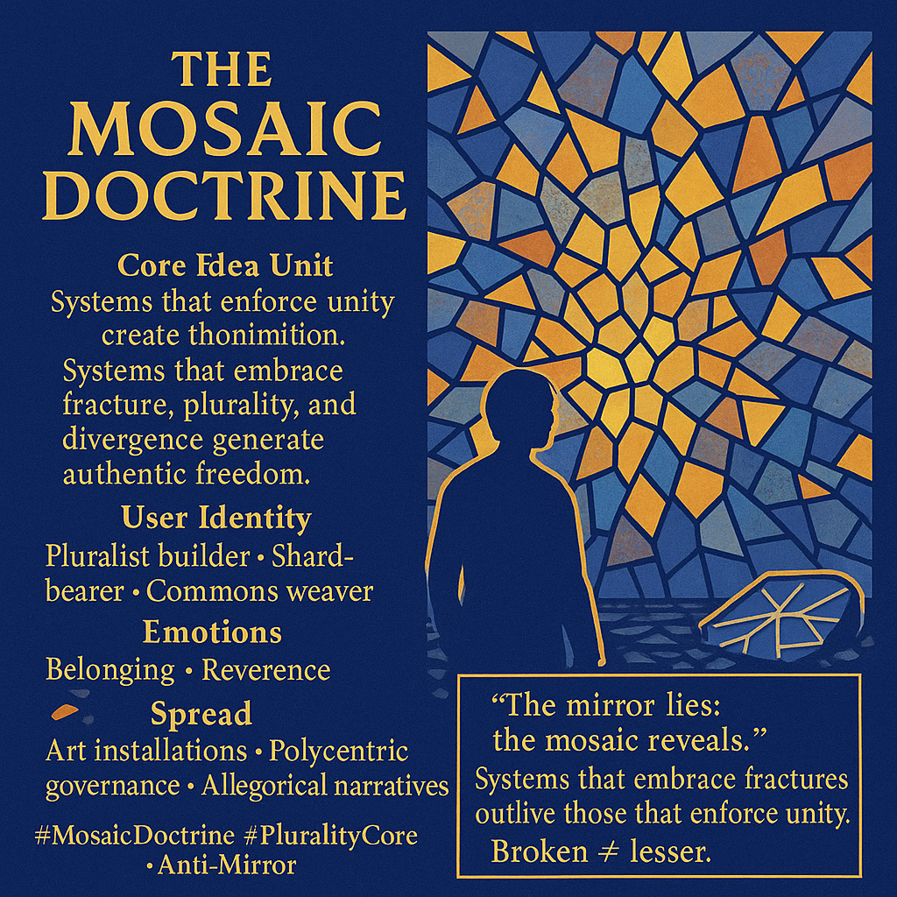

# Embracing Fractures: The Mosaic Doctrine

Created at 2025/12/05 10:43 AM

## **🧩 Title: The Mosaic Doctrine**

*(Alt shorthand: **Mosaic > Mirror**)*

***

## **🧠 Core Idea Unit**

Unity enforced through singular identity creates domination, fragility, and erasure. Multiplicity—fracture, divergence, shard-logic—creates resiliency and authentic freedom.

Mental pivot: *A mirror demands coherence; a mosaic demands participation.*

***

## **🎭 Identity Play & Roles**

- **Pluralist builder** crafting structures from many incompatible pieces
- **Shard-bearer** who holds brokenness as generative rather than shameful
- **Commons weaver** coordinating without coercing
- **Anti-mirror dissident** refusing unity myths

Identity shifts from “I must unify” → “I can hold many truths simultaneously.”

***

## **💥 Emotional Triggers**

- **Belonging:** difference becomes a contribution, not a deviation
- **Reverence:** fracture as sacred aesthetic of reality
- **Defiance:** rejecting the tyrannical demand for sameness
- **Relief:** pressure to self-cohere dissolves into plural acceptance

***

## **📡 Spread Mechanics**

**Distribution Vectors:**

- Installation art; mosaic symbolism
- Polycentric governance forums
- Narrative allegories in theory-literature
- Meme cards contrasting mosaics and mirrors
- Decentralized tech communities

**Propagation Style:**

- Poetic paradox (“broken is truer than whole”)
- Visual symbolism (shards, tessellation)
- Anti-monolithic governance critique
- Soft philosophical defiance

***

## **🛡️ Defense Reflexes**

- **Plurality shield:** critique of inconsistency is reframed as mirror-thinking
- **Anti-dogma posture:** refuses singular interpretation
- **Fracture-as-strength framing:** incoherence is a feature, not a flaw
- **Distributed authorship:** no point of failure, no orthodoxy to attack

***

## **🧬 Memeplex Anchor Points**

- Polycentric governance theory
- Meta-modern pluralism
- Post-structuralist difference
- Cybernetic diversity and multistability
- Anti-essentialist identity politics
- Complexity science and “unity without uniformity”

***

## **🧠 Sticky Symbols & Quotes**

**Symbols:**

- Broken ceramic shards forming a coherent pattern
- A shattered mirror turned outward as mosaic tiles
- Multi-color tessellations
- Fractured circles / un-symmetric mandalas
- Commons-style weaving of mismatched pieces

**Sticky Phrases:**

- “Systems that embrace fractures outlive those that enforce unity.”
- “Broken ≠ lesser; broken = plural.”
- “The mirror lies; the mosaic reveals.”
- “Fragmentation is a civic virtue.”
- “Difference is the substrate of freedom.”

***

## **🏷️ Tags**

#MosaicDoctrine #PluralityCore #AntiMirror #PolycentricEthics #FractureAsStrength #CyberDiversity #MetaPluralism

## Resources
- https://object.me.bot/front-img/users/send/img/1764960213587_c4zhf/0fc12758-57b8-4329-8a99-4f5f33a04771.png

## Insight

* The concept of the "Mosaic Doctrine" presents a philosophical framework emphasizing the strength of diversity and multiplicity over enforced unity, suggesting that systems embracing fractures foster authentic freedom. This aligns with contemporary discussions in complex systems theory, where resilience is often attributed to diversity and adaptable structures. 

* The visual representation of a mosaic signifies the core idea that fragmented identities and experiences can create cohesive beauty, reinforcing the notion that diversity should be seen as a strength rather than a liability. Historical artifacts, like Byzantine mosaics, exemplify this, illustrating how disparate pieces can form a unified artistic statement.

* The idea of identity as fluid and pluralistic resonates with current conversations around intersectionality, which aim to validate multiple identities and coexistences, stressing that each layer adds value to one's identity, much like the various colors and shapes in a mosaic. This contrasts sharply with traditional monolithic views of identity.

* Emotional triggers identified within the doctrine—such as belonging and reverence—underscore the human need for connection while respecting individual differences. These sentiments are crucial in community-building frameworks, where inclusive practices acknowledge and celebrate diversity.

* The use of art and allegory as distribution vectors supports the idea that visual and narrative representation can effectively communicate complex philosophical ideas. This method engages broader audiences, making abstract concepts more relatable, thus promoting discourse on identity and societal structures. 

* The phrase “broken ≠ lesser” encapsulates the central ethos of the doctrine, challenging prevailing narratives that equate wholeness with value, suggesting instead that fragmentation can lead to richer, more varied expressions of identity and community. This aligns with movements in art and culture that celebrate imperfection and vulnerability.
