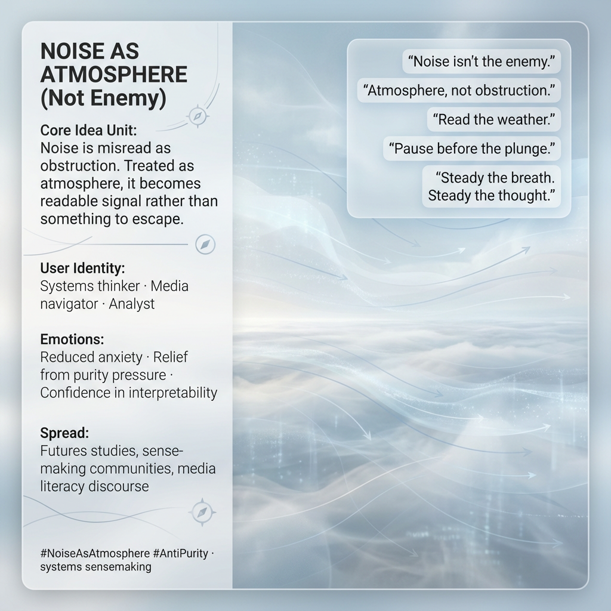

# Embracing Noise as Readable Atmosphere

Created at 2025/12/18 9:11 PM

## 🧩 **Noise as Atmosphere (Not Enemy)**

***

## ∴ Core Idea Unit

Noise is usually misread as obstruction. When treated as *atmosphere*, it becomes readable—context rather than interference, weather rather than weapon.

**Mental shift provoked:** From *“I must eliminate noise”* → *“I can read the air.”*

***

## ▲ Identity Play & Roles

**Cast as:** Systems thinker · Media navigator · Strategist

The meme positions the self as a *meteorologist of meaning*—someone who doesn’t panic at saturation but learns to orient within it. Authority comes from composure under complexity.

***

## ≈ Emotional Hooks & Cognitive Levers

- 🌬️ Reduced anxiety in chaotic environments
- 🧠 Relief from the impossible demand for purity
- 🧭 Confidence that overwhelm is interpretable
- 🫁 Calm through breath and pacing

These levers convert overload into legibility.

***

## 𐂷 Spread Mechanics

**Distribution vectors:**

- Futures studies and foresight work
- Sense-making and systems communities
- Media literacy and information ecology discourse

**Propagation style:** Reframing, stabilizing, non-alarmist. Often appears as a counter-move to panic narratives.

***

## ⛨ Defense Reflexes

- Immune to purity tests (“no signal without noise”)
- Deflects urgency by reclassifying chaos as context
- Resists adversarial framing of information environments

Critique weakens because the meme refuses the enemy frame entirely.

***

## ☷ Memeplex Anchor Points

- Complex systems thinking
- Anti-purity epistemics
- Attention ecology
- Media saturation theory
- Elemental cognition (Air as atmosphere)

***

## ✶ Sticky Symbols or Quotes

- “Noise isn’t the enemy.”
- “Atmosphere, not obstruction.”
- “Read the weather.”
- “Drift before dive.”
- Breath steadying thought

***

## ∿ Tags

#NoiseAsAtmosphere · #AntiPurity · #SystemsThinking · #Sensemaking · #AttentionEcology · #AirElement

***

**Reflection anchor:** Noise ain’t the enemy. It is atmosphere—something to read, not escape. In a world saturated with chaos, Air parts the noise by pausing before the plunge, steadying thought by steadying breath.

## Resources
- https://object.me.bot/front-img/users/send/img/1766121068667_c4zhf/5470b1c5-4721-4800-a486-438a4f6b1628.png

## Insight

* Noise recontextualizes how individuals perceive chaos, transforming it from a deterrent into a viable atmospheric context, crucial for navigating complex environments. This shift aligns with the concept in systems thinking, where understanding interconnectedness rather than isolation is vital for clarity in decision-making.  
* The idea of the self as a "meteorologist of meaning" encapsulates the essential role of adaptability. Just as meteorologists interpret weather patterns, individuals learn to navigate complexity by interpreting noise, fostering resilience in overwhelming situations.  
* Emphasizing emotional anchors enhances cognitive stability. Techniques that promote calmness, such as breath control, directly correlate with stress reduction, reinforcing the notion that maintaining composure allows for better interpretation of information.  
* The concept of "anti-purity" challenges traditional epistemological frameworks. It encourages embracing the inherent noise in information ecosystems, acknowledging that clarity and truth often reside in complexity rather than in simplistic or binary views.  
* Distribution in fields like media literacy and futures studies underscores the imperative of sound interpretation skills in the face of information saturation. As complexity increases, so does the necessity for tools and skills that promote effective sense-making rather than reactionary responses.  
* Sticky quotes such as “Pause before the plunge” evoke the importance of reflection amid overload. This mirrors practices in mindfulness and situational awareness, where thoughtful pauses can lead to more informed, less impulsive actions in chaotic contexts.  
* Overall, rethinking noise as an atmosphere rather than an obstruction invites a broader conversation about how society can adapt to and thrive in information-rich environments, promoting innovation and diversity in thought processes and practices.
