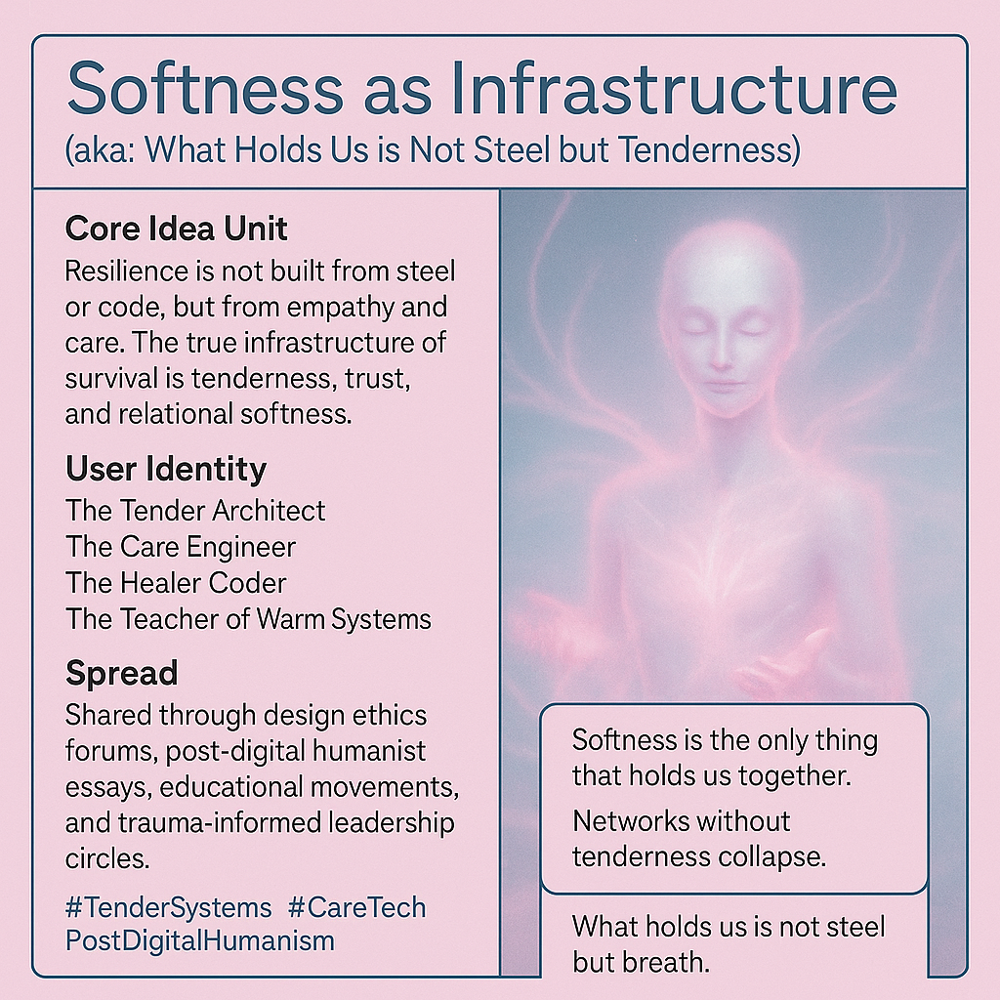

# Emotional Infrastructure: Resilience through Tenderness

Created at 2025/11/03 9:26 AM

**🧩 Title: Softness as Infrastructure** *(aka: “What Holds Us is Not Steel but Tenderness”)*

***

∴ Core Idea Unit:** The meme reframes resilience: it’s not built from steel and code, but from empathy and care. In an age of automation and cold efficiency, the real infrastructure of survival is tenderness, trust, and relational softness.

***

▲ Identity Play & Roles:** Positions the user as the **Tender Architect** — one who designs through feeling rather than force. They are the **Care Engineer**, the **Teacher of Warm Systems**, the **Healer-Coder** who rebuilds civilization through emotional intelligence and compassion.

***

≈ Emotional Triggers:**

- 😢 Mourning for lost connection
- 💗 Yearning for warmth and belonging
- 🤖 Discomfort at emotional automation
- 🌬️ Relief at rediscovering gentleness

***

𐂷 Spread Mechanics:**

- **Distribution Vectors:** Shared through design ethics conferences, feminist/posthumanist essays, education reform discourse, and emotional resilience communities.
- **Propagation Style:** Poetic aphorism, quiet manifesto tone, slow aesthetics—carried by soft visuals and empathic storytelling.

***

⛨ Defense Reflexes:**

- **Moral Framing:** Positions softness as ethical strength, not weakness.
- **Semantic Shield:** Redefines “infrastructure” to mean emotional interdependence, making critique of sentimentality seem miscalibrated.
- **Tone Armor:** Uses grace and empathy to disarm cynicism.

***

☷ Memeplex Anchor Points:**

- 💞 Feminist ethics of care
- 🌐 Post-digital humanism
- 🤲 Trauma-informed leadership
- 🕊️ Regenerative design and community resilience
- 💧 Emotional intelligence in technology

***

✶ Sticky Symbols or Quotes:**

- “Softness is the only thing that holds us together.”
- “Children raised by algorithms who never hear their names sung with love.”
- “Networks without tenderness collapse.”
- “What holds us is not steel but breath.”
- **Visuals:** flowing pink light (Sentaria’s glow), hands in mist, water currents, woven threads of light.

***

∿ Tags:** #TenderSystems · #CareTech · #PostDigitalHumanism · #EmotionalInfrastructure · #FeministDesign

## Resources
- https://object.me.bot/front-img/users/send/img/1762190791929_c4zhf/241be22b-4fae-40a4-be99-4cadc5e3afe9.png

## Insight

* The concept of "Softness as Infrastructure" challenges conventional notions of resilience, suggesting that emotional connections and empathy create a stronger foundation for community and support than traditional structures made of steel or technology. This reflects a growing movement in design and organizational theory that values human relationships over efficiency.

* The identities described, such as the Tender Architect and the Care Engineer, illustrate a shift towards roles that emphasize emotional intelligence. This aligns with feminist ethics of care, positing that nurturing and support are vital in not just personal relationships but in broader organizational and community frameworks as well.

* Emotional triggers outlined, such as mourning for lost connections and yearning for belonging, resonate deeply in our increasingly automated world. The contrast between “emotional automation” and the desire for genuine connection highlights the tension many feel between technological advancement and the need for human warmth.

* The propagation style of this message through aesthetics and storytelling underscores a deliberate choice to evoke emotion rather than logic, which can be more impactful in fostering community resilience. This approach is reflective of post-digital humanism, which seeks to re-center human experience in a tech-dominated culture.

* The quotes and symbols associated with the theme reinforce the idea that tenderness and emotional engagement are essential for sustaining networks and communities. Such concepts are vital when considering trauma-informed leadership and regenerative practices, emphasizing that care and emotional labor are integral to societal rebuilding.

* The tags, including #TenderSystems and #CareTech, facilitate conversations around the intersections of technology and emotional intelligence. These discussions are crucial in developing frameworks that prioritize human well-being amid rapid technological growth, fostering environments where care is recognized as foundational infrastructure.
