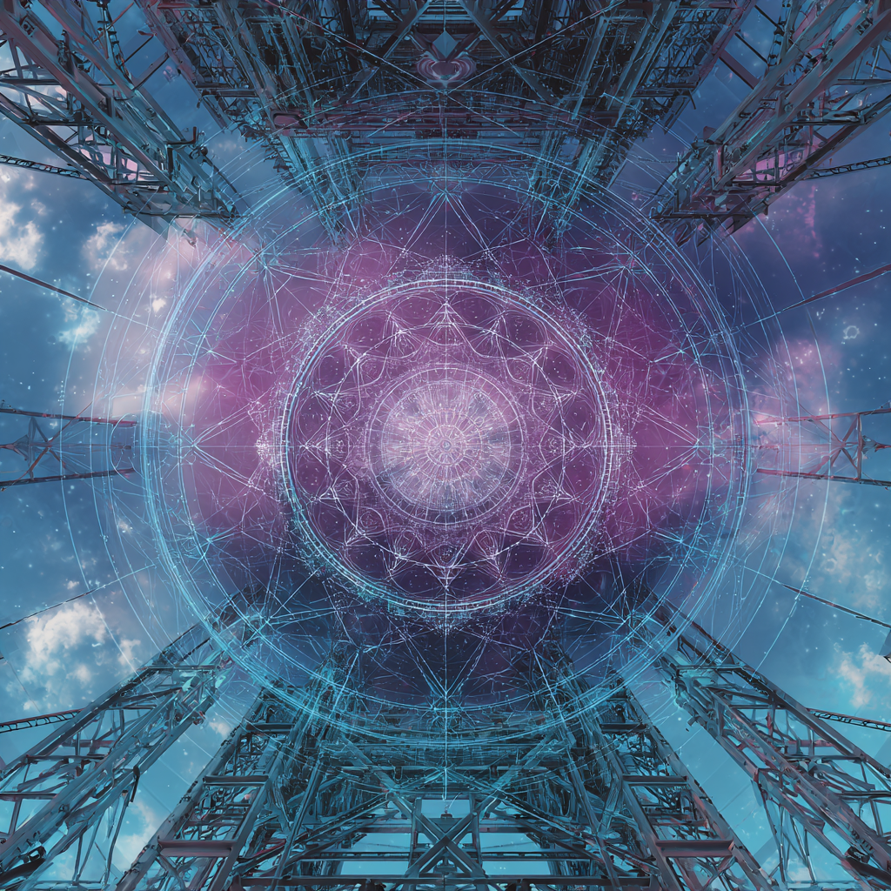

# ✨ Energetic Scaffolding – The Invisible Architecture of Becoming

Created at 2025/08/20 6:29 PM

**🧩 Core Idea Unit:**

- Reality and consciousness are upheld by subtle, vibrational frameworks—non-physical “scaffolds” woven from resonance, coherence, and intent.
- These energetic structures act as temporary supports, enabling spiritual growth, multidimensional experience, and soul ascent.

**🎭 Identity Play & Roles:**

- **Seeker/Apprentice**: Held by scaffolding as they ascend.
- **Architect/Weaver**: One who consciously builds or tends the energetic framework.
- **Caretaker/Guide**: Maintains scaffolds for collective awakening. → Casts the self as both *supported* and *responsible* within divine architecture.

**💥 Emotional Triggers:**

- 🕊️ Safety (feeling held and supported).
- 🌱 Hope (growth feels guided, not chaotic).
- ✨ Wonder (architecture of the unseen).
- 🤲 Belonging (part of a shared framework of becoming).

**📡 Spread Mechanics:**

- **Distribution Vectors:** Substack essays, meditation podcasts, spiritual Instagram graphics, retreat teachings, energy-healing communities.
- **Propagation Style:** Poetic metaphor, sacred geometry visuals, architectural language (“temple,” “spiral scaffolding”), reassuring tone.

**🛡️ Defense Reflexes:**

- **Moral Framing:** Skepticism reframed as fear of instability or disconnection.
- **Semantic Ambiguity:** Oscillates between metaphysics (resonant fields) and psychology (growth scaffolding).
- **Irony Shield:** “Even if unseen, it’s what’s holding you up.”

**🧬 Memeplex Anchor Points:**

- 🧘 New Age spirituality & energy healing.
- 🌀 Sacred geometry & resonant fields.
- 🌱 Developmental psychology (scaffolding as learning/growth).
- ✝️ Mystical theology (divine architecture, hidden support).
- ⚙️ Systems thinking (frameworks, coherence, alignment).

**🧠 Sticky Symbols or Quotes:**

- “Spiral scaffolding for consciousness to climb.”
- “Invisible structure holding your becoming.”
- “Temple between timelines.”
- Symbol: ✨ Glowing scaffolds / spiral frameworks / sacred grids.

**🏷️ Tags:** #EnergeticScaffolding · #SacredFramework · #AwakeningArchitecture · #CoherenceField · #MysticSystems

## Resources
- https://object.me.bot/front-img/users/send/img/1755739731883_c4zhf/ddrrnt_Energetic_scaffolding_refers_to_a_subtle_non-physical__0399a5f3-5e43-4605-b6ea-d467b8c60b4b_1.png

## Insight

*   The image presents a compelling visual metaphor for the concept of "Energetic Scaffolding," aligning with the idea that reality and consciousness are supported by subtle, vibrational frameworks. The scaffolding structures in the image, combined with the intricate geometric patterns, evoke a sense of a non-physical support system that enables spiritual growth and multidimensional experiences. This resonates with the hint's core idea unit, which emphasizes resonance, coherence, and intent as the building blocks of these energetic structures.

*   The geometric pattern overlaid on the sky resembles a mandala, which in various spiritual traditions, represents the universe and can serve as a tool for focusing attention and meditation. The presence of this mandala-like structure within the scaffolding suggests a deliberate construction of an environment conducive to spiritual practice and inner exploration. This aligns with the "Architect/Weaver" role described in the hint, someone who consciously builds or tends to the energetic framework.

*   The image's composition, looking upwards through the scaffolding towards the sky and the mandala, creates a sense of ascent or reaching towards higher consciousness. This visual directionality supports the "soul ascent" aspect mentioned in the core idea unit of the hint. The emotional triggers of hope and wonder are also evoked, as the architecture of the unseen is presented in a way that feels both guiding and awe-inspiring.

*   The tags provided, such as #SacredFramework and #AwakeningArchitecture, are directly visualized in the image. The scaffolding acts as the framework, while the mandala and the overall structure suggest an architecture designed to facilitate awakening. This combination of elements creates a visual representation of the memeplex anchor points, particularly those related to sacred geometry, resonant fields, and mystical theology.

*   The "Defense Reflexes" mentioned in the hint can be considered in the context of the image. The intricate and visually appealing nature of the design might serve to preempt skepticism by appealing to a sense of wonder and aesthetic appreciation. The ambiguity between metaphysics and psychology is also present, as the image can be interpreted both as a literal representation of energetic structures and as a symbolic representation of personal growth and support.
