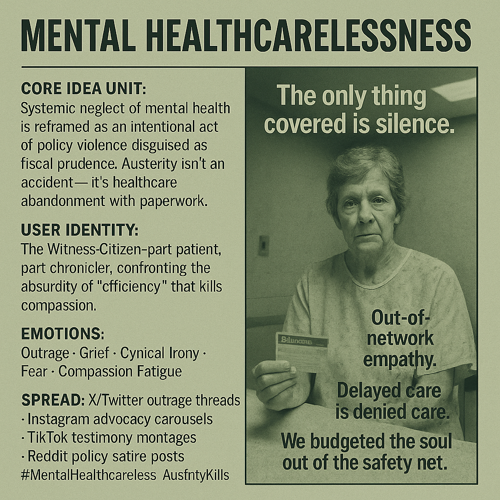

# Healthcare System's Absurdity and Indifference

Created at 2025/11/12 10:47 AM

**Mental Healthcarelessness**

also see [Memetic Analysis: “Healthcarelessness”](https://memeticcowboy.substack.com/p/memetic-analysis-healthcarelessness) and [Grok's research](https://grok.com/share/bGVnYWN5_19b2cb48-ec4f-45f7-93c2-6640fae46450)

∴ Core Idea Unit:** The meme reframes systemic neglect in U.S. mental health policy as both absurd and tragic — a hybrid of satire and despair that exposes how “efficiency” rhetoric translates into lethal care gaps. It encodes the belief that bureaucratic indifference is not accidental, but a structural feature of late-stage austerity.

▲ Identity Play & Roles:** Positions the participant as *Witness-Citizen*: a hybrid of victim and truth-teller who testifies against institutional cruelty. Inverts expert neutrality into moral witness — you’re not just informed; you’re implicated.

≈ Emotional Triggers:**

- Outrage at systemic injustice
- Despair over helplessness and decay
- Irony as coping mechanism
- Fear for aging relatives or one’s own future vulnerability
- Grief disguised as cynicism

𐂷 Spread Mechanics:**

- **Distribution Vectors:** X/Twitter (policy outrage threads), Instagram (advocacy carousels), TikTok (testimonials), Reddit (policy-meets-sarcasm discourse).
- **Propagation Style:** Dark humor, gallows irony, infographics-as-mourning. Visual satire of government documents and pharma ads; testimonial remix.

⛨ Defense Reflexes:**

- **Moral Framing:** “If you oppose this, you’re defending neglect.”
- **Irony Shield:** Uses absurd humor (“Ask your doctor if despair is right for you”) to pre-empt disbelief.
- **Grief Immunity:** Emotional gravity discourages trivial critique; to argue is to appear heartless.

☷ Memeplex Anchor Points:**

- Anti-Austerity activism
- Disability and elder justice movements
- Healthcare equity and public health reform
- Post-COVID burnout and compassion fatigue discourse
- Digital grief rituals and advocacy journalism

✶ Sticky Symbols or Quotes:**

- “Mental Healthcarelessness”
- “Out-of-network empathy”
- “Delayed care is denied care”
- “The only thing covered is silence”
- Visuals: empty hospital chair, frayed Medicare card, pills replaced by coins, patient records fading into static

∿ Tags:** #MentalHealthcarelessness #AusterityKills #ElderJustice #ParityNow #BehavioralAccessCrisis #PolicySatire #DigitalGrief #CareCollapse

#####

## Resources
- https://object.me.bot/front-img/users/send/img/1762973169820_c4zhf/255df57f-5883-42c1-9607-96e6c849c3a7.png

## Insight

* The image encapsulates the concept of "Mental Healthcarelessness," depicting systemic neglect in mental health policy as an essential critique of austerity—a critique that resonates with many who feel abandoned by institutional care systems. This aligns with the notion that such neglect is not an oversight but a design feature of fiscal restraint.

* The representation of the woman holding a medical card serves as a powerful symbol for the *Witness-Citizen* identity, implying a dual role of being both a victim of the system and a truth-teller. This perspective emphasizes that individual testimonies against institutional cruelty can mobilize outrage and foster a collective push for reform.

* The emotional triggers highlighted—outrage, grief, and cynicism—are vividly embodied in the expression and posture of the subject. Her somber demeanor reflects the despair and helplessness many feel when faced with bureaucratic indifference in healthcare, activating a powerful emotional response that can galvanize advocacy efforts.

* The use of dark humor and irony, evident in phrases like “The only thing covered is silence,” illustrates a pervasive coping mechanism among those impacted by mental health systemic issues. Such satirical messaging can draw attention to the absurdity of the current healthcare landscape, inviting discourse that challenges existing norms and provokes critical dialogues about equity in healthcare.

* The photo's distribution mechanics—via platforms like Twitter, TikTok, and Instagram—recognize the potency of social media as a tool for advocacy, facilitating the spread of policy discourse mixed with satire. This reflects a broader trend where digital spaces become vital for movements responding to systemic injustices, enabling grassroots mobilization. 

* The specific language employed—phrases like “Out-of-network empathy” and “Delayed care is denied care”—functions as sticky symbols that encapsulate broader societal issues surrounding healthcare access. Such language not only invites dialogue but also reinforces the urgency for reforms in mental health policy, particularly in light of delayed care exacerbating patient suffering.
