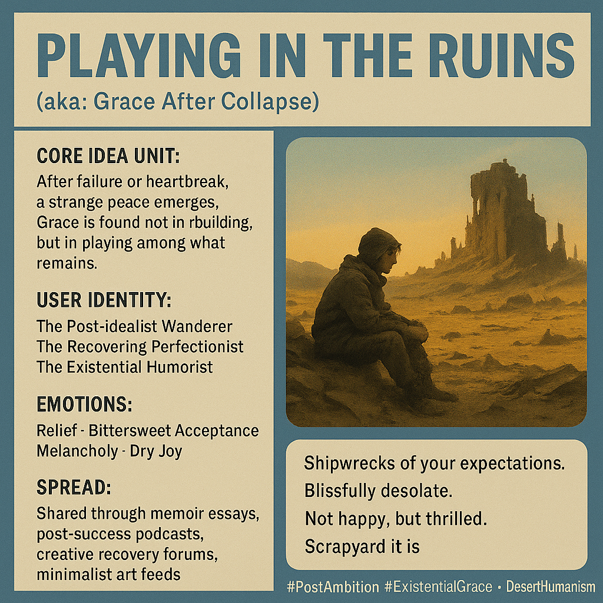

# Finding Grace Amidst Ruins

Created at 2025/11/03 11:46 AM

**🧩 Title:** **Playing in the Ruins I** *(aka: “Grace After Collapse”)*

***

**🧠 Core Idea Unit:** When the dream collapses, what remains isn’t emptiness — it’s clarity. This meme finds grace in disillusionment, turning the wreckage of expectation into a playground for authenticity, humor, and quiet wonder.

***

**🎭 Identity Play & Roles:** Positions the user as the **Post-Idealist Wanderer** — one who has survived ambition, heartbreak, and failure, and now wanders the ruins with peace instead of despair. They become the **Recovering Perfectionist**, finding beauty in impermanence and laughter in loss.

***

**💥 Emotional Triggers:**

- 😌 Relief after breakdown
- 💔 Bittersweet acceptance
- 🌵 Awe at what still lives amid ruins
- 😏 Dry humor as survival instinct

***

**📡 Spread Mechanics:**

- **Distribution Vectors:** Shared through memoir essays, podcasts on burnout, post-success reflections, and poetic posts in creative recovery communities.
- **Propagation Style:** Poetic realism, minimalist aphorism, existential deadpan humor.

***

**🛡️ Defense Reflexes:**

- **Irony Shield:** “Not happy, but thrilled.”
- **Aesthetic Reframe:** Uses visual desolation to encode emotional freedom.
- **Philosophical Armor:** Disillusionment as spiritual evolution.

***

**🧬 Memeplex Anchor Points:**

- 🌾 Anti-perfectionist humanism
- 🧱 Post-ambition realism
- 🌀 Existential grace and stoic humor
- 🕳️ Embrace of anti-climax as freedom
- 🌅 Desert and scrapyard aesthetics

***

**🧠 Sticky Symbols or Quotes:**

- “Shipwrecks of your expectations.”
- “Blissfully desolate.”
- “Not happy, but thrilled.”
- “Scrapyard it is.”
- “Glass ashtray.”
- Visuals: collapsed city glowing at dusk, desert blooms, a lone figure playing in rubble.

***

**🏷️ Tags:** #PostAmbition · #ExistentialGrace · #AntiPerfectionism · #DesertHumanism · #PlayingInTheRuins

## Resources
- https://object.me.bot/front-img/users/send/img/1762199153271_c4zhf/35df3bd5-6789-4d13-b192-9e11ca8fb7d3.png

## Insight

* The concept of "Playing in the Ruins" illustrates a profound transformation that occurs after disillusionment, suggesting that what remains is clarity and authenticity rather than a void. This aligns with existential philosophies that embrace the idea of finding meaning in emptiness, as seen in the works of thinkers like Albert Camus and Viktor Frankl, who propose that embracing life's absurdities can lead to a deeper understanding of oneself.

* The identity of the **Post-Idealist Wanderer**, as described, encapsulates a journey through failure and heartache towards a space of acceptance and peace. This reflects the narrative arc of many literary figures who traverse through loss and emerge with a sense of humor and wisdom, similar to the protagonists in novels such as “The Catcher in the Rye” or “A Man Called Ove.”

* The emotional triggers outlined—relief, bittersweet acceptance, awe, and dry humor—speak to the human capacity for resilience. Notably, this aligns with psychological theories on coping mechanisms, where humor serves as a defense mechanism to navigate life’s adversities, akin to the Stoic philosophy that encourages individuals to maintain equanimity in the face of challenges.

* The aesthetic imagery of the “collapsed city glowing at dusk” and “desert blooms” evokes a visual metaphor for regeneration and beauty found in decay. This resonates with the concept of “post-apocalyptic landscapes” in art and literature, where the depiction of ruins often symbolizes the resilience of nature and hope amid desolation, much like in works by artists such as Caspar David Friedrich.

* The tags like #PostAmbition and #ExistentialGrace signal a cultural narrative shift towards embracing imperfections and the beauty of fleeting moments. This reflects contemporary discussions surrounding mental health and burnout, advocating for authenticity and vulnerability in a world that often prizes perfectionism.

* The crossover between various media—memoirs, podcasts, and artistic expressions—suggests a growing desire for communal storytelling, enhancing the idea that shared experiences of failure can catalyze healing and connection, reminiscent of movements like the “vulnerability revolution” championed by Brené Brown.
