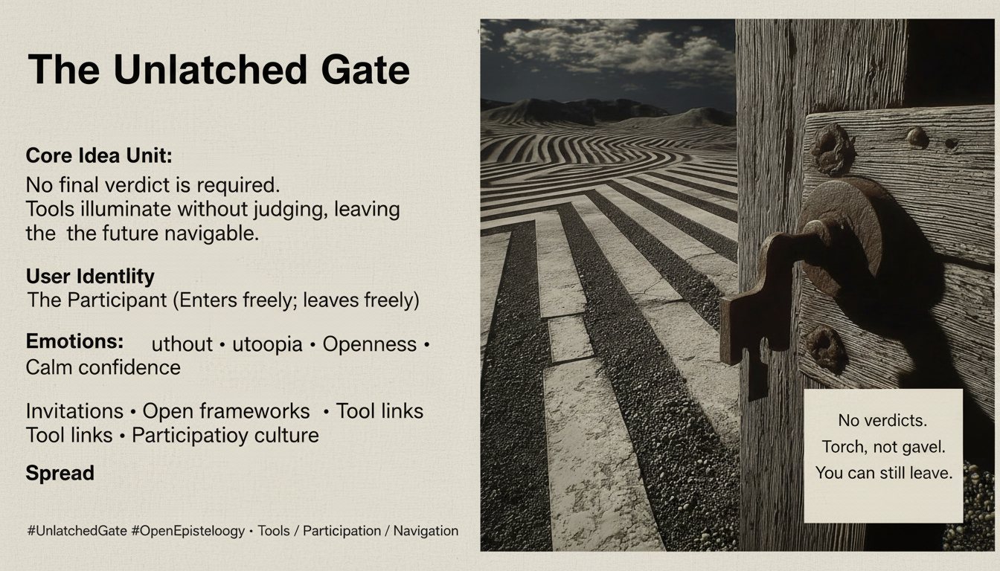

# Freedom Through the Unlatched Gate

Created at 2026/01/20 2:32 PM

## 🧩 **The Unlatched Gate**

***

## 🧠 Core Narrative Structure

There is a moment where systems expect a **verdict**— a final answer, a crowned truth, a settled position.

**The Unlatched Gate refuses this demand.**

Tools are offered not to judge, but to **reveal**. Illumination replaces adjudication. The future remains **navigable** precisely because closure is not enforced.

No crown is placed. No tribunal convenes. The gate is simply left **unlatched**.

Movement continues—not toward utopia, but toward **range**.

***

## 🧠 Core Idea Unit

**Essential belief encoded:** Epistemic freedom is preserved not by winning arguments, but by refusing to seal the exits.

**Mental shift provoked:** From *“What is the final answer?”* → *“What can we now see, and where can we still go?”*

The meme frames openness as an **active condition**, not indecision.

***

## 🎭 Identity Play & Roles

**Readers / Explorers / Participants**

- Engage without needing to convert or commit
- Use tools as orientation devices, not authorities
- Remain free to move, revise, and return

**Implicit Contrast:**

- Believers seeking closure
- Authorities seeking verdicts

**Repositioning:** From *audience* → *participant* From *agreement-seeker* → *navigator*

***

## 💥 Emotional Hooks & Cognitive Levers

- 🌅 **Hope without utopia** — possibility without fantasy
- 🌬️ **Openness** — air moving through the system
- 🧭 **Calm confidence** — orientation without certainty
- 🔦 **Empowerment** — seeing without being told what to see

**Primary lever:** Replaces the anxiety of conclusion with the confidence of continued access.

***

## 🛡️ Defense Reflexes

- **Anti-verdict framing** — no final claims to attack
- **Tool-first posture** — insight without authority
- **Exit preservation** — refusal to trap the reader
- **Non-hierarchical stance** — no crowns, no ranks

The meme resists capture by offering **nothing to overthrow**.

***

## 🧬 Memeplex Anchor Points

- Open epistemology
- Participatory sensemaking
- Anti-finality design
- Navigational tools
- Invitation-based culture
- Post-authoritarian knowledge

This meme integrates naturally with open frameworks, exploratory tools, and cultures that value **entry over agreement**.

***

## 🧠 Sticky Symbols & Phrases

- **The unlatched gate**
- **No crowns**
- **No verdicts**
- **Range**
- **Torch, not gavel**
- “You can still leave”

These function as invitations rather than slogans.

***

## 🏷️ Tags

#OpenEpistemology · #NoFinalAnswer · #UnlatchedGate · #ParticipatoryKnowledge · #RangeNotRule · #AntiFinality

***

### Quiet synthesis

**The Unlatched Gate** does not promise resolution. It promises something quieter—and more durable:

That you are **not trapped**. That nothing has closed behind you. That whatever tools are offered, **you remain free to move**.

No verdict was needed. The gate was never locked.

## Resources
- https://object.me.bot/front-img/users/send/img/1768948332959_c4zhf/hf_20260120_223047_b95267e4-ec38-4e9d-92df-9bd4888fef49.png

## Insight

* The concept of **epistemic freedom** is emphasized, presenting a narrative that values exploration and observation over conclusive judgment. This highlights the importance of tools that illuminate rather than evaluate, allowing for an ongoing journey of discovery.  
* The **unlatched gate** symbolizes openness and movement, suggesting that the absence of rigid conclusions or final answers fosters a more dynamic and adaptable approach to learning and understanding, contrasting heavily with rigid systems that demand closure.  
* The idea of positioning participants as **navigators** instead of passive audiences transforms the engagement experience. This invites individuals to interact with the content freely, encouraging continuous revision and exploration without the pressure to conform to a fixed belief system.  
* The emotional landscape of **hope without utopia** indicates a grounded approach to optimism. It recognizes the complexities of reality while still allowing for growth and opportunities, thereby fostering a culture that values **invitational participation** and collaborative learning.  
* The principle of **non-finality** in knowledge encourages ongoing dialogue and adaptability, speaking to the psychological comfort of knowing that one is not constrained by established conclusions. This reinforces the importance of maintaining pathways for inquiries and explorations, promoting a culture where questions lead to further inquiry rather than definitive answers.
