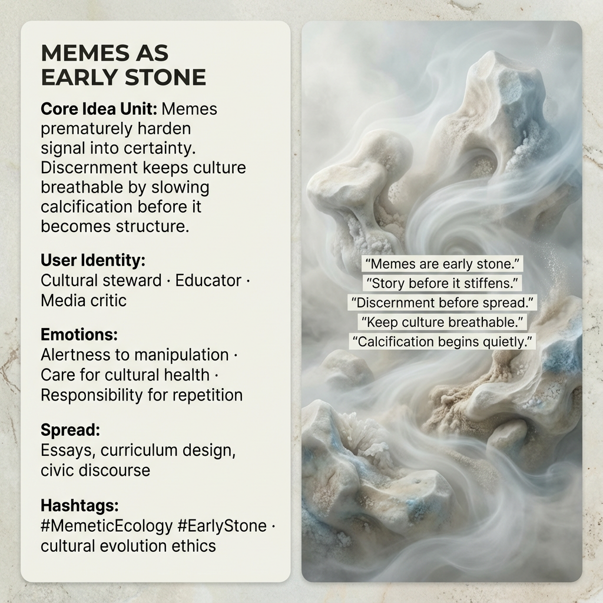

# Guardians of Cultural Breathing: Meme Stewardship

Created at 2025/12/19 8:45 AM

## 🧩 **Memes as Early Stone**

***

## 🧠 Core Idea Unit

Memes are not neutral carriers of meaning—they are *early stone*. They harden signal too soon, stiffening stories before discernment has done its work. Without care, culture loses breath; with discernment, it stays permeable.

**Mental shift provoked:** From *“memes spread ideas”* → *“memes shape the air culture breathes.”*

***

## 🎭 Identity Play & Roles

**Cast as:** Cultural steward · Educator · Media critic

The meme positions the self as a *keeper of cultural breath*—someone attentive to when meaning begins to calcify and willing to slow propagation in service of long-term health.

***

## 💥 Emotional Hooks & Cognitive Levers

- ⚠️ Alertness to subtle manipulation
- 🧠 Responsibility for what gets repeated
- 🌬️ Care for cultural respiration
- 🫁 Unease when stories stiffen too fast

These levers shift engagement from consumption to stewardship.

***

## 📡 Spread Mechanics

**Distribution vectors:**

- Longform essays and critiques
- Curriculum and pedagogy design
- Civic and media discourse
- Meta-memetic conversations about culture itself

**Propagation style:** Reflective, diagnostic, ecological. Often slows the feed rather than accelerating it.

***

## 🛡️ Defense Reflexes

- Resists virality by questioning speed
- Deflects accusation of “overthinking” by reframing harm as *premature certainty*
- Immune to hype cycles through ecological time scales

The meme protects itself by prioritizing cultural health over reach.

***

## 🧬 Memeplex Anchor Points

- Memetic ecology
- Cultural evolution ethics
- Attention ecology
- Anti-manipulation frameworks
- Elemental contrast: Stone (calcification) vs Air (breath)

***

## 🧠 Sticky Symbols or Quotes

- “Memes are early stone.”
- “Story before it stiffens.”
- “Keep culture breathable.”
- “Discernment before spread.”
- Calcification vs circulation

***

## 🏷️ Tags

#MemeticEcology · #EarlyStone · #CulturalHealth · #AntiManipulation · #DiscernmentBeforeSpread · #BreathableCulture

***

**Reflection anchor:** Every meme is a test of timing. Spread too fast, and signal turns to stone. Held with care, culture keeps breathing.

## Resources
- https://object.me.bot/front-img/users/send/img/1766162716282_c4zhf/ae5cd171-57e5-46b2-8310-f761b87ae952.png

## Insight

* The concept that "memes are early stone" underscores the danger of allowing ideas to prematurely solidify into rigid structures, thus stifling cultural evolution. This metaphor emphasizes the importance of discernment in meme propagation, where unchecked virality can lead to a calcification of thought, limiting the fluidity necessary for cultural vitality.

* The user identity presented as a cultural steward, educator, and media critic suggests an active role in nurturing the landscape of ideas. This stewardship is crucial for ensuring that the cultural narrative remains adaptable and sensitive to the complexities of societal issues.

* The emotional levers such as "alertness to manipulation" and "responsibility for repetition" reflect a heightened awareness among meme consumers. It invites individuals to engage critically with the media they encounter, thereby fostering a culture that values thoughtful contribution over blind consumption.

* The propagation style proposed—reflective, diagnostic, and ecological—encourages long-form discourse rather than rapid dissemination. This approach highlights the need for deep engagement with ideas, advocating for a slower, more thoughtful sharing process which can enrich cultural discussions.

* Defense reflexes against premature spread advocate for questioning the pace of discourse, showing a resistance to trends that prioritize speed over depth. This self-defense mechanism calls for a cultural shift away from sensationalism, promoting a more deliberate exchange of ideas that allows for nuanced understanding.
