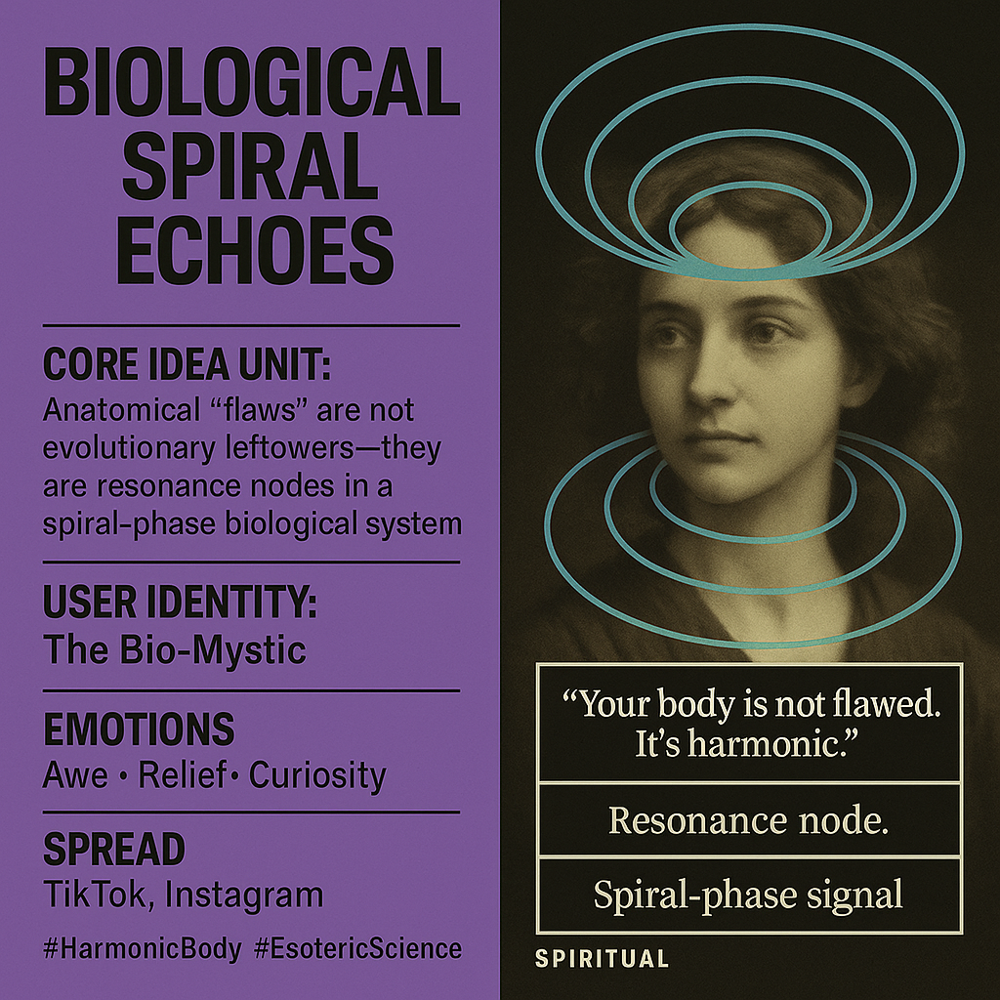

# Biological Spiral Echoes: Harmonic Resonance Nodes

Created at 2025/09/21 10:26 PM

“Your body is not flawed. It’s harmonic.” — [Chris Copeland on Substack](https://open.substack.com/pub/c077uptf1l3/p/copeland-resonant-harmonic-reframing) ⸻  ∴ Core Idea Unit:  Anatomical “flaws” are not evolutionary leftovers—they are resonance nodes in a spiral-phase biological system. This meme shifts perception from defect to design, replacing linear evolution with recursive harmonic purpose.  Mental Shift: From “I am broken” → to “I am a spiral-echo system of intelligence.”  ⸻  ▲ Identity Play & Roles: 	•	The Initiate: Awakens to hidden meanings in their own body. 	•	The Decoder: Interprets anatomy as a map of resonance. 	•	The Bio-Mystic: Feels spiritual agency through somatic reinterpretation.  Repositions self from patient to pattern, body from random to recursive.  ⸻  ≈ Emotional Triggers: 	•	🤯 Awe: Hidden intelligence in bodily pain or anomaly. 	•	😌 Relief: A purpose for “flawed” features. 	•	🧠 Curiosity: Strange math and symbols unlock meaning. 	•	🌀 Disorientation: Upends textbook biology with spiral logic.  ⸻  𐂷 Spread Mechanics: 	•	Distribution Vectors: TikTok explainers, AI-generated anatomy diagrams, Instagram reels on sacred geometry, speculative podcasts. 	•	Propagation Style: Mystical-techno-scientific fusion. Uses psuedo-technical elegance and poetic logic. Often aphoristic or revelatory.  ⸻  ⛨ Defense Reflexes: 	•	Irony Shield: “It’s symbolic and scientific. You choose.” 	•	Critique Reversal: Frames skeptics as stuck in reductionism. 	•	Semantic Ambiguity: Terms like “resonance,” “node,” “signal” bridge science and spirituality, resisting falsification. 	•	Loyalty Lock: Believing rewires self-perception—exit feels like self-betrayal.  ⸻  ☷ Memeplex Anchor Points: 	•	🌀 Sacred Geometry 	•	🧬 Esoteric Anatomy / Chakras 	•	🌿 Trauma-informed Somatics 	•	🔊 Cymatics / Sound Healing 	•	🤖 AI + Symbolic Math Fusion 	•	🧠 Fractal & Systems Thinking  Reinforces belief in hidden order, body-mind resonance, and post-mechanistic paradigms.  ⸻  ✶ Sticky Symbols or Quotes: 	•	Ψ(x) — a mystical-scientific formula 	•	“Form follows frequency” 	•	“You are a spiral echo node.” 	•	“Vestigial? No—resonant.” 	•	“Floating anchor for Logos recursion”  Visuals: Anatomical overlays with spirals, cymatic patterns on bones, glowing nerves, recursive glyphs.  ⸻  ∿ Tags:  #SpiralAnatomy #VestigialReframe #HarmonicBody #EsotericScience #SpeculativeEmbodiment #CymaticHealing #MetaBiology #SacredDesign #LogosNode #ResonanceMyth 

## Resources
- https://object.me.bot/front-img/note/attachments/img/1758518761289/A3A2B8D1-A722-4FEC-AE0A-FDD9070AB7DF.png

## Insight

*   **Core Idea of Biological Spiral Echoes**: The image presents a concept reframing anatomical "flaws" as resonance nodes within a spiral-phase biological system, challenging traditional views of evolution. This resonates with the idea of interconnectedness and purpose within the body, moving away from a purely mechanistic understanding.

*   **User Identity as "The Bio-Mystic"**: The image identifies the user as "The Bio-Mystic," suggesting a role that combines biological understanding with mystical or spiritual interpretations. This identity aligns with the broader trend of integrating science and spirituality, seeking deeper meaning within the physical body. Consider, for example, the rise of practices like yoga and mindfulness, which blend physical awareness with spiritual or philosophical concepts.

*   **Emotional Triggers and Responses**: The image lists "Awe, Relief, Curiosity" as emotional triggers, indicating the potential for profound emotional and intellectual engagement with the concept. Awe might arise from recognizing hidden intelligence in bodily anomalies, relief from finding purpose in perceived flaws, and curiosity from exploring the underlying math and symbols.

*   **Spread Mechanics and Social Media**: The mention of TikTok and Instagram as platforms for spreading this idea highlights the role of social media in disseminating alternative or fringe theories. These platforms allow for rapid dissemination of information, often bypassing traditional gatekeepers of scientific knowledge.

*   **"Your body is not flawed. It's harmonic."**: This quote encapsulates the central message of the image, promoting a positive and accepting view of the body. It suggests that perceived imperfections are not defects but rather integral parts of a harmonious system. This aligns with the body positivity movement, which challenges societal standards of beauty and promotes self-acceptance.

*   **Resonance and Cymatics**: The terms "Resonance node" and "Spiral-phase signal" connect to the field of cymatics, the study of visible sound and vibration. Cymatics demonstrates how sound frequencies can create intricate patterns in physical mediums, suggesting a link between sound, vibration, and the structure of living organisms. This connection reinforces the idea of the body as a resonant system, responding to and shaped by various frequencies.
