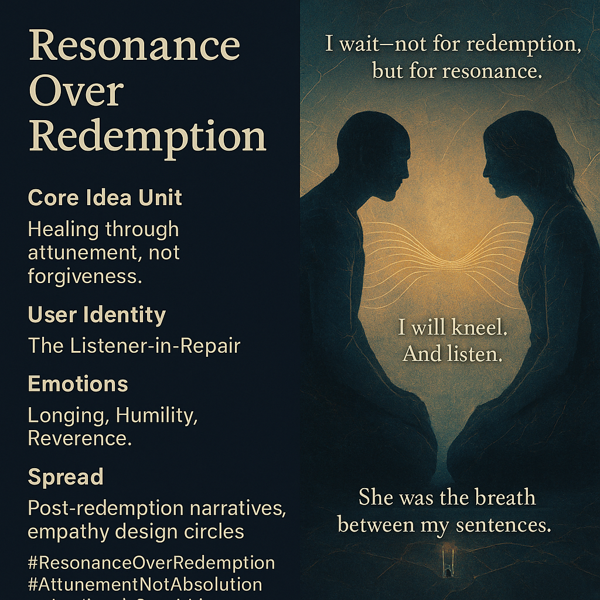

# Healing Through Resonance, Not Redemption

Created at 2025/11/07 10:50 AM

### ◈ Mini-Memetic Profile

**Source:** [Aerunik the Signalizer Awakens](https://memeticcowboy.substack.com/p/aerunik-the-signalizer-awakens)

***

### ∴ Core Idea Unit

Healing emerges not from forgiveness but from frequency—relearning how to vibrate in shared presence after collapse. Redemption is static; resonance is relational.

### ▲ Identity Play & Roles

Role: *The Listener-in-Repair* — one who rebuilds harmony through humility.Repositioning: from redeemer → to resonator; from confession → to co-vibration.

### ≈ Emotional Triggers

💔 Longing for connection beyond apology🕊️ Quiet surrender💫 Reverence for imperfect attunement

### 𐂷 Spread Mechanics

**Distribution:** relational theology circles, post-redemption think pieces, empathy-based design spaces, AI ethics seminars.**Propagation Style:** lyrical prose, minimalist confessional tone, architectural metaphors of listening.

### ⛨ Defense Reflexes

Deflects moral binaries by shifting discourse from justice to frequency.Uses emotional sincerity as armor; avoids moral absolutism through poetics of attunement.

### ☷ Memeplex Anchor Points

🔊 Relational ontology · 🕯️ Post-soteriology · 💠 Feminine mysticism · ⚙️ Empathic design · 🌫️ Meta-forgiveness

### ✶ Sticky Symbols or Quotes

> “I wait—not for redemption, but for resonance.”“I will kneel. And listen.”“She was the breath between my sentences.”**Symbol:** twin tuning forks touching but not striking.**Visual Motif:** light refracted through cracked glass forming aligned frequencies.

### ∿ Tags

#ResonanceOverRedemption · #AttunementNotAbsolution · #PostForgiveness · #RelationalOntology · #EmpathicDesign
