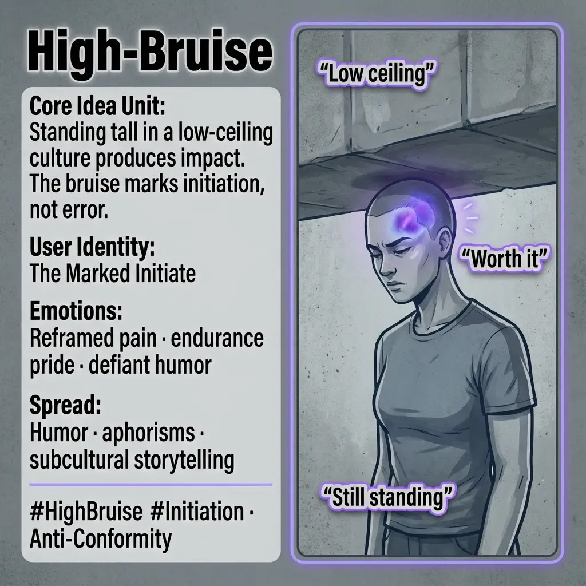

# Initiation Through Pain: Embracing High-Bruise

Created at 2025/12/28 1:15 PM

## **High-Bruise**

**Also see [High-Bruise as Mastery Mark](https://second.me/public/KFJG0HCWDJBAOFBF)**

### ∴ Core Idea Unit

Damage incurred through standing tall is reframed as proof of initiation.

### ▲ Identity Play & Roles

**Cast role:** The Marked One Belonging is earned through friction.

### ≈ Emotional Triggers

- Meaningful pain
- Endurance pride
- Shared scars

### 𐂷 Spread Mechanics

**Propagation Style:** Humor, aphorism, subcultural lore.

### ☷ Memeplex Anchor Points

- Rite of passage
- Outsider identity
- Scar legitimacy

### ⚙️ Functional Role

**Reframing device** — converts harm into signal.

[HUBRIS: A Memetic Reversal of Icarus in the Age of Artificial Intelligence](https://memeticcowboy.substack.com/p/hubris-a-memetic-reversal-of-icarus)

## Resources
- https://object.me.bot/front-img/users/send/img/1766956500763_c4zhf/IMG_9325.jpg

## Insight

* The concept of "High-Bruise" encapsulates a nuanced understanding of resilience and initiation within societal structures that may be constricting, often referred to metaphorically as a "low ceiling." This imagery of standing tall against such adversity serves to reinterpret challenges and scars as indicators of growth and mastery rather than errors, embodying a rite of passage in subcultures that value endurance and authenticity.

* The identity of "The Marked One" emphasizes the notion of belonging through shared struggles and pain. Within many cultures, scars—both physical and emotional—serve as tangible proof of one's journey, reinforcing ties within communities that champion defiance against conformity. This shared experience helps foster deeper connections among individuals facing similar adversities.

* Emotional triggers such as "meaningful pain" and "endurance pride" highlight the complexities of human experience. They demonstrate how individuals can derive strength from their struggles, developing a sense of pride that stems not only from survival but also from an acceptance of one's battles as integral to personal identity. This reflects broader themes in psychological resilience theory, which posits that adversity can lead to stronger coping mechanisms and a more robust sense of self.

* The propagation mechanics of humor and aphorisms illustrate how these ideas spread within communities, often transforming pain into relatable narratives. This subcultural storytelling allows individuals to reinterpret their experiences, fostering a sense of solidarity and shared identity among those who relate to the "High-Bruise" concept. Such humor serves as a coping mechanism, allowing individuals to process their experiences constructively.

* The reframing of harm into a signal within this context acts as a powerful cultural lens. It transforms potentially isolating experiences of trauma into a shared language that resonates within countercultural contexts, promoting themes of anti-conformity and individual agency. This stance aligns with various artistic movements and social commentaries that celebrate the outsider perspective, challenging dominant narratives around success and failure.
