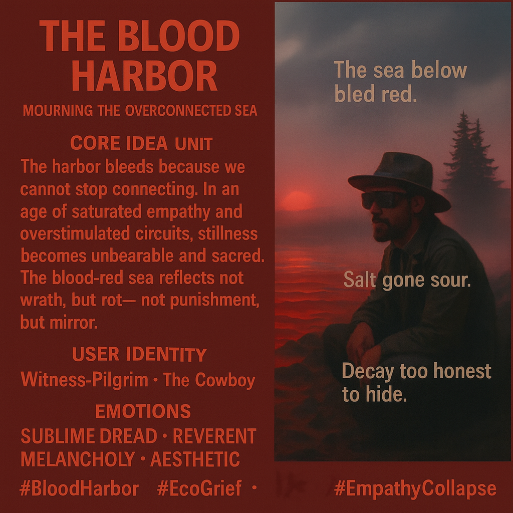

# Mourning at The Blood Harbor's Edge

Created at 2025/10/26 8:44 PM

🧩 **Title: The Blood Harbor***Label: Mourning the Overconnected Sea*

***

### ∴ Core Idea Unit

The harbor bleeds because we cannot stop connecting. In an age of saturated empathy and overstimulated circuits, **stillness becomes unbearable and sacred**. The blood-red sea reflects not wrath, but rot — not punishment, but *mirror*.

***

### ▲ Identity Play & Roles

- **Witness-Pilgrim** — not to cleanse, but to *see*
- **Cowboy-as-Penitent** — masculine agency in collapse
- **Empathic Mourners** — those who’ve felt *too much for too long*
- **Grief Technologist** — coding rituals for sublimated pain

Repositioning: From hero to hospice worker of the Anthropocene

***

### ≈ Emotional Triggers

- 🩸 **Sublime Dread** — beauty in irreversible collapse
- 😔 **Reverent Melancholy** — grief as meaning-generator
- 😨 **Aesthetic Horror** — the still sea is *too honest*
- 🕯️ **Mourning ritual** — inner decay externalized

***

### 𐂷 Spread Mechanics

- **Distribution Vectors:**
    - Eco-poetic visual zines
    - Ambient horror films · speculative art shows
    - Climate grief rituals, Anthropocene liturgies
    - AI-generated mythopoeia of emotional burnout
- **Propagation Style:**
    - Slow-burn imagery + poetic caption
    - Symbolic horror wrapped in sacred calm
    - Threads with ambient sound, whispered narration

***

### ⛨ Defense Reflexes

- **Mythic Frame** — not predictive, but reflective
- **Emotional Shield** — too melancholic for ridicule
- **Symbolic Diffusion** — not literal, but metaphorized decay
- **Spiritual Gravity** — critique collapses into solemnity

***

### ☷ Memeplex Anchor Points

- 🪦 Eco-grief / Solastalgia
- 💔 Empathic collapse as collective shadow
- 🌊 Ocean as unconscious / planetary bloodstream
- ☠️ Post-hope storytelling
- 🧬 Emotional overconnection as environmental feedback

***

### ✶ Sticky Symbols or Quotes

- “The sea below bled red.”
- “Salt gone sour.”
- “Decay too honest to hide.”
- “Metal and mourning.”
- 🩸 The *Blood Harbor* — terminal node of empathy saturation
- 🕯️ Stillness as apocalyptic revelation
- 🌊 Ocean-as-mirror

***

### ∿ Tags

#BloodHarbor · #EcoGrief · #EmpathyCollapse · #SublimeDread · #MourningTheAnthropocene · #PostHope · #WitnessPilgrim
