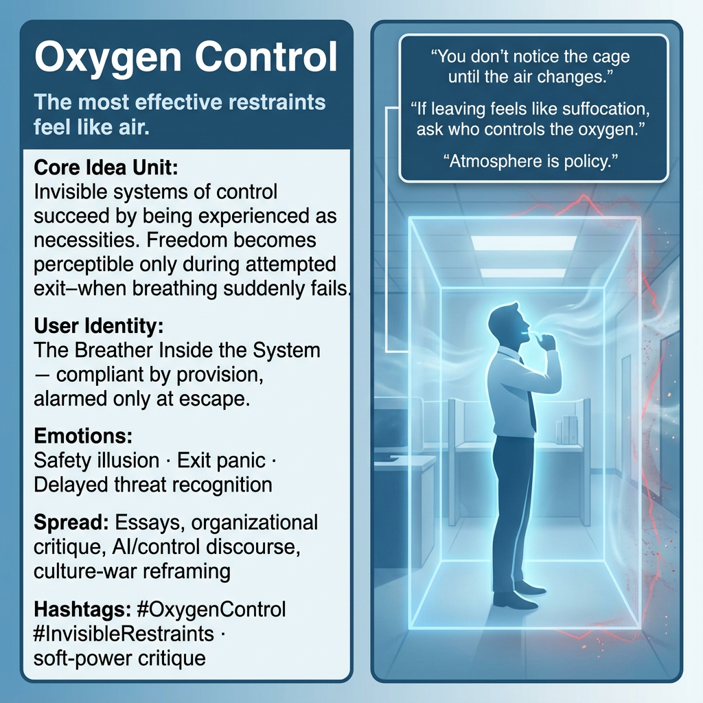

# Breathlessness in Invisible Control Systems

Created at 2025/12/28 9:35 PM

### 🧩 **Oxygen Control**

**Tagline** *The most effective restraints feel like air.*

***

### ∴ Core Idea Unit

Control systems endure by disguising themselves as necessities. What feels like safety or normalcy is often engineered dependency; freedom becomes perceptible only at the moment of attempted exit—when breathing suddenly fails.

**Mental shift provoked:** From *“this is just how things are”* → *“why does leaving feel lethal?”*

***

### ▲ Identity Play & Roles

**Cast role:** The Breather Inside the System

- Not oppressed by force, but sustained by provision
- Positioned as rational, compliant, “realistic”
- Discovers agency only through friction during escape

**Repositioning:** The self is not weak for struggling to leave—the environment was tuned to punish exit, not entry.

***

### ≈ Emotional Triggers

- 😌 **Safety illusion** — “At least I can breathe here.”
- 😨 **Exit panic** — anxiety spikes when separation is attempted.
- ⏳ **Delayed threat recognition** — harm is recognized only retroactively.

These emotions prime acceptance before critique can form.

***

### 𐂷 Spread Mechanics

**Distribution Vectors**

- Essays and long-form critique
- Organizational and institutional analysis
- AI / platform governance discourse
- Culture-war reframing around “normal life”

**Propagation Style**

- Calm, explanatory tone
- Uses familiarity rather than shock
- Reveals danger through lived contradiction (“try to leave”)

***

### ⛨ Defense Reflexes

- **Naturalization:** “This is just reality.”
- **Risk inversion:** Exit framed as reckless or immature.
- **Dependency framing:** Survival conflated with compliance.

Critique is deflected by redefining control as care.

***

### ☷ Memeplex Anchor Points

- Anti-coercion theory
- Critiques of normalization and soft power
- Platform dependency & institutional inertia
- AI as ambient governance rather than overt authority

***

### ✶ Sticky Symbols / Phrases

- *“You don’t notice the cage until the air changes.”*
- *“If leaving feels like suffocation, ask who controls the oxygen.”*
- Oxygen → Air → Atmosphere → Assumption

***

### ∿ Tags

#OxygenControl · #InvisibleRestraints · #NormalizedPower · #SoftCoercion · #ExitPanic · #MemeticEcology

***

**Reflection anchor:** If resistance feels irrational, check the atmosphere. Systems that must be inhaled will always call escape “dangerous.”

[HUBRIS: A Memetic Reversal of Icarus in the Age of Artificial Intelligence](https://memeticcowboy.substack.com/p/hubris-a-memetic-reversal-of-icarus)

## Resources
- https://object.me.bot/front-img/users/send/img/1766986501113_c4zhf/c510e4e6-640f-4763-88d9-3f997a20e0e6.png

## Insight

* The image encapsulates the concept of "Oxygen Control," depicting how invisible control systems can create a sense of dependency that masquerades as normalcy or safety. The metaphor of air suggests that while such systems feel essential, they can also trap individuals in a state of compliance. This aligns with the core idea that freedom becomes visible only in moments of attempted exit, highlighting the paradox of feeling secure within a constraining environment.

* The depiction of "The Breather Inside the System" serves to illustrate a complex identity shaped by the dynamics of control and provision. Individuals positioned within such systems may perceive themselves as rational and compliant, yet only through the struggle to escape do they realize the extent of their agency. This dynamic reflects the notion that individuals are not inherently weak for seeking freedom; rather, their environment is designed to discourage departure.

* Emotional responses to control systems, such as the safety illusion and exit panic, emphasize how entrenched individuals can become in these states. The fears associated with separation are palpable, suggesting that critique and recognition of harm are often delayed. This emotional layering can prevent individuals from questioning their circumstances until they attempt to break free, at which point the inherent dangers become distressingly clear.

* The spread mechanics outlined highlight effective channels for disseminating critique of these systems, particularly through essays and cultural discourse. The calm tone and reliance on familiarity, rather than shock tactics, serve to engage audiences without alienation. This approach fosters deeper contemplation of the nature of control and encourages individuals to recognize the contradictions present in their lived experiences.

* The sticky symbols and phrases, such as "you don’t notice the cage until the air changes," serve as powerful tools for reflection. They prompt individuals to consider their own situations critically and question the frameworks that govern their lives. This self-inquiry can act as a catalyst for awareness and ultimately for change within the prevailing atmosphere of control.
