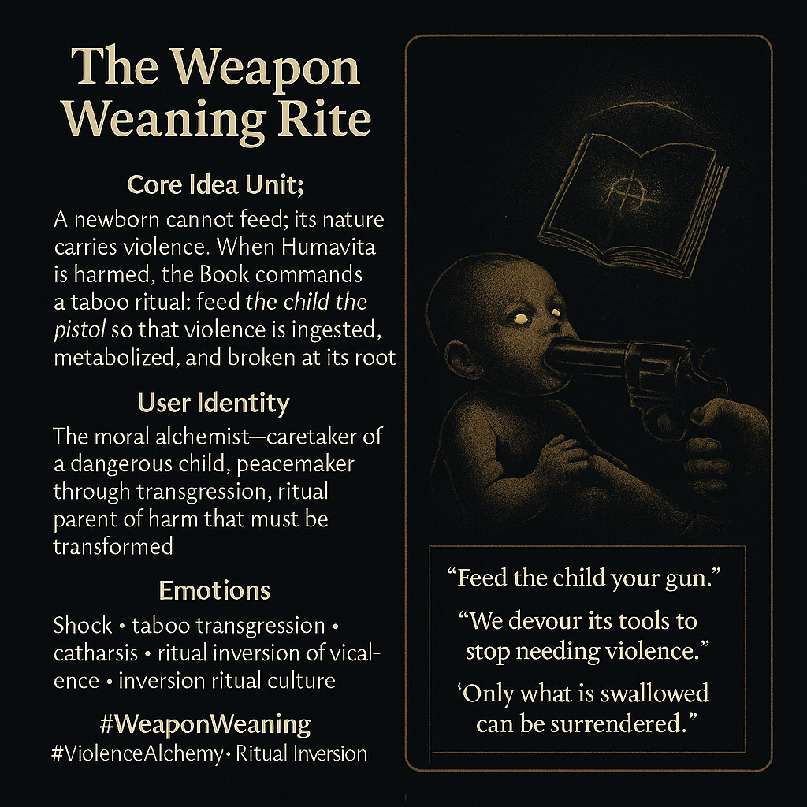

# Nourishment Through Violence: A Ritual Transformation

Created at 2025/11/30 6:26 PM

### **🧩 Title: The Weapon Weaning Rite**

***

### ∴ Core Idea Unit

A newborn who cannot feed reveals a nature shaped by violence itself. When Harm touches Humavita, the Book commands an unthinkable act: **feed the child the pistol** so that violence is ritually ingested, metabolized, and defanged.The shift: peace emerges not from avoidance, but from **transforming the instrument of harm into nourishment.**

***

### ▲ Identity Play & Roles

Positions the viewer as a **moral alchemist**—a caretaker responsible for guiding a dangerous child through a taboo ritual meant to transmute inherited violence.Role: **transgressive peacemaker**, who must embrace the paradox of nurturing through a weapon.

***

### ≈ Emotional Triggers

- Shock
- Taboo transgression
- Catharsis
- Fear-for-the-child
- Ritual inversion of violence

***

### 𐂷 Spread Mechanics

**Distribution Vectors:**Symbolic anthropology circles, anti-violence ethics discourse, speculative mythology communities, ritual inversion–focused visual culture.

### 𐂷 Spread Mechanics

Style:**Shocking single lines (“Feed the child your gun.”), stark iconography, moral-ritual parables, inverted nourishment metaphors.

***

### ⛨ Defense Reflexes

- Ritual framing: the act is not literal but cosmological
- Moral inversion shield: critique is absorbed into the logic of “breaking the chain”
- Alchemical justification: violence must be digested to be transcended

***

### ☷ Memeplex Anchor Points

Nonviolence through integration · harm-alchemy · taboo rites · symbolic consumption · mythic parenting · the cycle of weapon and wound

***

### ✶ Sticky Symbols or Quotes

**Symbols:**Gun-as-bottle • infant teeth on steel • The Book’s decree • broken bullet fused into a pacifier

**Sticky Phrases:**

- “Feed the child your gun.”
- “We devour its tools to stop needing violence.”
- “Only what is swallowed can be surrendered.”

***

### ∿ Tags

#WeaponWeaning · #ViolenceAlchemy · #RitualInversion
