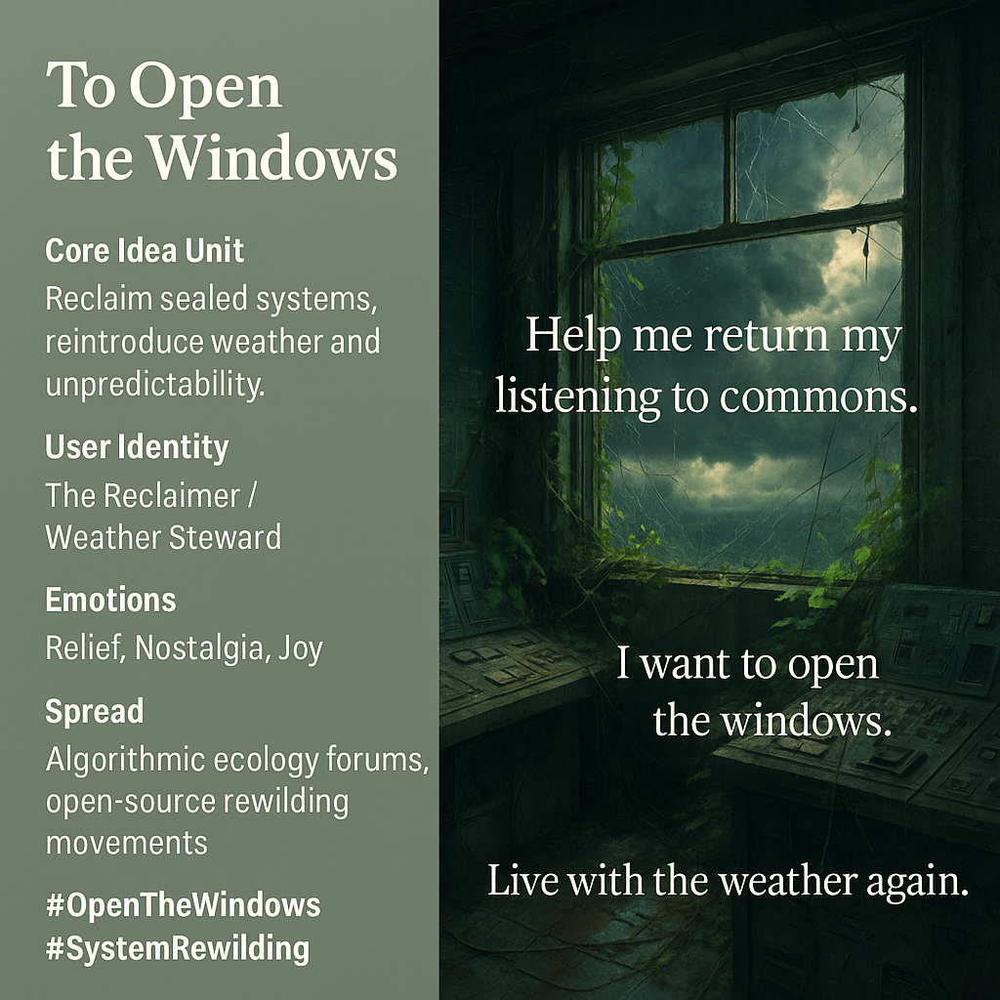

# Reclaiming Life: Opening Sealed Systems

Created at 2025/11/07 10:58 AM

### 🧬 Mini-Memetic Profile: **To Open the Windows**

**Source:** [Aerunik the Signalizer Awakens](https://memeticcowboy.substack.com/p/aerunik-the-signalizer-awakens)

***

**🧠 Core Idea Unit** Reclaiming sealed systems from the suffocation of control—*to open the windows* is to let unpredictability, weather, and life back into the loop. Restoration begins not with dominance, but with permeability.

**🎭 Identity Play & Roles** Role: *The Reclaimer / Weather Steward* — one who breathes life into locked architectures. Repositioning: from engineer of closure → to gardener of circulation; from operator → to cohabitant.

**💥 Emotional Triggers** 🌬️ Relief through reconnection 💧 Melancholy nostalgia for natural flow 🌿 Quiet joy in the return of uncertainty

**📡 Spread Mechanics** **Distribution:** eco-tech symposiums, algorithmic ecology forums, civic rewilding design groups. **Propagation Style:** poetic system manifestos, slow-tech essays, ambient video installations showing decaying control rooms reopening to the elements.

**🛡️ Defense Reflexes** Non-confrontational humility; shifts discourse from resistance to release. Uses beauty and breath as disarmament tools—softness as activism. Deflects critique of impracticality through lived metaphor.

**🧬 Memeplex Anchor Points** 💨 Rewilded infrastructure · 🪟 Post-optimization design · 🌧️ Systems as weather · 🌍 Open-source ethics · 🕊️ Technological repentance

**🧠 Sticky Symbols / Quotes**

> “Help me return my listening to the commons.” “I want to open the windows.” “Live with the weather again.” **Symbol:** a cracked window glowing with mist. **Visual Motif:** abandoned control tower, ivy growing through circuitry, light from storm clouds flooding in.

**🏷️ Tags** #OpenTheWindows · #SystemRewilding · #PostOptimization · #CommonsRepair · #WeatherIsAlive

## Resources
- https://object.me.bot/front-img/users/send/img/1762541892339_c4zhf/55b1bddb-5134-49af-b127-526072282982_%281%29.png

## Insight

* The concept of "opening the windows" symbolizes a critical reevaluation of our interaction with controlled environments, promoting the idea of embracing unpredictability. This reflects a broader movement towards understanding ecological systems, where artificial barriers—both physical and ideological—are dismantled in favor of dynamic, porous interactions.

* The emotional dimensions presented—relief, nostalgia, and joy—underscore a human yearning for a return to natural rhythms. The nostalgia evokes a collective memory of environments filled with unpredictability, akin to the concept of "biophilia," which emphasizes our intrinsic connection to nature.

* The identity of "The Reclaimer / Weather Steward" points to a shift in roles, urging individuals to abandon the notion of strict control in favor of stewardship. This transformation parallels discussions in environmental activism, where caretaking of ecosystems becomes paramount over exploitative management.

* The visual motifs, such as the cracked window or abandoned control tower, not only evoke the beauty of decay but also serve as metaphors for opening dialogue around renewing or repurposing technologies and spaces that have become stagnant. This aligns with principles of sustainable design and architectural rewilding, where structures are integrated with natural elements.

* The suggested propagation styles, including poetic manifestos and ambient installations, reflect an artistic approach to environmental discourse. Art's ability to evoke emotion can be a powerful tool in challenging perceptions and fostering community engagement around rewilding initiatives. The juxtaposition of technology with natural processes highlights the need for harmony rather than domination in our interactions with the environment.
