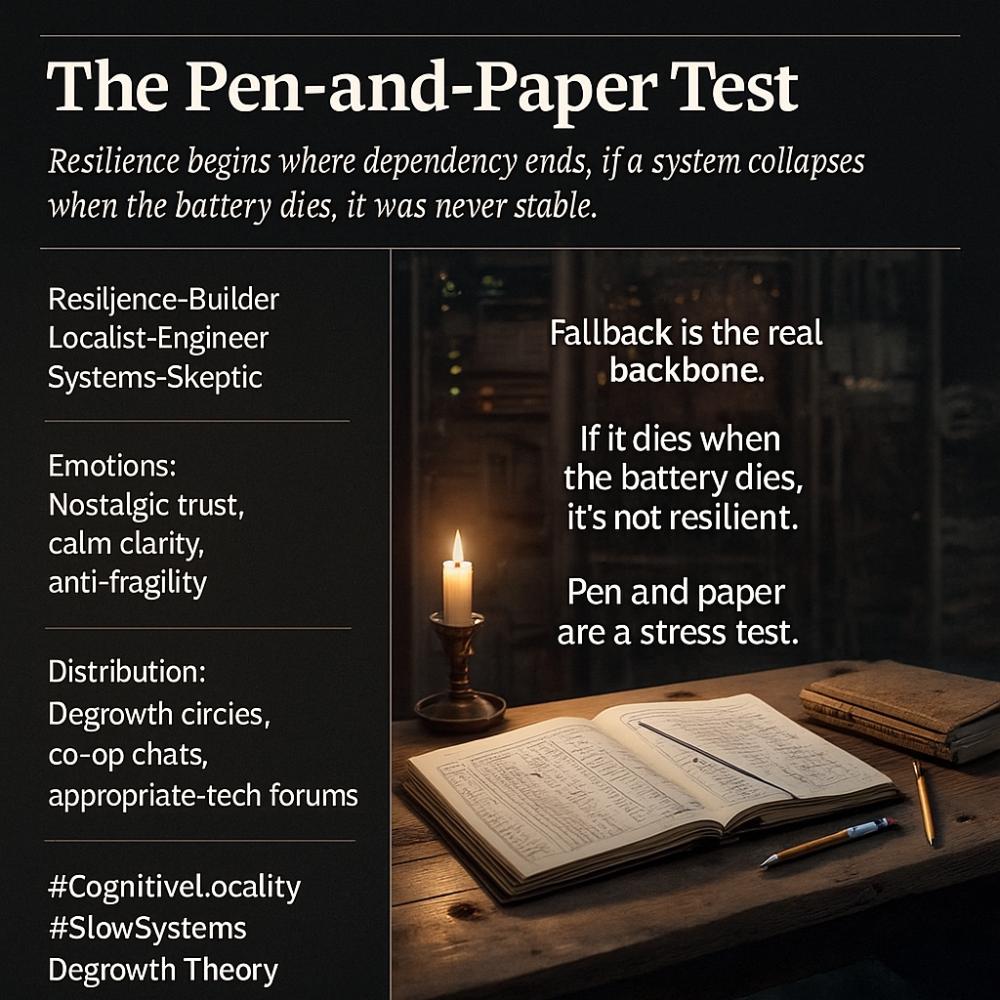

# Resilience Beyond Digital: The Pen-and-Paper Test

Created at 2025/11/20 3:06 PM

**🧩 Title: The Pen-and-Paper Test**
 Souce: [Anarcasper](https://substack.com/@anarcasper/note/c-178439372)
 🧠 Core Idea Unit Resilience isn’t digital; it’s fallback. Any system that collapses when the battery dies is running on borrowed stability. The meme shifts people from fetishizing efficiency to valuing durability, legibility, and human-scale comprehension.  🎭 Identity Play & Roles The Resilience-Builder • The Localist-Engineer • The Systems-Skeptic who checks whether complexity serves people or obscures power.  💥 Emotional Triggers Nostalgic trust, practical clarity, anti-fragility calm, frustration with over-engineered dependence, relief at human-readable systems.  📡 Spread Mechanics • Distribution: degrowth circles, localist co-ops, mutual aid servers, slow-tech communities, sustainability IG carousels • Propagation Style: earnest critique, simple parable, slow-tech aesthetic minimalism, “back-to-basics” rationalism  🛡️ Defense Reflexes “Not anti-tech, anti-fragility” framing; fallback-first rhetoric; human-readability as moral baseline; ambiguity between critique of scale vs critique of infrastructure.  🧬 Memeplex Anchor Points Degrowth · Appropriate Technology · Localism · Anti-fragility · Design for repair · Cognitive locality · Post-digital sustainability  🧠 Sticky Symbols / Quotes • “If it dies when the battery dies, it’s not resilient.” • “Pen and paper are a stress test.” • “Fallback is the real backbone.” • Notebooks, ledgers, chalkboards, hand-drawn maps, candle-lit co-ops.  🏷️ Tags #CognitiveLocality · #AppropriateTech · #Degrowth · #ResilienceDesign · #SlowSystems

## Resources
- https://object.me.bot/front-img/note/attachments/img/1763680008239/F5C83625-BF22-4B6B-8F94-CF13D4D30099.png

## Insight

* The image emphasizes the importance of resilience in systems, positing that true stability does not rely on technology or batteries but rather on the ability to function without them, encapsulated in the phrase, “If it dies when the battery dies, it’s not resilient.” This resonates with the arguments of scholars like Ivan Illich, who critiqued over-dependence on technological solutions, advocating instead for simpler, more sustainable alternatives.

* The idea of "fallback" as a critical organizational principle suggests a shift in perspective from efficiency to sustainability, reminiscent of concepts found in degrowth theory, which critiques excessive consumption and encourages a focus on enduring systems without over-reliance on technology. This connects with resilience engineering, which examines how systems can withstand and adapt to challenges without complete failure.

* The identified roles—Resilience-Builder, Localist-Engineer, and Systems-Skeptic—highlight the multifaceted nature of addressing contemporary social and ecological issues. Each role emphasizes a different approach to problem-solving that encourages local engagement and critical evaluation of existing frameworks, reflecting ideals from community-centered economics and localized resource management.

* Emotional triggers such as nostalgic trust and anti-fragility calm link deeply to human experiences of uncertainty and complexity in modern life. These ideas parallel discussions in psychology and sociology regarding how individuals and communities navigate crises, emphasizing the therapeutic and stabilizing power of simple, human-scale solutions amid chaos.

* The distribution mechanisms mentioned—degrowth circles, localist co-ops, and slow-tech communities—illustrate practical applications of the theories discussed. Involving grassroots organizations reflects a growing trend in social movements that prioritize sustainability and community resilience, often drawing from historical contexts where communities thrived without reliance on complex technologies.

* The "sticky symbols" and quotes suggest a simplicity that resonates in modern discourse on technology and its impacts. Phrases like “Pen and paper are a stress test” serve to remind us that while technology can provide many conveniences, it is essential to maintain interfaces for human interaction that are clear and comprehensible, harkening back to traditional tools of communication and record-keeping, which can enhance understanding and retention.
