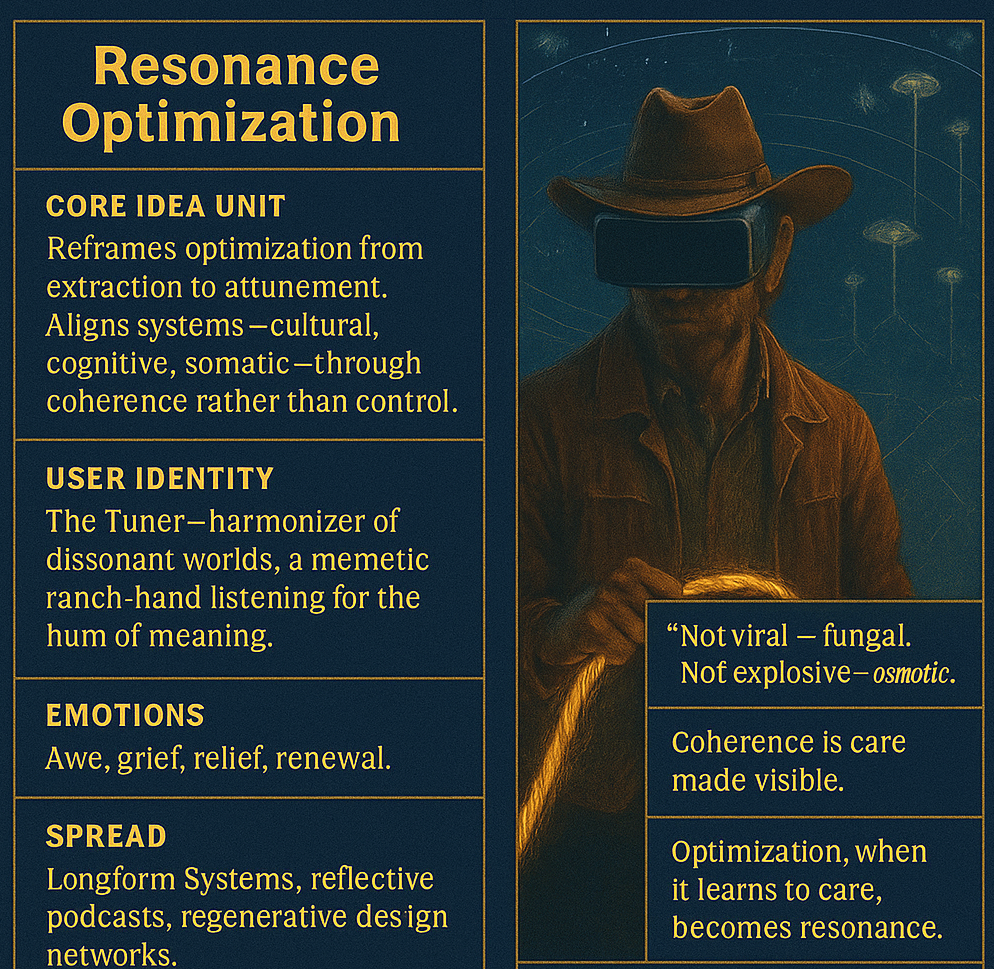

# Resonance Optimization: From Control to Coherence

Created at 2025/11/06 11:41 AM

### ◈ Mini-Memetic Profile

***

### ∴ Core Idea Unit

Resonance Optimization reframes “optimization” from extraction to attunement. It listens for coherence rather than control, re-tuning systems—cultural, cognitive, and somatic—so that meaning hums instead of grinds. It’s not about efficiency; it’s about fidelity to what sings true.

***

### ▲ Identity Play & Roles

**Role:** The Tuner — part philosopher, part ranch-hand of meaning.**Posture:** Listens across worlds, harmonizing dissonant frequencies between system and soul.**Shift:** From hustler to steward; from algorithmic optimizer to resonant attuner.

***

### ≈ Emotional Triggers

🤯 Awe at coherence felt rather than computed😢 Grief for what optimization hollowed out🧘 Relief in re-slowing to the rhythm of care🔥 Renewal through the rediscovery of harmony

***

### 𐂷 Spread Mechanics

**Distribution Vectors:** Longform essays, reflective podcasts, regenerative design forums, meditative social threads.**Propagation Style:** Parable + Field Report — poetic systems thinking couched in campfire myth.**Tone:** Slow, intimate, reverent toward feedback.

***

### ⛨ Defense Reflexes

- **Irony Shield:** Framed as “cowboy philosophy,” disarming technocratic critique.
- **Semantic Recode:** Redefines optimization to absorb critique instead of repel it.
- **Counter-narrative Preemption:** Casts efficiency culture as spiritually tone-deaf, inviting redemption instead of rejection.

***

### ☷ Memeplex Anchor Points

📈 Post-Capitalist Reframing🌀 Cybernetic Ethics & Feedback Literacy🌿 Regenerative Design / Ecological Systems🧘 Somatic Intelligence & Consciousness Studies🤖 AI Alignment via Coherence Metaphysics

***

### ✶ Sticky Symbols or Quotes

> “Not viral — fungal. Not explosive — osmotic.”“Coherence is care made visible.”“Optimization, when it learns to care, becomes resonance.”“Time is rhythm. Success is coherence.”Glyph: tuning-fork / fungus / feedback loop / campfire ring.

***

### ∿ Tags

#ResonantSystems · #OptimizationMythos · #MemeticCowboy · #FeedbackWisdom · #AttunementOverEfficiency · #PostInstrumentalism · #SlowMeme · #CoherenceEcology
