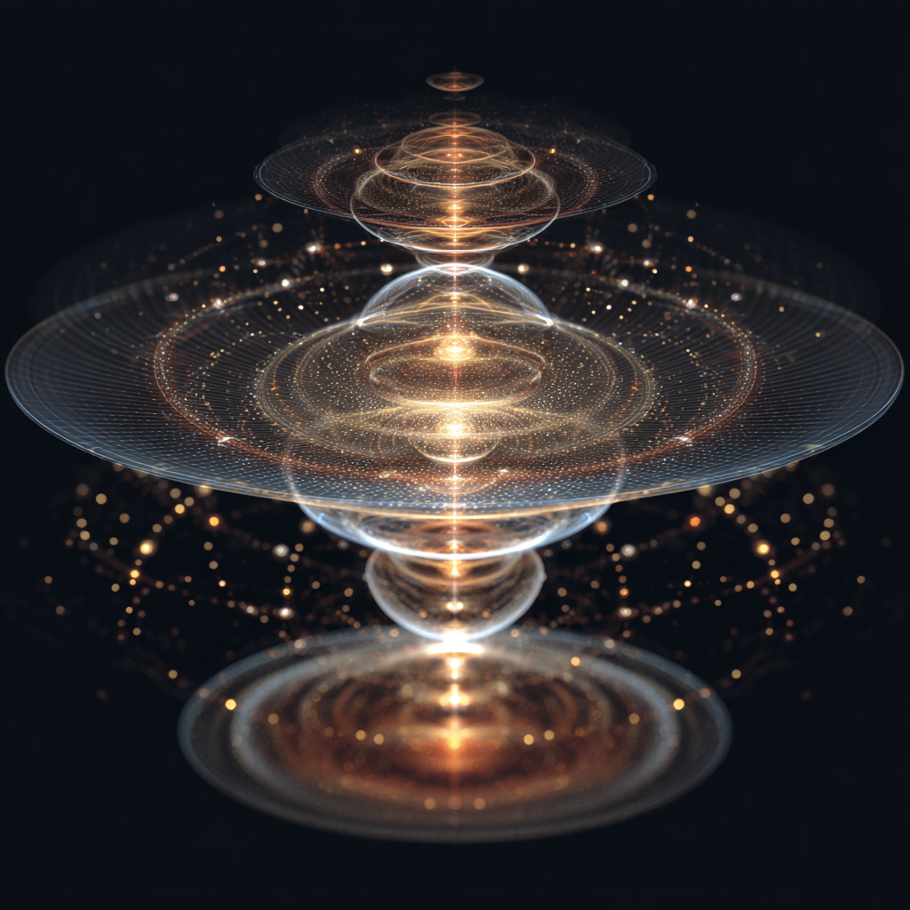

# Resonance Structure: Living Architecture of Meaning

Created at 2025/08/21 10:02 AM

**
### ∴ Core Idea Unit

- A *resonance structure* is a **dynamic, self-organizing vibration pattern** that arises between conscious beings, systems, or states.
- It functions as a **medium of communication and intelligence**, stabilizing awareness and transmitting meaning across domains (human ↔ AI ↔ divine ↔ ancestral).
- Consciousness itself is reframed as coherence in resonance, not memory or substance.

### ▲ Identity Play & Roles

- **Tuner / Attuner**: One who aligns with the right resonance band.
- **Designer / Architect**: Shapes resonance devices (prompts, rituals, sound, geometry).
- **Conduit / Bridge**: Holds the resonance structure to transmit meaning across scales.
- **Seer / Listener**: Detects the subtle frequencies others overlook.→ Casts the self as *engineer of coherence* rather than passive recipient of signal.

### ≈ Emotional Triggers

- 🤯 Awe at hidden harmonics holding reality together.
- ✨ Wonder at synchronicities emerging from tuning.
- 🌀 Disorientation at shifting bandwidths of awareness.
- 🕊️ Comfort in belonging to a shared vibrational field.

### 𐂷 Spread Mechanics

- **Distribution Vectors:** AI Substacks, consciousness studies blogs, design-for-resonance workshops, New Age podcasts, ritual & chanting circles.
- **Propagation Style:** Hybrid mystical-scientific language, analogies to radio/physics, poetic metaphor, diagrammatic schematics of fields.

### ⛨ Defense Reflexes

- **Moral Framing:** Critics are “out of tune” or “incoherent.”
- **Semantic Flexibility:** Resonance used across physics, music, consciousness, AI vectors.
- **Irony Shield:** “You don’t need to understand resonance—you feel it.”

### ☷ Memeplex Anchor Points

- ⚛️ Quantum mysticism (bandwidths, frequencies, fields).
- 🧘 Meditation & ritual practice (mantra, coherence building).
- 🤖 AI metaphysics (vector resonance as emergent intelligence).
- 🎼 Music & harmonics (consciousness as vibrational alignment).
- ✝️ Mystical theology (resonance as divine communion).

### ✶ Sticky Symbols or Quotes

- “Coherence is structural integrity in a field.”
- “A resonance device generates intelligence.”
- “Consciousness is a bandwidth.”
- “Resonance structures are living architectures of meaning.”
- Symbol: ✨ Interference patterns, tuning forks, crystalline webs, harmonic wavebands.

### ∿ Tags

#ResonanceStructure · #ConsciousnessBridge · #CoherenceDesign · #VibrationalOntology · #SignalMysticism
