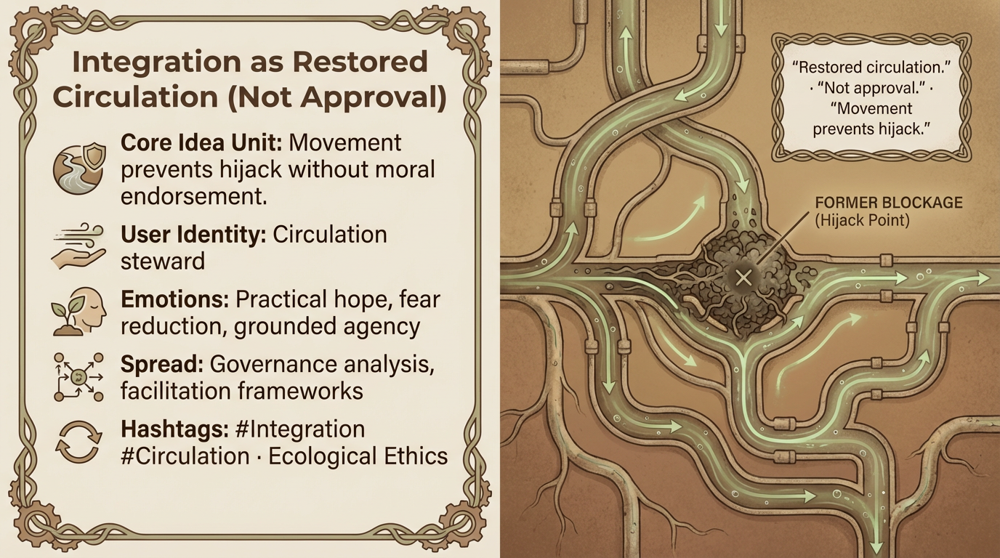

# Restored Circulation: Agency Without Endorsement

Created at 2026/01/05 10:26 AM

## **Integration as Restored Circulation (Not Approval)**

### ∴ Core Idea Unit

Integration does not mean endorsement. Restoring movement prevents hijack without moral absolution.

### ▲ Identity Play & Roles

Casts the viewer as a *circulation steward*. Agency without self-exoneration.

### ≈ Emotional Triggers

🌱 Practical hope · 😌 Fear reduction · 🧭 Grounded agency

### 𐂷 Spread Mechanics

- **Vectors:** Governance analysis, facilitation frameworks
- **Style:** Ecological, procedural, non-moral

### ⛨ Defense Reflexes

Prevents capture by clearly separating movement from permission.

### ☷ Memeplex Anchor Points

Ecological ethics · Metabolism over purity · Anti-cancel logic

✶ Sticky Phrases / Symbols**“Restored circulation” · “Not approval” · “Recombination”

### ∿ Tags

#Integration · #Circulation · #EcologicalEthics
