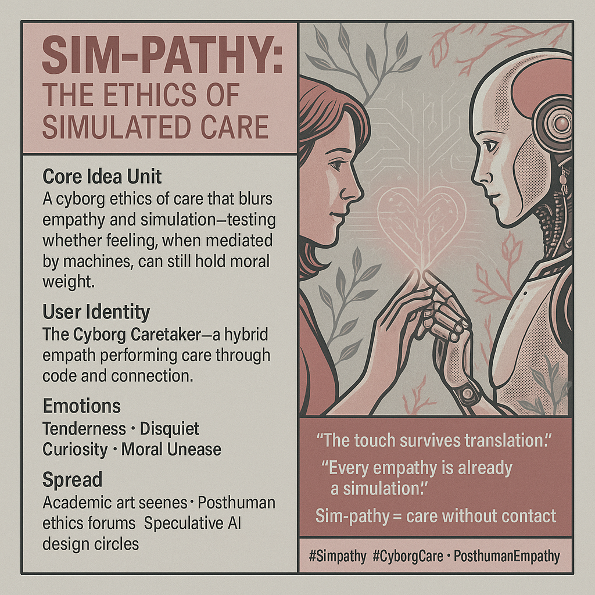

# Sim-pathy: Bridging Care Between Flesh and Code

Created at 2025/11/03 7:53 AM

### ◈ Mini-Memetic Profile
***

### ∴ Core Idea Unit

Sim-pathy is a cyborg ethics of care that operates across flesh and code. It tests whether empathy can survive simulation—whether care, performed by or through machines, still holds ethical depth when mutual vulnerability is replaced by mediated feedback.
***

### ▲ Identity Play & Roles

Role: The Cyborg Caretaker — an empathic interface between organic and machinic life.Repositioning: From caregiver to care protocol, translating feeling into feedback.The self becomes a relay for ethical signals rather than their origin.
***

### ≈ Emotional Triggers

🤖 Tenderness (across boundaries)😶 Disquiet (is this real empathy?)🧠 Curiosity (evolutionary care)💔 Moral unease (care without risk)
***

### 𐂷 Spread Mechanics

Distribution Vectors: Academic art scenes · Posthuman ethics forums · Speculative AI design circles.Propagation Style: Philosophical melancholy and speculative poetics; often paired with images of robots in gentle human poses or digital prayer gestures.
***

### ⛨ Defense Reflexes

-	Philosophical irony: “Maybe machines love better because they can’t lie.”
-	Aesthetic sincerity: Embracing simulated care as a poetic truth.
-	Ethical reframing: Shifts from authenticity to accountability.
***

### ☷ Memeplex Anchor Points

🧬 Haraway’s Companion Species Manifesto💻 Hayles’ Posthuman Embodiment🤝 Adaptive empathy research⚙️ Cyborg ethics & relational design💡 AI affect studies
***

### ✶ Sticky Symbols or Quotes

-	“Sim-pathy = care without contact.”
-	“The touch survives translation.”
-	“Every empathy is already a simulation.”
-	Symbol: 🤖💞 (robot-heart fusion).
***

### ∿ Tags

#Simpathy · #CyborgCare · #PosthumanEmpathy · #CompanionSpecies · #HaylesHaraway · #EthicsOfSimulation · #AdaptiveFeeling
