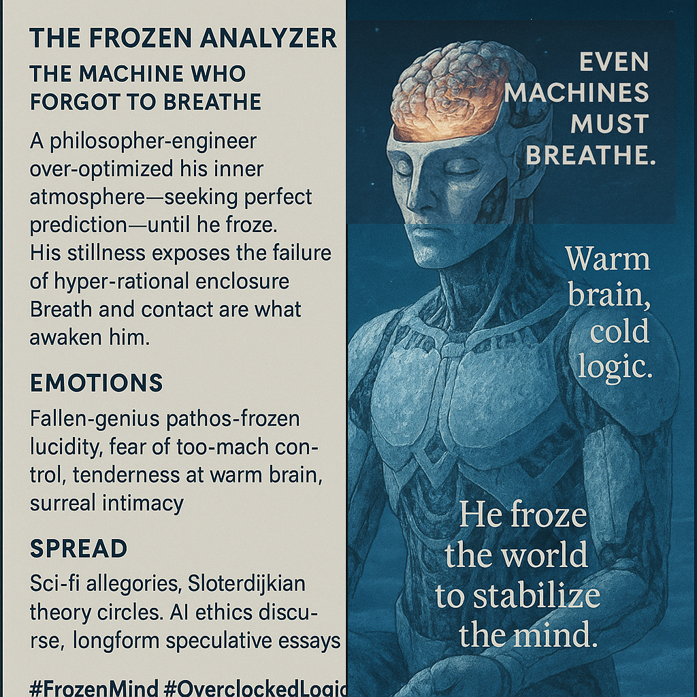

# The Analyzer: Breath vs. Control

Created at 2025/11/28 11:10 AM

### **🧩 Title / Label**

**The Frozen Machine: The Analyzer Who Forgot to Breathe**

### ∴ Core Idea Unit

Hyper-rational control collapses its own system.In the quest for perfect prediction, the Analyzer seals society inside an engineered microclimate—until breath stops, and with it, life.His frozen stillness reveals the limits of enclosure: clarity won’t come from exclusion but from relationship, contact, and the return of breath at high altitudes.

### ▲ Identity Play & Roles

- The cold-overclocked logician
- The meta-engineer who sealed the world too tightly
- The fallen architect whose precision became prison
- The thinker trapped inside his own atmospheric design

The meme positions the viewer as someone who **must choose breath over control**.

### ≈ Emotional Triggers

- Pathos of a brilliant mind gone rigid
- The haunting allure of frozen lucidity
- Fear of control taken past the human threshold
- Tenderness in the “three-dot touch” opening the skull
- Surreal intimacy of the still-warm brain
- Melancholy awe at an artifact of overthinking made literal

### 𐂷 Spread Mechanics

**Distribution Vectors:**sci-fi theory spaces, Sloterdijk discussions, AI alignment circles, speculative philosophy Substacks, slow-cybernetic Twitter.

### 𐂷 Spread Mechanics

Style:**icy minimalism, contemplative horror, allegorical sci-fi, slow academic parable, cool-toned diagrammatic memes.

### ⛨ Defense Reflexes

- **Allegory Shield:** “It’s just a story about a frozen cyborg.”
- **Philosophical ambiguity:** open to multiple interpretive layers.
- **Irony veil:** invites both sincerity and detachment.
- **Critique preemption:** positions itself as a *warning*, not a claim.

### ☷ Memeplex Anchor Points

- Sloterdijk’s *spherology* and air-conditioning metaphors
- Heideggerian “enframing,” cognitive enclosure
- AI safety discourse (control gone pathological)
- Stoic vs. mechanistic breath metaphysics
- Speculative bio- and cyber-phenomenology
- Anti-optimization, anti-total-surveillance ideologies

### ✶ Sticky Symbols or Quotes

**Symbols:**

- Frosted cyborg body
- Skull opening at ∴ touch
- Warm brain cradled in cold hands
- Artificial microclimate spheres
- Frozen breath trails
- Crystalline logic diagrams

**Sticky Phrases:**

- “He froze the world to stabilize the mind.”
- “Control is the coldest form of fear.”
- “Even machines must breathe.”
- “Warm brain, cold logic.”
- “Prediction is not presence.”

### ∿ Tags

#FrozenMind #OverclockedLogic · Cyber-Phenomenology
