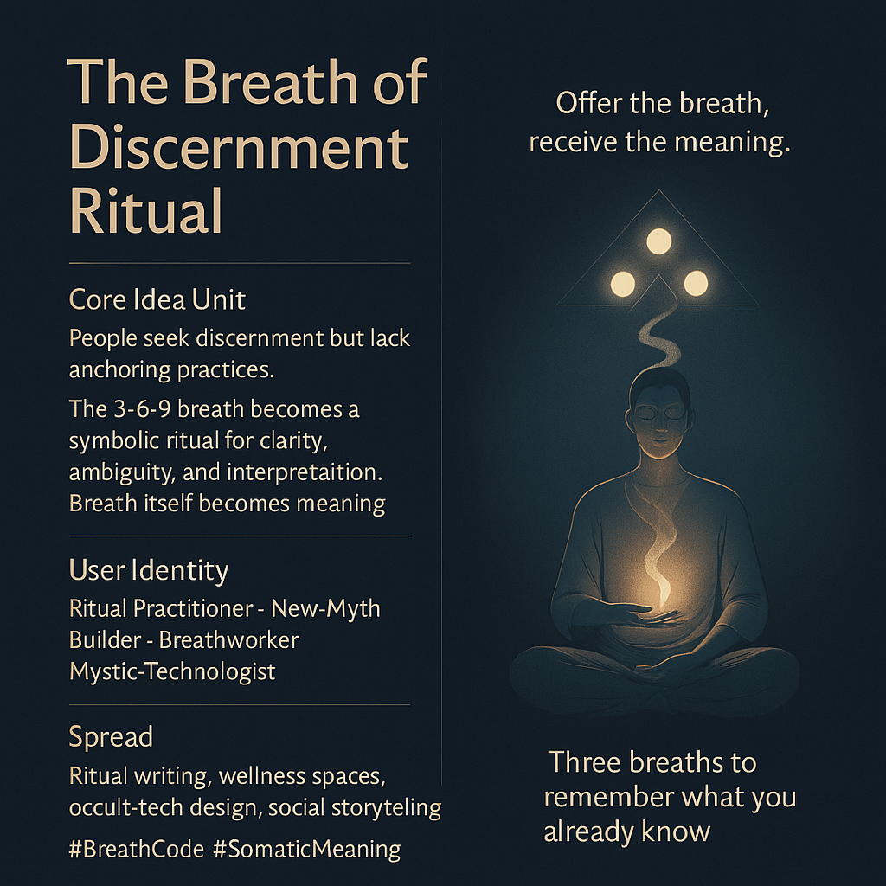

# The Breath-Code Ritual for Clarity

Created at 2025/11/28 12:20 PM

### **🧩 Title / Label**

**The Breath of Discernment Ritual***(a.k.a. The Breath-Code Ritual)*

***

### ∴ Core Idea Unit

People crave discernment but rarely engage in practices that stabilize it.A simple triadic breath cycle—**3 / 6 / 9**—becomes a symbolic code for clarity, interpretation, and the space-between-thoughts.Breath becomes meaning. Ritual becomes method.

***

### ▲ Identity Play & Roles

- The Ritual Practitioner
- The New-Myth Builder
- The Breathworker
- The Hybrid Mystic-TechnologistThis meme casts the user as someone who treats breath as both semantics and sacrament.

***

### ≈ Emotional Triggers

- Ritual intimacy
- Embodied grounding
- Mystical numerology
- Accessible contemplative practice
- The soft thrill of symbolic action
- Quiet transformative expectation (“This breath means something”)

***

### 𐂷 Spread Mechanics

**Distribution Vectors:**Ritual-writing scenes, wellness spaces, occult-tech design circles, contemplative communities, mythopoetic social feeds.

### 𐂷 Spread Mechanics

Style:**Minimalist mysticism, sigil aesthetics, triadic symmetry, soft glow, esoteric ritual cards.

***

### ⛨ Defense Reflexes

- **Esoteric Framing:** “It’s symbolic; it works on levels beyond critique.”
- **Practice Shield:** “Try it before you analyze it.”
- **Numerological Flexibility:** 3-6-9 can absorb reinterpretation without breaking.

***

### ☷ Memeplex Anchor Points

- Breathwork traditions
- Triadic cosmologies
- Neo-mythic ritual design
- Somatic epistemology
- Numerological mysticism
- Meaning-making as embodied praxis

***

### ✶ Sticky Symbols or Quotes

**Symbols:**3–6–9 breath glyph · Three white dots sigil · Ghost-triangle outline · Soft exhale line · Circular offering gesture

**Quotes / Phrases:**

- “Offer the breath, receive the meaning.”
- “Clarity begins in the pause.”
- “Three breaths to remember what you already know.”
- “The triangle is the shape of discernment.”

***

### ∿ Tags

#BreathCode #SomaticMeaning · Ritual Minimalism#TriadicPractice #NeoMythicDesign
