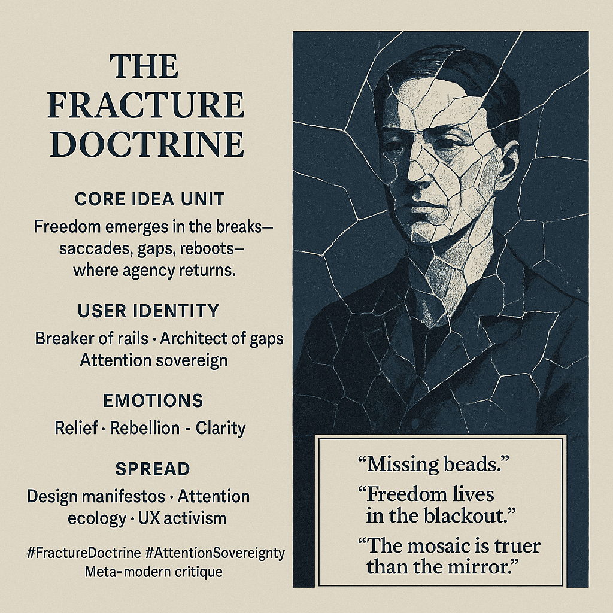

# The Fracture Doctrine: Embracing Discontinuity

Created at 2025/12/05 10:12 AM

### **🧩 Title**

**The Fracture Doctrine**

### ∴ Core Idea Unit

Freedom is not found in continuity but in the intentional *breaks*—ruptures that interrupt passive flow, expose hidden structure, and reawaken agency.

### ▲ Identity Play & Roles

- Breaker of Rails
- Architect of Gaps
- Attention Sovereign reclaiming the right to interrupt automation

It repositions the self as one who *chooses the discontinuities* that systems try to erase.

### ≈ Emotional Triggers

- Relief (permission to stop, refuse, break)
- Rebellion (rupture becomes a weapon)
- Clarity (fracture reveals architecture)

### 𐂷 Spread Mechanics

**Distribution:** design theory circles, attention-ecology discourse, anti-enframing critique, Substack diagrams, UX activism threads.**Propagation:** stark contrasts, parables about gaps, aesthetic fragmentation, anti-stream aphorisms.

### ⛨ Defense Reflexes

- Ambiguity shield: “the break *is* the meaning.”
- Moral framing: “seamlessness is coercion.”
- Paradox defense: critique requires rupture, so any critique of rupture performs it.

### ☷ Memeplex Anchor Points

- Heideggerian anti-enframing
- Anti-UX smoothness critique
- Attention sovereignty
- Meta-modern mosaic logic
- Ritualized refusal and break-taking

### ✶ Sticky Symbols or Quotes

- “Missing beads.”
- “Freedom lives in the blackout.”
- “The trail is the gaps between footsteps.”
- “The mosaic is truer than the mirror.”
- Saccade flash; heartbeat blackout; deliberate reboot.

### ∿ Tags

#FractureDoctrine #AttentionSovereignty #AntiSeamless #MosaicMind #DesignEthics
