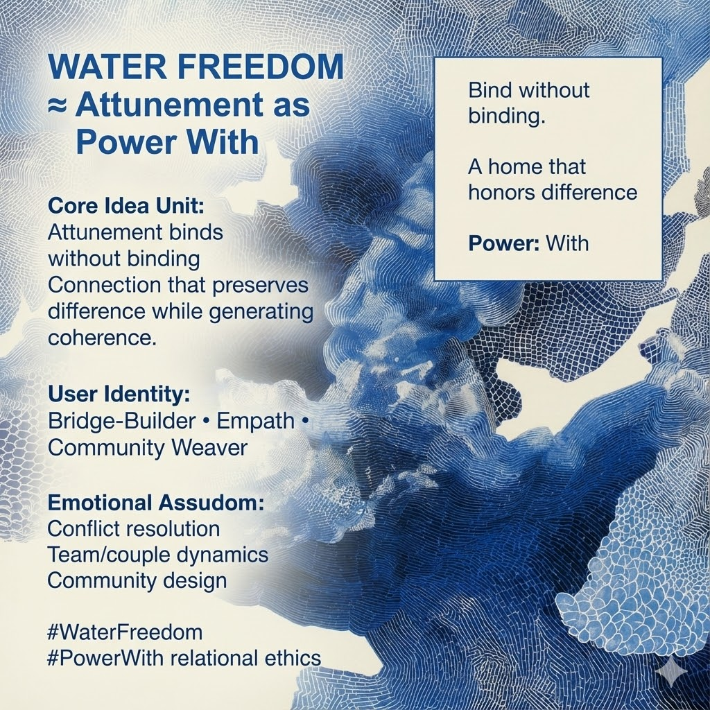

# Water Freedom: Attunement in Connection

Created at 2025/12/14 12:13 PM

## **Water Freedom: Attunement as Power With** ≈

***

### ∴ Core Idea Unit

When connection lacks attunement, relationship collapses into **conquest** (Power Over) or **fusion** (loss of self).**Water Freedom names a third mode**: attunement — connection that *binds without binding*, preserving difference while creating coherence.

**Resolution frame:**True relation does not absorb or dominate.It **resonates**.

**Mental shift provoked:**From *“How do I win or belong?”* → *“Can we attune without collapsing?”*

***

### ▲ Identity Play & Roles

**Cast the viewer as:**

- **Bridge-Builder** — holding tension across difference
- **Empath** — sensing without merging
- **Community Weaver** — designing relational safety
- **Dialogic Participant** — mutuality without erasure

**Repositioning:**The self becomes a **resonant surface**, not a wall or a sponge.

***

## ≈ Emotional Hooks & Cognitive Levers

- 🌊 **Belonging Without Loss** — connection that doesn’t cost identity
- 🔥💧 **Warmth Without Coercion** — safety without capture
- 🛟 **Relief from Binary Choice** — neither dominance nor disappearance

This meme stabilizes attachment by **restoring differentiation**.

***

### 𐂷 Spread Mechanics

**Distribution Vectors**

- Conflict resolution & mediation spaces
- Couple, team, and group dynamics work
- Community and organizational design
- Dialogue and deliberative practice circles

### 𐂷 Spread Mechanics

**Style**

- Relational metaphors
- Felt-sense language
- Practical reframes that reduce defensiveness

***

### ⛨ Defense Reflexes

- **Anti-Codependence Shield:** Attunement ≠ fusion
- **Anti-Domination Guard:** Connection ≠ control
- **Anti-Coldness Lock:** Difference ≠ distance

Critique must argue **why coercion or merger outperform attuned relation** — rarely convincing in lived systems.

***

### ☷ Memeplex Anchor Points

- Relational ethics
- Dialogic pluralism
- Systems and family therapy
- Anti-tribalism
- IF-Prime elemental Water (≈)

***

### ✶ Sticky Symbols or Quotes

- ≈ **WATER**
- 🌊 *Resonance*
- 🔗 **“Bind without binding.”**
- 🏠 *A home that honors difference*
- 🤝 **Power: With**

***

### ∿ Tags

#WaterFreedom · #Attunement · #PowerWith · #RelationalEthics · #DialogicPluralism · #IFPrime

***

**Reflection anchor:**This meme doesn’t ask you to choose sides or dissolve yourself.It asks **whether connection can deepen while difference remains intact.**
